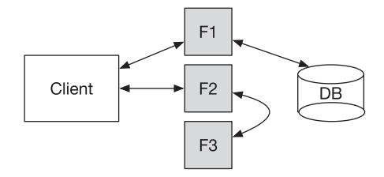
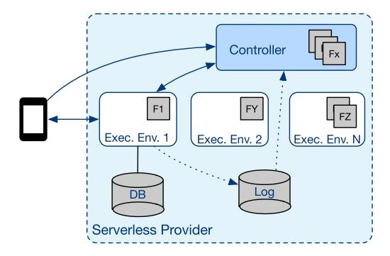
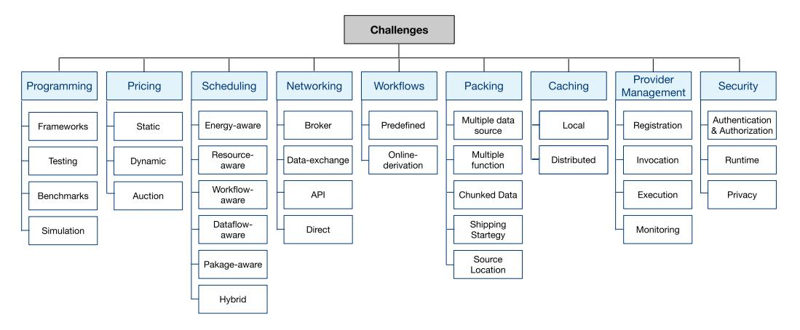
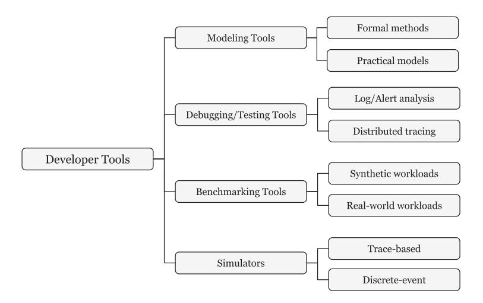
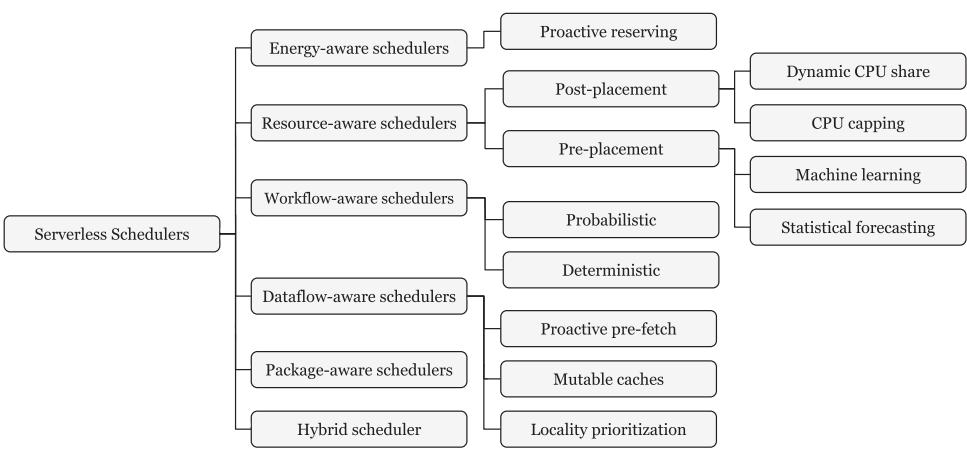
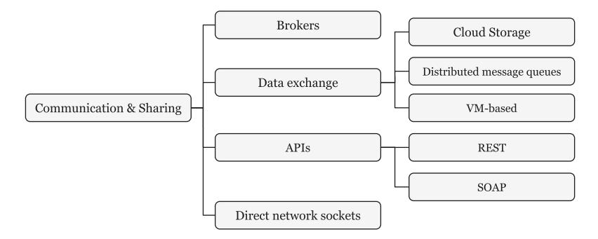
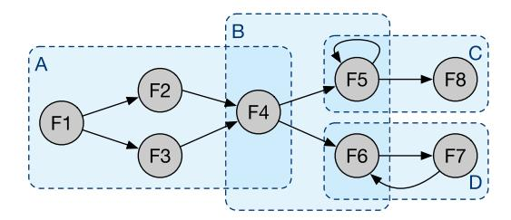
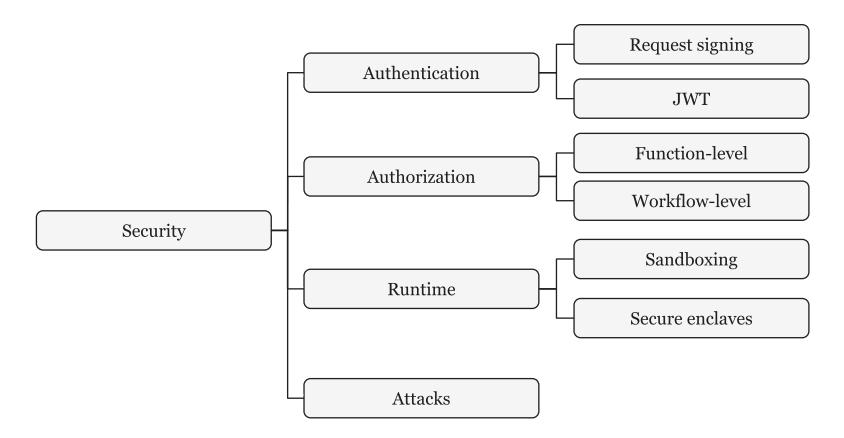

.

Latest updates: [hps://dl.acm.org/doi/10.1145/3510611](https://dl.acm.org/doi/10.1145/3510611)

SURVEY

## Serverless Computing: A Survey of Opportunities, Challenges, and Applications

[HOSSEIN](https://dl.acm.org/profile/99659535047) SHAFIEI, K. N. Toosi University of [Technology,](https://dl.acm.org/institution/60016248) Tehran, Tehran, [Iran](https://dl.acm.org/institution/60016248)

AHMAD [KHONSARI](https://dl.acm.org/profile/81319495057), [University](https://dl.acm.org/institution/60022927) of Tehran, Tehran, Tehran, Iran PAYAM [MOUSAVI](https://dl.acm.org/profile/87059612857), [University](https://dl.acm.org/institution/60022927) of Tehran, Tehran, Tehran, Iran

Open Access [Support](https://libraries.acm.org/acmopen) provided by:

[University](https://dl.acm.org/institution/60022927) of Tehran

K. N. Toosi University of [Technology](https://dl.acm.org/institution/60016248)

Published: 10 November 2022 Online AM: 18 February 2022 Accepted: 06 January 2022 Revised: 07 December 2021 Received: 04 June 2021

[Citation](https://dl.acm.org/action/exportCiteProcCitation?dois=10.1145%2F3510611&targetFile=custom-bibtex&format=bibtex) in BibTeX format

EISSN: 1557-7341

# **Serverless Computing: A Survey of Opportunities, Challenges, and Applications**

HOSSEIN SHAFIEI, K. N. Toosi University of Technology, Iran AHMAD KHONSARI, University of Tehran, Iran, and Institute for Research in Fundamental Sciences (IPM), Iran

PAYAM MOUSAVI, University of Tehran, Iran

The emerging serverless computing paradigm has attracted attention from both academia and industry. This paradigm brings benefits such as less operational complexity, a pay-as-you-go pricing model, and an autoscaling feature. The paradigm opens up new opportunities and challenges for cloud application developers. In this article, we present a comprehensive overview of the past development as well as the recent advances in research areas related to serverless computing. First, we survey serverless applications introduced in the literature. We categorize applications in eight domains and separately discuss the objectives and the viability of the serverless paradigm along with challenges in each of those domains. We then classify those challenges into nine topics and survey the proposed solutions. Finally, we present the areas that need further attention from the research community and identify open problems.

CCS Concepts: • **Computer systems organization** → **Cloud computing;**

Additional Key Words and Phrases: Cloud services, serverless computing, function-as-a-service (FaaS)

#### **ACM Reference format:**

Hossein Shafiei, Ahmad Khonsari, and Payam Mousavi. 2022. Serverless Computing: A Survey of Opportunities, Challenges, and Applications. *ACM Comput. Surv.* 54, 11s, Article 239 (November 2022), 32 pages. <https://doi.org/10.1145/3510611>

#### **1 INTRODUCTION**

Large technology companies such as Amazon, Google, and Microsoft offer serverless platforms under various brand names. Although the specifics of the services may differ, the essential idea behind the offered services is almost the same; i.e., by rendering computation to the pay-as-you-go model, serverless computing tries to achieve auto-scaling while providing affordable computation services [\[90\]](#page-29-0).

Serverless computing differs from traditional cloud computing concepts (we refer to them as serverful in this article) in the sense that the infrastructure and platforms in which the services are running are hidden from customers. In this approach, the customers are only concerned with the desired functionality of their application and the rest is delegated to the service provider.

Authors' addresses: H. Shafiei, K. N. Toosi University of Technology, Tehran, Iran; email: shafiei@kntu.ac.ir; A. Khonsari, University of Tehran, Tehran, Iran, and Institute for Research in Fundamental Sciences (IPM), Tehran, Iran; email: ak@ipm.ir; P. Mousavi, University of Tehran, Tehran, Iran; email: pa.mousavi@ut.ac.ir.

Permission to make digital or hard copies of all or part of this work for personal or classroom use is granted without fee provided that copies are not made or distributed for profit or commercial advantage and that copies bear this notice and the full citation on the first page. Copyrights for components of this work owned by others than ACM must be honored. Abstracting with credit is permitted. To copy otherwise, or republish, to post on servers or to redistribute to lists, requires prior specific permission and/or a fee. Request permissions from [permissions@acm.org.](mailto:permissions@acm.org)

© 2022 Association for Computing Machinery.

0360-0300/2022/11-ART239 \$15.00

<https://doi.org/10.1145/3510611>

239:2 H. Shafiei et al.

There are successful commercial implementations of this model. Amazon introduced Lambda1 in 2014 and later Google Cloud Functions,2 Microsoft Azure Functions,3 and OpenWhisk4 were launched in 2016. Since then, many studies have focused on the challenges and open problems of this concept. Some of the previous studies are skeptical about the potential of serverless computing due to the poor performance of their case studies [\[73\]](#page-29-0). In contrast, others believe that serverless computing will become the face of cloud computing and the performance issues will be addressed eventually [\[90\]](#page-29-0).

The aim of the serverless services is threefold: (1) relieve users of cloud services from dealing with the infrastructures or the platforms, (2) convert the billing model to the pay-as-you-go model, and (3) auto-scale the service per customers' demand. As a result, in a truly serverless application, the execution infrastructure is hidden from customers and customers only pay for the resources they actually use. The service is designed such that it can handle request surges rapidly by scaling automatically. The basic entities in serverless computing are functions. The customer registers their functions at the service provider. Then, those functions can be invoked either by an event or per users' request. The invocation of the functions is delegated to one of the available computation nodes inside the service provider. Usually, these nodes are cloud containers such as Docker [\[111\]](#page-30-0) or an isolated runtime environment [\[74\]](#page-29-0). The execution results are sent back to the customer.

Though the concept of serverless computing is relatively new, it has paved its way into many real-world applications ranging from online collaboration tools to the **Internet of Things (IoT)**. We survey the papers that introduce real-world serverless applications and categorize them into eight different domains. We summarize the objectives (as justified by the authors) for migrating to serverless services for each of the application domains. We further assess the aptness of the serverless paradigm for each application domain based on the arguments made by the authors, the obtained results, and the challenges they reported. Table [1](#page-6-0) lists the application domains, migration objectives, and assessments.

There are several challenges that serverless services are currently facing. There exist some surveys and literature reviews that discuss those challenges [\[36,](#page-27-0) [46,](#page-28-0) [48,](#page-28-0) [90,](#page-29-0) [160\]](#page-32-0). Our approach is different in that, instead of focusing on the inherent obstacles and shortcomings of the concept, we analyze the challenges reported in each of the surveyed application domains.5 Then, we categorize and discuss the existing solutions for those challenges. We bring out the areas that need further attention from the research community. We also discuss the limitations of those solutions and identify open problems. Some of the challenges surveyed in this article are common between various application domains such as the topic of providing security and privacy in serverless services. And some of them are domain specific, such as the issues of scheduling, pricing, caching, provider management, and function invocation.

In this article, we also discuss the opportunities presented by serverless computing. We emphasize that serverless services are more customer-friendly as they relieve customers from the intricacies of deployment. They are also more affordable in some cloud computing scenarios that we will discuss later in this article. We argue that new marketplaces are emerging around these services, which implies new business opportunities.

The rest of this article is organized as follows. Section [2](#page-3-0) presents definitions and characteristics of serverless services. Section [3](#page-4-0) focuses on the opportunities that the serverless computing model

[1https://aws.amazon.com/lambda/](https://aws.amazon.com/lambda/).

[2https://cloud.google.com/functions/](https://cloud.google.com/functions/).

[3https://azure.microsoft.com/](https://azure.microsoft.com/).

[4https://openwhisk.apache.org/](https://openwhisk.apache.org/).

5Our focus here is on the research studies that were published during the past few years.

offers. Section [4](#page-5-0) discusses the application domains. Section [5](#page-9-0) surveys the challenges toward the vast adoption of the concept. Section [6](#page-26-0) concludes the article.

### **2 DEFINITION AND CHARACTERISTICS**

#### **2.1 Definitions**

There is no formal definition for the concept of serverless computing and its various services. So, here we present the most commonly acknowledged definitions.

- *2.1.1 FaaS.* **Function as a service (FaaS)** is a paradigm in which the customers can develop, run, and manage functions without the trouble of building and maintaining the infrastructure. It enables "on-demand" execution of functions that allows the infrastructure to be powered down and does not incur charges when not in use.
- *2.1.2 BaaS.* **Backend as a Service (BaaS)** is an online service that handles a specific task over the cloud, such as authentication or notification. Both BaaS and FaaS require no resource management from the customers. While FaaS only offers to execute users' functions, BaaS offers a complete online service.
- *2.1.3 Serverless Service.* A serverless service can be viewed as a generalization of FaaS and BaaS that incorporates the following characteristics:
  - (1) The execution environment should be hidden from the customer; i.e., the computation node, the virtual machine, the container, its operating system, and so forth are all hidden from the customer.
  - (2) The provider6 should provide an auto-scaling service; i.e., the resources should be made available to the customer instantly per demand.
  - (3) The billing mechanism should only reflect the number of resources the customer actually uses, i.e., pay-as-you-go billing model.
  - (4) The provider does its best effort to complete the customer's task as soon as it receives the request and the execution duration of the task is bounded.
  - (5) The basic elements in serverless services are functions. The functions are not hidden from the provider. The provider knows their dependencies to external libraries, runtime environments, and state during and after execution.

A serverless application is usually composed of two parts:

- A client.7 The client implements most of the application logic. It interacts with two sides, i.e., the end-user and the provider, invoking functions on one side and translating the results into usable views for the other side.
- Registered functions on a provider. Functions are uploaded to the provider. The provider invokes a copy of the function according to the user's request or based on a predefined event.

Figure [1](#page-4-0) depicts an example of a serverless application. In this example, the client invokes function F1, which retrieves data from the database; performs some operations on it; and sends the result back to the client. As depicted, the client also invokes F2, then F2 in turn invokes another function called F3, the result is sent back to F2, and then it sends its result to the client. Here, we

6Throughout this article, by a service provider we mean the organization (or company) that serves customers in a serverless fashion.

7The client part is not essential in every serverless scenario; i.e., often functions are directly called by other functions or they are triggered by an external event.

239:4 H. Shafiei et al.

Fig. 1. An example of a serverless application.

Fig. 2. An example of an invocation scenario in a serverless provider. This figure only depicts the concept and the actual implementation may differ.

can see a sequence of function executions. Later in this article, we argue that these sequences are important for performance optimization.

The provider accepts customers' functions and stores them. Upon receiving an invocation request, the provider assigns the function to one of its computation nodes for execution. The parameters upon which the provider selects the execution node have a great impact on the performance of the system, which is thoroughly surveyed in Section [5](#page-9-0) of this article. The node (which can be a virtual machine, a container, or any sandbox execution environment) executes the function, sends back the result to the client, and sends the execution log to the provider. The provider can use these logs to improve further execution of the function. Figure 2 shows an example of such a scenario.

#### **3 OPPORTUNITIES**

In this section, we discuss the opportunities that serverless computing offers.

#### **3.1 No Deployment and Maintenance Complexity**

The very first and foremost opportunity that serverless computing offers is to relieve users from managing the infrastructure, which is now already accomplished in **Infrastructure-as-a-Service (IaaS)**. However, users still have to manage their virtual resources, i.e., installing and configuring related packages and libraries. Certainly, **Platform-as-a-Service (PaaS)** providers such as Heroku [\[17\]](#page-26-0) have made the management slightly easier, although users still have to configure the application to match the PaaS requirements, which is not a trivial task. Serverless computing takes a big step in this manner. Users only have to register their functions and then receive credentials to invoke the functions.

#### **3.2 Affordable Scalability**

Another promise of cloud computing is the ability for customers to deploy the functionalities of their applications without worrying about the scalability of the execution infrastructure or platform. The scalability is a direct result of the auto-scaling nature of these services; i.e., per request the service invokes a copy of the requested function and there is virtually no bound for the number of concurrent requests. Each invocation is assigned to the most feasible and available resource for execution.

The affordability of serverless services is mainly due to the reduced costs of the providers. There are two main reasons for the reduced costs: (1) resource multiplexing and (2) infrastructure heterogeneity. Resource multiplexing leads to higher utilization of available resources. For example, consider the case in which an application has one request every minute and it takes milliseconds to complete each request. In this case, the mean CPU usage is very low. If the application is deployed to a dedicated machine, then this is highly inefficient. Many similar applications could all share that one machine. Infrastructure heterogeneity means that the providers also can use their older machines that are less attractive for other direct services to reduce their costs (mainly because the execution environment is a black box for the customer).

It is important to note that the affordability of serverless services depends on the usage scenario; i.e., in some cases renting a virtual machine is cheaper than using serverless's pay-as-you-go model. Lin et al. [\[104\]](#page-30-0) developed an economic model to establish a tradeoff between pricing of virtual machines and serverless services. Their study characterizes scenarios where customers can benefit from switching to serverless services.

#### **3.3 New Marketplaces**

With the advent of modern operating systems for mobile devices such as Android or iOS, various marketplaces for applications, which are specifically designed for those operating systems, have emerged such as Google Play Store [\[16\]](#page-26-0) and Apple's App Store [\[7\]](#page-26-0). Such a scenario is already appearing for the serverless paradigm; i.e., with the growth in the popularity of serverless computing, new marketplaces for functions have emerged. In these types of markets, developers can sell their developed functions to others. Every generalized or domain-specific functionality can be bought or offered in those markets. For example, a software developer may need a geospatial function that checks whether a point resides inside a geospatial polygon. They could buy such functions from those markets. The AWS Serverless Application Repository [\[4\]](#page-26-0) is an example of such a capability. [\[136\]](#page-31-0) presents a quantitative analysis of functions available inside the AWS Application Repository.

The competition forced by the economics of these markets will lead to high-quality functions, i.e., from the perspective of code efficiency, cleanness, documentation, and resource usage. The function markets may present buyers with a catalog for every function that shows the resource usage of the function and prices it incurs per request. Thus, the buyer can choose from many options for a specific task.

## **4 APPLICATIONS**

Many real-world serverless applications have been proposed in the literature during the past few years. We categorize these applications into eight domains. Table [1](#page-6-0) lists the application domains, the main reason for migration stated in the papers, assessments based on the arguments made by the authors, the obtained results, and the challenges they reported. In what follows, we survey these application domains in detail.

239:6 H. Shafiei et al.

| Application                                  | Main Reason               | Assessment |
|----------------------------------------------|---------------------------|------------|
| Real-time Collaboration and Analytics        | Auto-scaling feature      | Promising  |
| Urban and Industrial Management Systems      | Pricing model             | Promising  |
| Scientific Computing                         | Lower deployment overhead | Fair       |
| Artificial Intelligence and Machine Learning | Pricing model             | Fair       |
| Video Processing and Streaming               | Lower deployment overhead | Fair       |
| System and Software Security                 | Auto-scaling feature      | Promising  |
| Internet of Things (IoT)                     | Auto-scaling feature      | Promising  |
| E-commerce, Banking and Blockchains          | Auto-scaling feature      | Fair       |

Table 1. Serverless Application Domains

#### **4.1 Real-time Collaboration and Analytics**

The stateless nature of serverless services makes them an attractive platform for real-time collaboration tools such as instant messaging and chatbots. Yan et al. [\[165\]](#page-32-0) proposed an architecture for chatbots on OpenWhisk [\[19\]](#page-26-0). An XMPP-based serverless approach for instant messaging is also introduced in [\[129\]](#page-31-0). Real-time tracking is another example of collaboration tools that are very suitable for serverless services as these applications are not heavily dependant on the system's state. Anand et al. [\[29,](#page-27-0) [30\]](#page-27-0) proposed two real-time GPS tracking methods on low-power processors.

Serverless services are also utilized for data analytics applications [\[115\]](#page-30-0). In these applications, various sources stream real-time data to a serverless service. The service gathers, analyzes, and then represents the data analytics. The auto-scaling feature of serverless computing makes the handling of concurrent massive data streams possible. Müller et al. [\[113\]](#page-30-0) proposed Lambada, which is a serverless data analytics approach that is one order of magnitude faster and two orders of magnitude cheaper compared to commercial Query-as-a-Service systems.

#### **4.2 Urban and Industrial Management Systems**

The pay-as-you-go model of serverless services paved the way for the introduction and implementation of various budget-restricted urban and industrial management systems. Al-Masri et al. [\[26\]](#page-27-0) presented an urban smart waste management system. Hussain et al. [\[83\]](#page-29-0) proposed a serverless service for oil and gas field management systems. An implementation of a serverless GIS platform for land valuation is presented in [\[112\]](#page-30-0).

The distributed nature and auto-scaling feature of serverless services make it an apt choice for smart grids. Zhang et al. [\[169\]](#page-32-0) proposed event-driven serverless services to handle SCADA/EMS failure events. A distributed data aggregation and analytics approach for smart grids is proposed in [\[80\]](#page-29-0). Serverless services have been also utilized for urban disaster recovery applications. Franz et al. [\[67\]](#page-28-0) proposed a community formation method after disasters using serverless services. Another similar approach is also proposed in [\[53\]](#page-28-0).

The migration-toward-serverless paradigm seems a reasonable choice for this domain of applications, especially for public sector services or for developing countries due to its lower deployment overheads and also its pay-as-you-go pricing model.

#### **4.3 Scientific Computing**

It has been debated in [\[73\]](#page-29-0) that serverless computing is not an attractive alternative for scientific computing applications, albeit many studies have focused their attention toward serverless services for those applications. We believe disagreement lies in the fact that the range of scientific computing and its applications is vast and there are certainly some areas in this domain for which the utilization of serverless services is feasible.

Spillner et al. [\[137\]](#page-31-0) argue that serverless approaches provide a more efficient platform for scientific and high-performance computing by presenting various prototypes and their respective measurements. This idea is also echoed in [\[49\]](#page-28-0), where high-performance Function-as-a-Service is proposed for scientific applications. A serverless tool for linear algebra problems is proposed in [\[131\]](#page-31-0) and a case for matrix multiplication is presented in [\[156\]](#page-32-0). The serverless paradigm is harnessed for large-scale optimization in [\[34\]](#page-27-0). A serverless case study for scientific workflows is discussed in [\[109\]](#page-30-0).

Serverless approaches have been also used in DNA and RNA computing [\[81,](#page-29-0) [100\]](#page-30-0). Niu et al. [\[117\]](#page-30-0) utilized the potentials of the serverless paradigm in all-against-all pairwise comparison among all unique human proteins. On-demand high-performance serverless infrastructures and approaches for biomedical computing are proposed in [\[98\]](#page-30-0).

Scientific applications that require extensive fine-grained communication are difficult to support with a serverless approach, whereas those that have limited or coarse-grained communication are good candidates. Also, note that scientific computations with time-varying resource demands will benefit from migrating to a serverless paradigm.

#### **4.4 Artificial Intelligence and Machine Learning**

Machine learning in general and neural-network-based learning in particular are currently one of the most attractive research trends. The suitability of the serverless paradigm for this domain has received mixed reactions both from the research and industrial communities. For example, it has been argued that deep learning functions are tightly coupled (they require extensive communication between functions), and also these functions are usually compute and memory intensive; as such, the paradigm is not promising for these applications [\[64\]](#page-28-0). Nevertheless, it has been discussed that deep neural networks can benefit from serverless paradigms as they allow users to decompose complex model training into several functions without managing virtual machines or servers [\[162\]](#page-32-0). As such, various such approaches have been proposed in the literature. A case of serverless machine learning is discussed in [\[47\]](#page-28-0). Ishakian et al. [\[85\]](#page-29-0) discussed various deep learning models for serverless platforms. Neural network training of serverless services is explored in [\[64\]](#page-28-0). Also, a pay-per-request deployment of neural network models using serverless services is discussed in [\[147\]](#page-32-0). A prototype serverless implementation for the estimation of double machine learning models is presented in [\[99\]](#page-30-0). A distributed machine learning using serverless architecture is also discussed in [\[151\]](#page-32-0).

Christidis et al. [\[51\]](#page-28-0) introduce a set of optimization techniques for transforming a generic artificial intelligence codebase to serverless environments. Using realistic workloads of the UK rail network, they showed that by wielding their techniques the response time remained constant, even as the database scales up to 250 million entries. A serverless framework for the life-cycle management of machine-learning-based data analytics tasks is also introduced in [\[40\]](#page-27-0).

The viability of serverless as a mainstream model serving platform for data science applications is studied in [\[161\]](#page-32-0). The authors presented several practical recommendations for data scientists on how to use the serverless paradigm more efficiently on various existing serverless platforms.

#### **4.5 Video Processing and Streaming**

Serverless approaches have been proposed for video processing. Sprocket [\[31\]](#page-27-0) is a serverless video processing framework that exploits intra-video parallelism to achieve low latency and low cost. The authors claim that a video with 1,000-way concurrency using Amazon Lambda on a full-length HD movie costs about \$3 per hour of processed video. A serverless framework for auto-tuning video pipelines is discussed in [\[128\]](#page-31-0). It achieves 7.9 times lower latency and 17.2 times cost reduction on average compared to that of serverful alternatives. In [\[126\]](#page-31-0) GPU processing power

239:8 H. Shafiei et al.

is harnessed in a serverless setting for video processing. Zhang et al. [\[168\]](#page-32-0) present a measurement study to extract contributing factors such as the execution duration and monetary cost of serverless video processing approaches. They reported that the performance of video processing applications could be affected by the underlying infrastructure.

Serverless video processing and broadcasting applications have gained some traction from both the industrial and research communities during the COVID-19 pandemic. A live media streaming in a serverless setting is presented in [\[96\]](#page-30-0). A serverless face-mask detection approach is discussed in [\[153\]](#page-32-0). The serverless paradigm also has been utilized in video surveillance applications. Elordi et al. [\[62\]](#page-28-0) proposed an on-demand serverless video surveillance using deep neural networks.

#### **4.6 System and Software Security**

The power of serverless computing has been leveraged for providing security for various software systems and infrastructures. A mechanism for securing Linux containers has been proposed in [\[41\]](#page-27-0). Serverless services have also been utilized for intrusion detection. StreamAlert [\[114\]](#page-30-0) is a serverless, real-time intrusion detection engine built upon Amazon Lambda. Birman et al. [\[42\]](#page-27-0) presented a serverless malware detection approach using deep learning.

Serverless approaches have been also used for ensuring data security. A method for automatically securing sensitive data in the public cloud using serverless architectures has been introduced in [\[65\]](#page-28-0). Hong et al. [\[76\]](#page-29-0) presented six different serverless design patterns to build security services in the cloud.

We believe that the serverless approach has great potential to improve the security of systems and services. This is due to various reasons:

- (1) Security threats are often ad hoc in nature. In these cases, the pay-as-you-go pricing leads to reduced costs.
- (2) Some of the attacks exhibit sudden traffic bursts. The auto-scaling feature of the serverless services facilitates the handling of such a scenario.
- (3) Attackers may conduct widespread attacks interrupting various components and infrastructures of the victim. Serverless functions are standalone in the sense that the functions can be executed in various execution environments.

In the opposite direction, serverless approaches have been used to develop a botnet [\[159\]](#page-32-0). We think that preventing attackers from using serverless infrastructures to conduct these types of attacks is an important issue that needs to be addressed.

#### **4.7 Internet of Things (IoT)**

The serverless computing paradigm has been exploited for various IoT domains. Benedetti et al. [\[37\]](#page-27-0) conducted various experiments on IoT services to analyze the aptness of different serverless settings. Using a real-world dataset, authors of [\[152\]](#page-32-0) showed that a serverless approach to manage IoT traffic is feasible and utilizes fewer resources than a typical serverful approach. Cheng et al. [\[50\]](#page-28-0) propose a serverless fog computing approach to support data-centric IoT services. A smart IoT approach using the serverless and microservice architecture is proposed in [\[75\]](#page-29-0). A serverless body area network for e-health IoT applications is presented in [\[125\]](#page-31-0). A serverless IoT platform for smart farming is introduced in [\[146\]](#page-32-0). Serverless paradigms also have been utilized for coordination control platforms for UAV swarms [\[79\]](#page-29-0).

In another research direction, Persson et al. [\[121\]](#page-31-0) introduced a flexible and intuitive serverless platform for IoT. A decentralized framework for serverless edge computing in the Internet of Things is presented in [\[52\]](#page-28-0). The objective of the article is to form a decentralized FaaS-like execution environment (using in-network executors) and to efficiently dispatch tasks to minimize the

Fig. 3. An overview of the challenges discussed in this article.

response times. In another interesting work, George et al. introduced Nanolambda [\[69\]](#page-28-0), which is a framework that brings FaaS to microcontroller-based IoT devices using a Python runtime system. Amazon's Greengrass [\[8\]](#page-26-0) also provides a serverless edge runtime for IoT applications.

It is reasonable to confer that serverless services can act as feasible backends for IoT applications that have infrequent and sporadic requests. For the scenarios where rapid unpredictable surges of requests emerge, serverless services can conveniently handle requests as they can auto-scale rapidly.

#### **4.8 E-commerce, Banking, and Crypto-currencies**

The inherent scalability of serverless services has enticed few e-commerce and banking applications. A serverless implementation of a core banking system is presented in [\[95\]](#page-30-0). Goli et al. [\[70\]](#page-29-0) present a case study of migrating to serverless in the FinTech industry. Huy et al. [\[84\]](#page-29-0) implemented a crypto-currency tracking system based on OpenWhisk.

#### **5 CHALLENGES**

In this section, we summarize and discuss the challenges faced by the application domains surveyed in Section [4.](#page-5-0) We categorize those challenges into nine topics and survey the existing solutions for each of them. Figure 3 depicts an overview of these topics. We also present the areas that need further attention from the research community and identify open problems.

#### **5.1 Developer Tools**

As the topic of serverless computing is relatively new, its development tools, concepts, and models are not rich enough. This poses a great challenge for software developers. In what follows, we discuss these challenges in detail. A taxonomy of serverless developer tools is presented in Figure [4.](#page-10-0)

Modeling, verifying the correctness, and reasoning about the behavior of complex software systems are important as they help disambiguate system specifications, articulate implicit assumptions, expose flaws in system requirements, and enable a better understanding of the problem. The serverless paradigm imposes various inherent challenges on the modeling, verification, and semantic reasoning of the applications:

• The semantic reasoning of the system's state (and its transformations) is challenging, mainly because the sequential consistency or serializability of functions cannot be presumed in serverless applications. To address the limitation imposed by the stateless nature of func239:10 H. Shafiei et al.

Fig. 4. Serverless developer tools taxonomy.

| Reference              | Modeling Tool    | Goal                                               |
|------------------------|------------------|----------------------------------------------------|
| Gabbrielli et al. [68] | λ and π calculus | Formalize function interactions                    |
| Jangda et al. [86]     | λλ calculus   | Capture program non-determinism                    |
| Obetz et al. [118]     | Event semantics  | Model inter-function communication & program flows |

Table 2. Formal and Analytical Models Introduced for Serverless Paradigm

Winzinger and Wirtz [\[157\]](#page-32-0) Graphs Identification of hot-spots and test generation

tions in the serverless paradigm, serverless programmers usually shift the state into external data stores. This may lead to parallel and concurrent executing functions gaining access to the same state data, which makes the application's behavior hard to trace and predict.

- Serverless functions often interact with various external cloud services, which makes semantic reasoning and formal verification even harder.
- Serverless functions can be triggered by an external event (such as changes in data stores). This also makes semantic reasoning challenging.

As such, the lack of proper modeling tools and approaches limits the ability of programmers to capture the limitations of their code and to further optimize their serverless applications. To remedy this shortcoming, researchers have taken two main routes; (1) introducing formal and analytical models and (2) presenting practical models. While the former models can formalize and reason about various interacting parts of the system, the practical models serve as architectural patterns for specific application domains. Perez et al. [\[119\]](#page-31-0) offers an example of practical models. It focuses on file processing applications. Table 2 summarizes various existing formal and analytical models for the serverless paradigm. While the method presented in [\[68\]](#page-28-0) can model how serverless functions can interact with each other, it fails to capture some of the observable details of serverless platforms, e.g., warm starts. The model discussed in [\[86\]](#page-29-0) captures those details; however, it does not model program flows appropriately. [\[118\]](#page-30-0) addresses this issue but fails to capture the interaction with external services. Overall, we believe that this area of research has great potential for future studies.

Debugging and testing tools are integral parts of any software development approach. These tasks are often more challenging in serverless platforms. The developers' ability to identify and

| Reference                                         | Metrics Coverage                  | Platform(s)     | Test Cases/Workloads |  |
|---------------------------------------------------|-----------------------------------|-----------------|----------------------|--|
| DeathStarBench [63]                               | QoS, tail latency, costs          |                 | Various real-life    |  |
|                                                   | Communication efficiency, startup | AWS, OpenWhisk, |                      |  |
| ServerlessBench [167]                             | latency, and overall performance  | and Fn          | Real-world workloads |  |
|                                                   | Latency, cold start,              |                 |                      |  |
| FaaSdom [108]                                     | throughput, and cost estimation   | and OpenWhisk   | Synthetic            |  |
| PanOpticon [135] Latency and function chaining |                                   | AWS and GCF     | Synthetic            |  |
| vHive [148] Latency, memory, cold start delay  |                                   | Knative         | FunctionBench [92]   |  |

Table 3. Comparison of Various Serverless Benchmarking and Experimentation Tools

troubleshoot runtime faults is limited because they have no access and also no control over the infrastructure. The challenge is also exacerbated by the fact that serverless applications are often composed of many decoupled stateless functions that may use various external services [\[101\]](#page-30-0). To facilitate debugging and testing in serverless platforms, Manner et al. [\[110\]](#page-30-0) propose a combined monitoring and debugging approach that relies on alerts and log messages to provide a semi-automatic troubleshooting process. However, it lacks tracing mechanisms to improve the task of debugging and testing. This shortcoming is addressed in [\[97,](#page-30-0) [103\]](#page-30-0), and [\[43\]](#page-27-0). While the focus of [\[97\]](#page-30-0) is limited to the tracing of costs, [\[103\]](#page-30-0) introduces distributed tracing to extract causal dependencies across functions, and [\[43\]](#page-27-0) aims at improving the observability of faults in serverless applications using distributed tracing. The main challenge in this approach is the enormous scale at which the traces are generated in real-world serverless platforms. To overcome this limitation, Amazon's AWS X-Ray [\[10\]](#page-26-0) applies a sampling algorithm to ensure the efficiency of tracing while providing a representative sample of the requests that serverless applications generate.

Another important set of tools to test the applicability and performance of any new idea are benchmark suites. Several benchmark tools have been developed for serverless applications and service providers during the past few years. A rich set of benchmark suites for serverless infrastructures is presented in [\[63\]](#page-28-0). Yu et al. [\[167\]](#page-32-0) introduced *ServerlessBench*, an open source benchmark suite that includes many test cases to explore important metrics such as communication efficiency, startup latency, and overall performance. FaaSdom [\[108\]](#page-30-0) is another benchmark suite for serverless computing platforms that also integrates a model to estimate budget costs for deployments across the supported providers. Another such benchmarking tool is PanOpticon [\[135\]](#page-31-0), which also provides an array of configurable parameters and gives out performance measurements for each selected configuration and platform. Ustiugov et al. [\[148\]](#page-32-0) introduce vHive, which is an open source framework for serverless experimentation and benchmarking. Table 3 compares these serverless benchmarking and experimentation tools.

Simulation tools are also important for rapid modeling of real-world situations or testing new ideas and concepts. Several simulation tools have been proposed for serverless computing and FaaS platforms. Table [4](#page-12-0) lists and compares those tools.

#### **5.2 Pricing and Cost Prediction**

Many big technology companies now offer serverless computing services with different specifications and prices. As the popularity of serverless services increases, the number of companies and their options for pricing will grow. Many factors affect the price offered by each company. These factors range from the company's revenue strategy to the platform it uses and the energy prices (based on the region or the time of day during which the function execution occurs). For example, a request that gets to a server at 2 a.m. (local time) in the winter typically costs less compared to that of the same request with the same resource consumption at 2 p.m. in the summer. Another

239:12 H. Shafiei et al.

| Reference        | Simulator's Main Objective                                                                     | Based On | Distinguishing Feature(s)                                                                 |
|------------------|------------------------------------------------------------------------------------------------|----------|-------------------------------------------------------------------------------------------|
| Abad et al. [22] | Evaluation of scheduling strategies                                                         | SimPy    | Simplicity                                                                                |
| DFaaS [88]       | Evaluation of function placement strategies                                                 | CloudSim | Custom topology generators                                                                |
| Faas-sim [13]    | Evaluation of operational strategies such as scheduling, autoscaling, and load balancing | SimPy    | Trace-driven framework based on available real-world traces                            |
| SimFaaS [107]    | Performance modeling of internal properties                                                 | None     | Ability to mimic public serverless platforms such as AWS Lambda, GCF, and OpenWhisk |

Table 4. Comparison of Various Serverless Simulation Tools

factor is the load level that is imposed on the provider at that moment, i.e., whether the provider is nearing its peak power demand or not. Peak demand prices are reported to be 200 to 400 times that of the nominal rate [\[116\]](#page-30-0). Consequently, the contribution of peak charge in the electricity bill for a service provider can be considerable, e.g., from 20% to 80% for several Google data centers [\[163\]](#page-32-0). The price offered by the competitors is also a key decision factor. Various pricing models have been proposed for cloud computing in general [\[27\]](#page-27-0) that are not directly applicable to serverless service. Extracting a pricing model for service providers is a challenging issue that should further be studied by the research community.

The pricing problem is also important for customers. As discussed above, the diversity of the prices will lead to a competitive environment between service providers. Thus, the customer can choose between various price options in an online manner to reduce the costs. In this way, customers put their functions on multiple serverless services (or ship it instantly), and then based on the online available prices, the user's client application decides to place the request to the most affordable service provider. The ultimate goal of the customers is to reduce their costs while maintaining the quality of service. Note that one of the important factors in determining the quality of service is the response time.

Finding an optimal or a sub-optimal pricing strategy with multiple providers and customer constraints is a challenging issue that must be addressed in research studies. A similar notion has been extensively discussed for cloud computing in general, where supply and demand are considered in extracting dynamic pricing models [\[164\]](#page-32-0).

It is noteworthy to mention that the nature of serverless services makes online pricing more feasible compared to that of other cloud services. In those services such as IaaS, the cost of moving and maintaining several virtual machines in various service providers is higher compared to that of function placement in several serverless providers. This enables the scenario in which function placement can be done using auctions as discussed in [\[38\]](#page-27-0). In practice, however, major serverless providers only offer static pricing as it is simpler for customers; i.e., it prevents customer confusion. This has led to some arguments that serverless applications actually can cost more compared to other legacy approaches and this pricing scheme has to change [\[21\]](#page-26-0).

The current static pricing scheme, however, makes the task of predicting the customer costs straightforward as the costs only depend on the resource usage rather than other somewhat harderto-predict parameters (such as time of use). Thus, several research studies have focused on either predicting or modeling resource usage of serverless functions. Table [5](#page-13-0) summarizes existing cost prediction approaches and their limitations. Using Monte Carlo simulation, Eismann et al. [\[61\]](#page-28-0) proposed a methodology for the cost prediction of serverless workflows. They showed that the

| Reference             | Target      | Technique                           | Limitation(s)                            |
|-----------------------|-------------|-------------------------------------|------------------------------------------|
|                       |             | Only considers a synthetic workflow |                                          |
| Eismann et al. [61]   | Google CF   | Monte Carlo simulation              | and not platforms' workflow services     |
|                       |             |                                     | such as AWS Step Functions               |
|                       |             |                                     | Focuses on CPU-intensive functions and   |
| Cordingly et al. [54] | AWS, IBM CF | Execution profiling                 | the effects of external services,        |
|                       |             | and multiple regression             | and state data stores are not considered |
|                       |             |                                     | State transition costs in workflows,     |
|                       |             |                                     | the effects of external services,        |
| Lin and Khazaei [102] | AWS         | PRCP (Greedy algorithm)             | state data stores, and platform's        |
|                       |             |                                     | hardware heterogeneity are neglected     |
|                       |             |                                     |                                          |

Table 5. Serverless Cost Prediction Approaches Proposed in the Literature

Fig. 5. A taxonomy of serverless schedulers.

proposed approach can predict the cost of a function execution based on its input parameters with an accuracy up to 96.1%. Cordingly et al. [\[54\]](#page-28-0) introduced a profiling tool and utilized Linux CPU time accounting principles and multiple regression for accurate performance and cost predictions with error percentages below 4%. Interestingly, they showed that CPU heterogeneity inside serverless providers can significantly reduce the accuracy of predictions. An analytical model using a heuristic algorithm is presented in [\[102\]](#page-30-0). The results show accuracy up to 98%. The latter approach is easier to implement and faster to attain as it only executes a greedy algorithm.

#### **5.3 Scheduling**

Invocation requests are sent to the provider either by customers' applications or other functions. These requests often have predefined deadlines. This is especially of great importance for real-time, latency-sensitive, or safety-critical applications. The provider must schedule where (i.e., which computation node) and when to execute the functions such that it conforms with the deadlines while considering other system-related criteria such as energy consumption or resource utilization. There are various strategies for function execution scheduling in providers. In what follows, we summarize those strategies. Figure 5 depicts a taxonomy of scheduling approaches for serverless computing. Note that real-world schedulers may adopt one or more of these strategies concurrently.

239:14 H. Shafiei et al.

**Energy-aware scheduling:** The main idea in this type of scheduling is to put inactive containers or the execution environment in a hibernate mode (or cold-state mode) to reduce energy consumption. The transition from cold-state to active mode incurs delays in the execution of invoked functions, which may go beyond the deadlines defined by the customer.8 Thus, in these approaches, the executions are scheduled so that the number of such transitions minimizes. For example, Suresh et al. [\[140\]](#page-31-0) introduced ENSURE, which is a scheduler for serverless applications. To prevent cold starts, it proactively reserves a few additional containers in a warm state that can smoothly handle workload variations. Using a theoretical model, they tried to minimize the amount of additional capacity while ensuring an upper bound for the request latency. Fifer [\[71\]](#page-29-0) also uses a similar approach; i.e., it proactively spawns containers to avoid cold starts.

An energy-aware scheduler also can take advantage of delaying non-latency-sensitive tasks (such as background or maintenance tasks) to reduce overall energy consumption. We think introducing execution scheduling for a mixture of latency-sensitive and non-latency-sensitive functions can be a good direction for future research studies.

**Resource-aware scheduling:** Serverless applications are diverse, and so are their resource consumption patterns. For example, a scientific computing function is usually CPU intensive, while an analytic application is often memory intensive. Co-locating many CPU-intensive functions in a physical node leads to resource contention and may incur delays to the execution of those functions. This is also true for other types of computing resources such as memory, disk, and network. Resource-aware schedulers place functions in the computation nodes so that they can provide resource requirements of the functions promptly. Resource-aware schedulers can be categorized into two categories; post-placement and pre-placement. Here, placement means the assignment of function to a computation node for execution. Thus, post-placement approaches try to optimize resource usage inside a computation node, while pre-placement approaches attempt to assign function execution to computation nodes such that overall resource utilization maximizes while also possibly conforming with other QoS requirements. FnSched [\[139\]](#page-31-0) falls into the former category. It reduces CPU contention between co-located functions by dynamically regulating their CPU shares at runtime. The approach proposed in [\[93\]](#page-30-0) also falls into the same category. It uses the dynamic CPU capping method to effectively reduce CPU contention between functions inside a computation node. HoseinyFarahabady et al. [\[78\]](#page-29-0) and [\[77\]](#page-29-0) proposed a QoS-aware resource allocation scheme that dynamically scales by predicting the future rate of incoming events for serverless and FaaS platforms. They utilized a **model predictive controller (MPC)** that uses a model to predict the dynamic behavior of functions and then makes the (near-) optimal decision based on the value of input vectors as the feedback loop. They showed that their solution increases the overall CPU utilization by 18% on average while achieving an average 87% improvement in preventing QoS violation incidents.

Pre-placement approaches usually utilize an offline profiling component to gather resource demands of functions (using logs gathered from previous invocations of the function). These approaches then use this data to predict the future resource demands of the same function. This helps users to find optimal resource configurations for their functions and also enables providers to schedule functions based on users' requested configurations and current resource utilization of the computation nodes. Fifer [\[71\]](#page-29-0) falls into this category. It conducts offline profiling to calculate the expected execution time of functions and balances the load adaptively. Fifer then forecasts the estimated number of requests based on past arrival rates along with the expected execution time to proactively spawn additional containers to reduce SLA violations. COSE [\[25\]](#page-27-0) can be utilized

8By our estimates on a laboratory installation of OpenWhisk, the cold-start latency can range from 2 to 6 seconds; by contrast, real-world open source function executions usually take millisecond scale.

| Reference         | Category        | Technique             | QoS goal                | Implementation   |
|-------------------|-----------------|-----------------------|-------------------------|------------------|
| FnSched [139]     | Post-           | Dynamic CPU           | Resource efficiency     | Extension        |
| riischeu [139]    | placement       | regulation            | Resource efficiency     | over OpenWhisk   |
| Kim et al. [93]   | Post-placement  | CPU cap control       | Latency and             | Standalone       |
| Kiiii et al. [95] | 1 ost-placement | Cr o cap control      | Resource efficiency     | Standarone       |
| HoseinyFarahabady | Post-placement  | Profiling and ARIMA   | Latency and             | Proof of concept |
| et al. [78]       | r ost-placement | Froming and ARIMA     | Resource efficiency     | inside OpenWhisk |
| Fifer [71]        | Pre-            | Profiling and         | Resource efficiency and | On top of        |
| riiei [/1]        | placement       | Linear regression     | Energy efficiency       | Microsoft Azure  |
| COSE [25]         | Both            | Sampling and          | Resource efficiency     | On top of        |
| COSE [23]         | Dom             | Bayesian optimization | Resource efficiency     | AWS Lambda       |

Table 6. Various Serverless Resource-aware Schedulers Proposed in the Literature

Table 7. Summary of Serverless Workflow-aware Scheduling Methods Proposed in the Literature

| Reference                       | Type                                 | Technique             | QoS goal            | Implementation |
|---------------------------------|--------------------------------------|-----------------------|---------------------|----------------|
| Xanadu [57]                     | Xanadu [57] Probabilistic Function c |                       | Cold-start latency  | Extension      |
| Aanadu [57]                     | FIODADIIISUC                         | forecasting           | reduction           | over OpenWhisk |
| Sequoia [144]                   | Deterministic                        | Priority queue        | Runtime performance | Standalone     |
| Archipelago [134] Deterministic |                                      | Partitioning and      | Execution latency   | Standalone     |
|                                 |                                      | semi-global scheduler | reduction           | Standarone     |

both in pre and post-placement settings. It uses Bayesian optimization to find the optimal configuration for serverless functions. It uses learning techniques to gather samples and predict the cost and execution time of a serverless function across unseen configuration values. The framework uses the predicted cost and execution time to select the best configuration parameters. These attained configurations can be used either to change the parameters during execution (on the fly) or for future executions of a single or a chain of functions while satisfying customer objectives. However, as typically serverless functions are short-lived, the proposed solution best fits the second scenario, i.e., future executions. Table 6 summarizes existing resource-aware serverless schedulers.

**Workflow-aware scheduling:** Serverless applications usually require the execution of several functions to handle their tasks. These stateless small discrete functions are chained together and orchestrated as serverless workflows. We describe this in Section 5.5 comprehensively. By knowing the chain-of-function invocations, schedulers can speculate the next functions in the chain to forecast, schedule, and provision in advance, e.g., prepare a warm container for the execution. Xanadu [57] uses such speculation to reduce the overheads and delays up to 10 times compared with OpenWhisk. Sequoia [144] proposes a deterministic approach in which it takes a DAG9 as input. Archipelago [134] also adopts variations of this strategy. It uses DAG structure to predict the size of worker pools and thus achieves low scheduling overheads for request execution. Table 7 lists existing workflow-aware serverless schedulers.

We think that this area has the potential for further studies. For example, probabilistic serverless DAGs discussed in [102] can be leveraged to further improve workflow-aware scheduling methods. **Dataflow-aware scheduling:** Although in an ideal serverless setting the functions are stateless and do not depend on any external data sources, in practice, this is usually not the case. For example, in many machine learning applications, the dependency on external sources is high. The

&lt;sup>9Directed Cyclic Graphs (DAGs) are usually used to show dependency between tasks in scheduling algorithms.

239:16 H. Shafiei et al.

| Reference        | Deployment | Technique QoS Goal                                |                           | Implementation |
|------------------|------------|------------------------------------------------------|---------------------------|----------------|
| Freshen [82]     | Cloud      | Proactive data pre-fetching                       | Latency reduction         | Standalone     |
| Cloudburst [138] | Cloud      | Mutable caches co-located with function executors | Latency and throughput | Standalone     |
| Skippy [124]     | Edge       | Prioritization based on data locality             | Latency and throughput | OpenFaaS       |

Table 8. Summary of Serverless Data-aware Scheduling Proposed in the Literature

scheduler thus should take the availability of the data or the data serving delays into account. Hunhoff et al. [\[82\]](#page-29-0) introduced *freshen,* which allows developers or providers to proactively fetch data along with other runtime reuse features to reduce overheads when executing serverless functions. The scheduling policy of Cloudburst [\[138\]](#page-31-0) also prioritizes data locality. Rausch et al. [\[124\]](#page-31-0) presented a domain-specific dataflow-aware serverless scheduler for edge computing. Table 8 summarizes existing data-aware serverless schedulers.

We further investigate the data dependency in Section [5.6.](#page-19-0) Data caching is also of great importance to reduce the delay imposed by data dependency, which we discuss in Section [5.7.](#page-21-0)

**Package-aware scheduling:** In some of the current serverless technologies, e.g., OpenLambda, the computation node should fetch and install application libraries and dependent packages declared by function upon receiving an invocation request. This obviously takes some time and defers the execution. Amuala et al. [\[33\]](#page-27-0) proposed a package-aware scheduling scheme that addresses this issue. Other serverless platforms are usually designed such that the customers themselves incorporate those packages during the registration phase.

This area of research also has potentials for further investigation. For example, machine learning approaches could be utilized to predict future needed libraries based on currently installed libraries similar to the next basket recommendation problem [\[35\]](#page-27-0).

**Hybrid scheduling:** Hybrid virtual-machine/serverless scheduling also has gained attention recently. The idea is to have the best-of-all-worlds scenario; a central scheduler decides to place requests to a private virtual machine or to a serverless provider. Spock [\[72\]](#page-29-0) is a hybrid scheduling mechanism that flattens request peaks using VM-based auto-scaling. Skedulix [\[55\]](#page-28-0) is also a hybrid scheduler with the objective of minimizing the cost of using public cloud infrastructures while conforming with user-specified deadlines.

## **5.4 Networking, Sharing, and Intra-communications**

A serverless software is typically a composition of many functions that work together to provide the desired functionality. To attain this, the functions need to somehow communicate with each other and share their data or their state. In other cloud services, this is attained through network addressing. For example, in IaaS, each virtual machine can send and receive data through pointto-point networking using network addresses.

The functions of intra-communication and network-level function addressing in serverless platforms are challenging. Functions in serverless services have characteristics that must be considered to be able to introduce some kind of addressing scheme for them:

• Due to the auto-scaling nature of serverless computing, at any given time there may be several running invocations of the same function inside various computation nodes around the world. This rules out the possibility of addressing based on function name or location.

- • The functions are often short-lived. The short life span of the functions means that any addressing scheme should be fast enough to track the rapid changes of the system's entire state.
- With the growth in the usage of serverless services, the number of copies of functions that are being deployed will grow drastically. Thus, the proposed addressing space should be scalable enough to be able to handle that volume of functions.

Even with a proper addressing scheme, intra-communication between functions is still challenging. Figure [6](#page-18-0) shows a taxonomy of various inter-communication approaches for serverless computing. In what follows, we discuss those approaches in detail.

- (1) Intermediate functions or external coordinators that serve as brokers between functions are suggested in [\[66\]](#page-28-0). The same idea is also utilized in [\[150\]](#page-32-0), where proxies act as coordinators. However, it has been argued in [\[90\]](#page-29-0) that this places a burden of extreme overhead on the infrastructure. Performance evaluation of this approach that reveals the bottlenecks and further investigation and optimization of contributing factors are a good direction for related research studies.
- (2) Communication through data exchange is another approach. This is achievable through either data exchange mechanisms that rely on cloud storage to pass the data such as that of [\[113\]](#page-30-0) and [\[120\]](#page-31-0) or using distributed message queues such as Amazon's Kinesis Data Streams [\[3\]](#page-26-0). There is also the possibility of tailored VM-based resource exchange mechanisms [\[123,](#page-31-0) [158\]](#page-32-0). This type of communication imposes an order of magnitude higher latency than point-to-point communications [\[154\]](#page-32-0). Introducing new fast protocols and methods for data exchange that is specifically designed for function communication in serverless environments needs researchers' attention.
- (3) Communication through APIs using stateless communication schemes (or protocols) such as REST or SOAP. These protocols are vastly used over the Internet and seem to be good candidates. Such an approach is introduced by [\[20\]](#page-26-0) using specialized APIs and network protocols.
- (4) Direct network sockets over TCP/IP is also another approach that is introduced in [\[154\]](#page-32-0) and [\[145\]](#page-31-0). The idea is to enable generalized networking capabilities for functions rather than facilitating only function-to-function communications. Wawrzoniak et al. [\[154\]](#page-32-0) proposed such a method over TCP/IP. Their benchmark shows a sustained throughput of 621 Mbit/s and a round-trip latency of less than 1 ms. In another related approach, Thomas et al. introduced Particle [\[145\]](#page-31-0), which is an optimized network stack for serverless settings. It improves application runtime by up to three times over existing approaches.

Functions in serverless services are usually orchestrated in workflows (we will discuss this in the next section). One interesting future research direction is to take into account these workflows in designing function intra-communications and also deriving optimal network configurations between computation (worker) nodes.

#### **5.5 Serverless Workflows**

As discussed earlier in this article, a serverless application is a composition of various functions working in coordination with each other to accomplish the desired tasks. Rarely do we have applications that are composed of a single function; instead, usually, there are many interdependent functions, processing and passing data to each other and sending back the result to the application. For example, real-world implementation of an online social network (with functionalities similar to Facebook [\[14\]](#page-26-0)) on Amazon's Lambda infrastructure has around 170 functions [\[23\]](#page-26-0). These small functions are orchestrated into high-level workflows to form serverless applications.

239:18 H. Shafiei et al.

Fig. 6. A taxonomy of sharing and intra-communication approaches in serverless platforms.

Fig. 7. An example of a task graph for a serverless application. This application has eight functions where the start function is F1. Four different types of structures in task graphs are shown: (A) a parallel execution, (B) a branch, (C) a self-loop, and (D) a cycle.

In each application, functions are executed in various sequences. For example, users *sign up* in the application, view latest *products*, click on the *add-to-cart* button, and *check out*. These four functions are executed in a sequence. Obviously, this may not be the only execution sequence in the application. There are many other possibilities for the sequences of functions. For example, consider a case in which the users have already signed up and just need to *sign in*. Knowledge of these sequences (or chains) plays a key role in improving the performance of serverless services. Providers can use this knowledge to pre-fetch, prepare, and optimize functions to reduce costs and serve customers with better performance.

From each serverless application, a directed task graph can be derived where the nodes are functions and edges show the dependency or precedence of the execution of one function to another. Figure 7 shows an example of such a graph. The application depicted in the figure has eight functions (F1 to F8). A directed edge from F1 to F2 means that the execution of F2 depends on the execution of F1. For example, users must *sign up* to be able to *check out*. The figure shows different types of sub-structures in the task graph, i.e., parallel execution, cycle, self-loop, and branch. Each of these structures must be considered and investigated inside providers to improve the system's overall performance as studied in [\[102\]](#page-30-0).

There are two main approaches to attain workflows for a serverless application:

*5.5.1 Predefined Workflows.* In this approach, the application developer submits a file that contains the workflow or defines it through an interface. The provider receives and processes the workflow for further actions. Many of the existing serverless providers offer this service. AWS Step Functions [\[9\]](#page-26-0), Azure Durable Functions [\[11\]](#page-26-0), Alibaba Serverless Workflow [\[1\]](#page-26-0), and Google Cloud Composer [\[15\]](#page-26-0) are examples of such a service.

| Reference            | Graphical UI   | Programming Language(s)       | Target               |
|----------------------|----------------|-------------------------------|----------------------|
| ASL [5]              | Available      | JSON                          | AWS Lambda           |
| Azure [11]           | Not Available  | Standard programming language | Azure                |
| Google Composer [12] | Apache Airflow | Python                        | GCF and OpenWhisk    |
| AFCL [127]           | Not Available  | A domain-specific language    | AWS Lambda or IBM CF |
| Triggerflow [106]    | Not Available  | Python                        | AWS, IBM, and Azure  |

Table 9. Summary of Exiting Serverless Workflow Definition Approaches

Various approaches exist to define and specify workflows for serverless platforms. Amazon uses States Language (ASL) [\[5\]](#page-26-0), which is a language that enables users to define state machine and determine state transitions. Microsoft Azure uses standard programming language of choice (such as JavaScript, Python, C#, or PowerShell) to represent workflows [\[45\]](#page-27-0). Google's composer service enables users to use Python to define workflows. It enables customers to define their workflows using Apache Airflow [\[6\]](#page-26-0). It also provides workflow templates for customers. To enable a platformindependent language for various existing platforms, Ristov et al. [\[127\]](#page-31-0) introduced AFCL, which is a generic language for serverless workflow specification that can be translated to multiple platforms, e.g., AWS Lambda or IBM Cloud Functions. Triggerflow [\[106\]](#page-30-0) is another interesting approach to compose event-based workflows for serverless systems. Table 9 summarizes existing workflow definition approaches.

Wen and Liu [\[155\]](#page-32-0) conducted an empirical study of these serverless workflow services. They thoroughly investigated the characteristics and performance of these services based on real-world workloads. In another related study, the performance of sequential workflows under various platforms is discussed in [\[45\]](#page-27-0). Domain-specific serverless workflows also have been proposed in the literature to accelerate serverless application development in that domain. SWEEP [\[89\]](#page-29-0), which is a utility to define, execute, and evaluate workflows of scientific domains, falls into this category.

*5.5.2 Detection and Extraction During Execution.* In this approach, a workflow graph is formed inside the service provider based on the activities of the application. This approach is simpler for the developer since it does not need any further workflow definition tools or services. It is also more flexible in the sense that it extracts the chains of execution based on the actual behavior of the application (these chains are described as *implicit* chains in [\[57\]](#page-28-0)). In large applications with hundreds or even thousands of functions, there are many paths and sometimes it is not trivial to predict the exact behavior of the users to define them. Exploiting them during execution leads to more accurate estimations. This approach is also more robust than the other since the workflows defined by the users could be faulty or less accurate. Presumably, this is a good direction for future studies.

#### **5.6 Packing**

The main incentive for the migration toward a serverless service is its ability to auto-scale itself by executing copies of customers' functions and assign each request to those copies. Schedulers select the physical node to execute the functions based on various strategies that we discussed in Section [5.3.](#page-13-0) In many real-world scenarios, functions have certain dependencies on a single remote data source or even several data sources. The data must be shipped from those sources to the computation nodes. This leads to orders of magnitude slower function execution [\[90\]](#page-29-0) mainly because of higher traffic inside the provider, which increases the latency and reduces the overall performance of the system. Thus, it seems wise to ship the function as near as possible to the data, i.e., "pack" functions with data. Figure [8](#page-20-0) shows a taxonomy of packing approaches for serverless computing.

239:20 H. Shafiei et al.

Fig. 8. A taxonomy of function/data packing in serverless platforms.

To attain a robust approach for packing of functions with data, Zhang et al. [\[170\]](#page-32-0) proposed Shredder, which is a multi-tenant cloud store that allows serverless functions to be performed directly within storage nodes (i.e., packing functions to storage). However, this approach leads to complexity in provisioning and utilization as the storage and compute resources are co-located. To overcome this issue, the authors in [\[39\]](#page-27-0) propose an approach that enables users to write storage functions that are logically decoupled from storage. The storage servers then choose where to execute these functions physically using a cost model.

It is also possible to pack data and functions together. Shashidhara [\[132\]](#page-31-0) proposed Lambda-KV, which is a framework that aggregates and transforms compute and storage resources into a single entity to enable data locality (i.e., packing functions and storage together). This approach is not suitable for the scenarios in which the data changes with high frequency, e.g., IoT sensor data readings in certain scenarios. However, the method is applicable to many transaction-based applications such as that of e-commerce and banking applications or that of background applications such as video processing tasks.

Choosing between the two approaches, i.e., packing data to functions or the other way, is highly dependant on the application domain. As such, Kayak [\[166\]](#page-32-0) adaptively chooses between shipping data to functions (i.e., packing storage to functions) or vice versa. It maximizes throughput while meeting application latency requirements. There are further considerations for packing of functions that must be taken into account:

**Multiple data sources and a single function:** There are some scenarios in which a function consumes various data sources. The basic idea would be to ship the data sources together and then pack the function with those data sources. However, this may not be feasible due to various reasons: (1) one or more of the data sources are already near other functions that consume the data, (2) the movement is not physically possible due to the lack of sufficient storage, and (3) the movement is not feasible since the number of times that functions access the data is considerably low. Finding an optimal position for the function based on the distance between the physical location of the function and its data sources on the network topology is an interesting problem that needs to be addressed.

**Multiple functions and a single data source:** This case is actually simpler. In this case, multiple functions are packed together with the data source in one machine. Fasslets [\[133\]](#page-31-0) is well suited for this scenario. It provides isolation abstraction for functions based on **software-fault isolation (SFI)** while enabling memory regions to be shared between functions in the same machine. Photon [\[59\]](#page-28-0) tries to co-locate multiple instances of the same function within the same runtime to benefit from the application state and data.

**Chunked data:** The packing of function and data can be done with chunks of data instead of the whole data. For example, for a function that queries customers' tables of a company's database, that specific table is important and can be packed with the function instead of the whole database.

**Evolutionary vs. revolutionary movement of data:** As mentioned above, there are scenarios in which data must be moved toward the function. This can be done in evolutionary or revolutionary

| Reference         | Category              | Type      | Price    | Performance | Implementation |
|-------------------|-----------------------|-----------|----------|-------------|----------------|
| ElastiCache [2]   | External              | In-memory | High     | High        | Standalone     |
| Locus [123]       | External              | Hybrid    | Low      | Moderate    | Standalone     |
| InfiniCache [150] | Local                 | In-memory | Moderate | High        | Amazon AWS     |
| CloudBurst [138]  | Distributed and local | In-memory | Moderate | Moderate    | Standalone     |
|                   |                       |           |          |             |                |

Table 10. Summary of Exiting Serverless Caching Approaches

modes. In the former mode, the chunks of data are moved based on requests from the function, and the movement is done incrementally. This may lead to inconsistency in the data, which must be taken care of by the provider. In the latter, the data is moved altogether.

**Source location:** The relative geographical location of the request to the function also may play a role. Packing data and functions together and then shipping them to the nearest possible location to the requester would reduce the delays that the service faces due to network traffic.

The packing can be done before, during, or after the first execution of a function. In the case in which the packing is done before the execution of the function, a careful manifestation of data dependency is needed to find the optimum placement of the function. To this end, Tang and Yang [\[143\]](#page-31-0) proposed LambData, which enables developers to declare a function's data intents. In the evolutionary model, the packing is done during the execution. It can also be done after the first execution. In this case, the execution logs are inspected after the first execution, and by using optimization techniques and machine learning approaches the optimal packing strategy is extracted to improve the performance of the service and to minimize the costs. Note that packing may undermine the benefits of statistical multiplexing, leading to queuing delays and inefficient resource utilization, which is a good direction for future research studies.

#### **5.7 Data Caching**

To avoid the bottlenecks and latencies of persistent storage, software systems utilize multiple levels of caches. This is a common practice among cloud-based applications [\[32\]](#page-27-0). Utilizing caches in serverless environments is a challenging issue since functions are executed independently of the infrastructure. For example, consider a serverless customer management application. When a function requests the data of a user from the database, the platform usually caches the data to handle any further requests and to reduce the number of costly database accesses. This works perfectly in serverful services. However, in a serverless service, the next execution of the function may be assigned to another available computation node, which renders the caching useless. This is also true when multiple functions consecutively work on a chunk of data; i.e., if the computation node changes, the cached data becomes expired. Without caching, in many real-world scenarios, the costs, overheads, and latency grow dramatically, which makes serverless services infeasible. Thus, this is one of the important challenges toward the successful implementation of any serverless service. Few caching mechanisms have been proposed for serverless systems. Amazon offers ElastiCache [\[2\]](#page-26-0), which is an in-memory cache and data store. It is at least 700x more expensive than Amazon's storage service (called S3). Pu et al. [\[123\]](#page-31-0) proposed a method to attain a costefficient combination of slow storage and costly in-memory caches. InfiniCache [\[150\]](#page-32-0) is another inmemory object caching system based on stateless cloud functions. CloudBurst [\[138\]](#page-31-0) also proposes a caching mechanism in its architecture. Table 10 compares various exiting serverless caching approaches.

We think this subject has the potential for many further research studies. In designing and implementing caches, the following must be considered:

239:22 H. Shafiei et al.

**Effect of packing:** In one of the packing schemes, i.e., packing function with data, the functions are shipped as near as possible to the data. This may lead to a scenario in which multiple invocations of the same function are executed in a computation node near the data. This actually reduces the complexity of caching. Instead of focusing on a system-wide cache solution, one can focus on efficient local caching mechanisms. The action of packing also tends to ship other functions that consume the data toward the vicinity of the data, and thus with proper local caching, the chance of cache hits is improved.

**Effect of workflows:** The sequence upon which a batch of functions is executed also has a great impact on designing caches. In fact, in a sequential execution, the likelihood of data dependency between two or more consecutive functions is high. Thus, caching will be effective if the execution chains are considered in the local caching strategy.

**Local caching vs. distributed caching:** In some of the real-world scenarios of serverless computing, an efficient local caching can be feasible.10 However, there are cases in which the functions cannot be shipped to the vicinity of the data. In these cases, distributed caching can be utilized.

Distributed in-memory caches often utilize **distributed hash functions (DHTs)** to extract the location of cached data [\[149\]](#page-32-0). Then, the data is routed to the requester. If the data does not reside in the distributed cache, the requester extracts the data and caches it. This works well when the cost of extracting data from its source is higher than that of getting it from the remote cache. CloudBurst [\[138\]](#page-31-0) proposes a variation of this idea. It utilizes both DHT-like distributed storage and local caching to improve the performance of serverless applications.

Note that using distributed caching may incur more costs. We are facing a scenario in which the function cannot be shipped to the vicinity of the data. In this scenario, caching the data in the server that executes the function may accelerate the future invocations of the same function. However, as most other functions are shipped near the data, the cost of routing the cached data to the functions compared to that of extracting it from the source directly may actually be higher. This must be considered in any distributed cache design for serverless services.

#### **5.8 Provider Management**

The management operation inside the serverless providers is a complex and resource-demanding task. It involves many monitoring and provisioning operations for each of the infrastructures inside the provider. The controller should handle and keep track of functions' registration, invocation, and execution. Below, we discuss each operation:

**Registration:** Every user should be able to upload their function and select its required resources. The provider then sends back credentials for invocation. Other tracking and business aspects are handled by the provider during this step.

**Invocation:** A provider receives invocation requests from applications or other functions, checks the requester's credentials, and then finds a feasible computation node and assigns the function to the node for execution. The tasks of placement, scheduling, packing, and caching are part of the responsibility of the controller. The controller decides to assign function invocations to the computation node based on various criteria such as the node's available resources, data locality, and the content of caches.

**Initialization and execution:** To execute functions, providers often use sandbox execution environments to provide strong isolation between function instances. OpenWhisk uses containers

10Here, by local we mean a caching mechanism shared between multiple servers in a rack or possibly a cluster of racks near each other.

for the execution [\[19\]](#page-26-0); however, containers usually have isolation problems. As such, many recent studies have focused on providing serverless sandboxes with reliable isolation. Catalyzer [\[58\]](#page-28-0) is an example of such efforts. It provides strong isolation with sub-millisecond startup time. FireCracker [\[24\]](#page-27-0) introduces the **Virtual Machine Monitor (VMM)** device model and API for managing and configuring MicroVM. It provides strong isolation with minimal overhead (less than 5MB of memory) and millisecond scale boot time. Unikernels in which the function is linked with a bare minimum library operating system is another approach to attain a sandbox execution environment for serverless computing [\[142\]](#page-31-0).

**Monitoring:** Although the execution takes place inside the computation nodes, the controller should closely monitor the execution of functions to detect errors and malfunctions. It gathers the execution logs to analyze the footprints and thus improve future invocations. Various commercial monitoring approaches exist for serverless and cloud systems such as Epsagon,11 Datadog,12 and Dynatrace.13 These solutions usually are restricted to basic metrics such as CPU utilization. Eismann et al. [\[60\]](#page-28-0) proposed a resource consumption monitoring module specifically tailored for serverless platforms.

There are two approaches to attain a controller system for serverless providers: centralized or distributed. While the centralized approach is more trivial and more efficient, it may experience extreme loads and it could become the single point of failure. Distributed monitoring, on the other hand, is complex and hard to implement.

For the controller to be able to handle its responsibilities, manage resources, and optimize the services, it should have an online view of the entire system. Various pieces of information contribute to the formation of this view, such as:

- (1) Information about the functions: their data dependency, the workflow, their owner, the origin of the requests, rate of invocations, and so forth
- (2) The state of the infrastructure: the location of nodes, the communication infrastructure, their online available resources, which functions are assigned to them, the execution logs, and so forth
- (3) The data sources: the format of data, the location of data sources, their infrastructure, and so forth
- (4) The state of local caches: what they have in the caches, what policy for cache they use, what is the size of their cache, and so forth.

Having all of the above information in an online manner incurs heavy overhead on the provider. On the other hand, having partial information may lead to imprecise decisions by the controller. This challenge deserves attention from both the research and industrial communities.

#### **5.9 Security and Privacy**

Security is an indispensable concern in any computation service, be it serverless or not. Various security challenges are common between serverless and other cloud services. Prechtl et al. [\[122\]](#page-31-0) reviewed some of those challenges. Here, we survey the security issues that specifically threaten the normal operation of serverless service. We also consider the privacy of users in such environments. Figure [9](#page-24-0) depicts a taxonomy of security approaches for serverless computing.

*5.9.1 Authentication and Authorization.* The foremost security challenge in any serverless scheme is how to authenticate applications so that only legitimate ones can use the available

1[1https://epsagon.com/](https://epsagon.com/).

1[2https://www.datadoghq.com/](https://www.datadoghq.com/).

1[3https://www.dynatrace.com/](https://www.dynatrace.com/).

239:24 H. Shafiei et al.

Fig. 9. A taxonomy of security in serverless platforms.

functions. Without authentication, a freeloader can use the available resources of the victims. A common approach to counter these attacks is the usage of authentication tokens in the header of requests. JWT is an example of such tokens [\[91\]](#page-29-0). Amazon's Lambda currently implemented such a scheme that uses a bearer token authentication strategy to determine the caller's identity [\[18\]](#page-26-0). However, if the request is sent through an unsecured channel, the attacker could simply extract the token and reuse it in another application. Using SSL/TLS protocols, this type of threat could be handled. However, there are cases in which these sophisticated public-key-based protocols are beyond the capabilities of the application's hardware. Very low-power IoT devices are an example of such hardware. Request signing is already proposed for such scenarios, which incurs lower resource consumption [\[141\]](#page-31-0). We think the design and implementation of security protocols with minimal energy footprint for authentication in IoT and embedded devices is a promising direction for future research.

Serverless services are also susceptible to replay attacks. In these types of attacks, the attacker doesn't know about the content of the message being transmitted; however, they are interested in the effect of transmitting the message. So, the attacker captures the secured function execution request and replays it to sabotage the normal operation of the system. An example of such an attack is to replay a logout request indefinitely to prevent users from accessing their desired service. Detection and prevention approaches should be introduced for these types of attacks.

There is also the issue of authorization, i.e., to specify which users or functions can invoke a certain function and to restrict others' access. This is different from the application-level authentication that we mentioned earlier. Here we authorize a function or a user to call another function. Lacking a proper authorization scheme can pose severe threats to the application's security. Recall that one of the envisioned advantages of serverless services, which we mentioned, is the ability to purchase off-the-shelf functions. Without authorization schemes, functions can be used without the consent of the application owner. To remedy this important issue, Amazon Lambda uses a role-based access controls approach; i.e., customers statically assign functions to roles that are associated with a set of permissions. The shortcoming of this approach is that it is restricted to a single function and the workflow-level access control is not considered. Sankaran et al. [\[130\]](#page-31-0) proposed WillIam, which enables identity and access control for serverless workflows.

*5.9.2 Runtime Security.* In the wake of the Meltdown [\[105\]](#page-30-0) and Spectre [\[94\]](#page-30-0) attacks, the vulnerability of applications against common execution environments has become one of the main security concerns. This issue is particularly severe in serverless environments since many functions from various owners are being executed in a shared execution environment. To counter these types of attacks, a lightweight and high-performance JavaScript engine is presented in [\[44\]](#page-27-0) that utilizes secure enclaves for the execution environments. The limitation of this work is that it suffers from high memory overhead and it only supports JavaScript. This is an area of research that deserves special attention from the research community.

Runtime environments also can be customized to surveil the functions during execution to detect and prevent malicious activities. SecLambda [\[87\]](#page-29-0) introduces a modified container runtime environment called runsec. It intercepts HTTP requests and I/O operations to check whether or not the function conforms with a set of predefined security policies. Trapeze [\[28\]](#page-27-0) also adopts the same strategy; i.e., it puts each serverless function in a sandbox that intercepts all interactions between the function and the rest of the world based on policy enforcement rules defined by their dynamic information flow control model. Valve [\[56\]](#page-28-0) proposes a serverless platform that performs runtime tracing and enforcement of information flow control. The downside of these approaches is that they have a fairly heavy impact on the performance of serverless services. More lightweight approaches need to be investigated for delay-sensitive functions.

*5.9.3 Resource Exhaustion Attacks.* The main focus of the attacker in these types of attacks is to over-utilize the resources of the victim to either disrupt the service or impose excessive financial/monetary loads. The victim in this type of attack can be both the service provider and the customer. An attacker may tamper with the application to send fraudulent requests to the provider. Although the auto-scaling nature of serverless services can handle these situations, the load may go beyond the SLA with the provider and thus the provider may deny further requests, or at least it can impose a heavy financial load on the application owner. Monitoring approaches must be introduced for serverless providers to detect and mitigate these types of attacks.

Resource exhaustion attacks can also be established against the provider itself. These types of attacks would be particularly destructive for small to medium-sized providers. In this scenario, the attacker is familiar with the internal mechanisms of the provider or they can exploit it by studying the system's behavior. Using the knowledge, the attacker could launch a series of attacks that disrupt the normal operation of the system by intentionally preventing any optimization effort. For example, by knowing the packing strategy used by the provider, the attacker may inject fake dependencies to other data sources to prevent the function from being shipped near the data source, which imposes heavy traffic inside the network of the provider.

*5.9.4 Privacy Issues.* There are many privacy-sensitive applications for serverless services especially in the area of IoT. For example, in a healthcare application that gathers patients' data and then processes the data to infer certain conclusions, the privacy of the users is essential. The intent of the attacker here is not to alter the normal operation of the system as opposed to security attacks. Rather, they attempt to deduce knowledge about a user or a group of users, using a minimal set of gathered information. For example, in the domain of IoT healthcare systems, an attacker may be interested in answering the question of whether a user has a health condition or not.

There is much contextual data that an attacker could gather to infer knowledge about the victim. These are especially attainable when the network only uses application-layer security protocols. Here, we list some of these contextual data that can reveal sensitive information about the victim, along with their respective examples:

- Which function is invoked. For example, in a serverless surveillance system, if the function *gate-opened* is called, the attacker can deduce that someone has entered.
- The sequence of function invocation; e.g., in a healthcare monitoring system, a sequence of functions that are being invoked could reveal some kind of health condition of the patient.

239:26 H. Shafiei et al.

• At which time/location a function is invoked. For example, an online retail store could reveal the vicinity in which a product is popular, which is interesting for the store's competitors.

• The rate of function invocation. In our previous example, i.e., surveillance system, this could reveal sensitive data about the traffic at the gates.

Comprehensive anonymity and disguise methods must be introduced for serverless services to prevent the breach of users' privacy.

#### **6 CONCLUSION**

In this article, we surveyed some of the new opportunities that the vast adoption of serverless computing model will present. Then, we surveyed and categorized various serverless application domains. For each domain, we summarized the objectives for migrating to serverless services and assessed the aptness of the paradigm. We listed challenges that those applications faced and discussed existing solutions for them. We presented the areas that need further research investigations and identified open problems. We may envision that, in addition to cloud computing, other promising technologies such as IoT and Tactile networks heavily rely on serverless and its variants such as service mesh among their other requirements.

#### **REFERENCES**

- [1] [\[n.d.\]. Alibaba Group. Alibaba Serverless Workflow. Retrieved March 24, 2021, from](https://www.alibabacloud.com/product/serverless-workflow) https://www.alibabacloud.com/ product/serverless-workflow.
- [2] [n.d.]. Amazon Inc. Amazon ElastiCache. Retrieved August 24, 2021, from [https://aws.amazon.com/elasticache/.](https://aws.amazon.com/elasticache/)
- [3] [\[n.d.\]. Amazon Inc. Amazon Kinesis Data Streams. Retrieved April 7, 2021, from](https://aws.amazon.com/kinesis/data-streams/) https://aws.amazon.com/kinesis/ data-streams/.
- [4] [\[n.d.\]. Amazon Inc. Amazon Serverless Repo. Retrieved March 24, 2021, from](https://aws.amazon.com/serverless/serverlessrepo/) https://aws.amazon.com/serverless/ serverlessrepo/.
- [5] [\[n.d.\]. Amazon Inc. Amazon State Language. Retrieved August 24, 2021, from](https://docs.aws.amazon.com/step-functions/latest/dg/concepts-amazon-states-language.html) https://docs.aws.amazon.com/stepfunctions/latest/dg/concepts-amazon-states-language.html.
- [6] [n.d.]. Apache Software Foundation. Apache Airflow. Retrieved August 24, 2021, from [https://airflow.apache.org.](https://airflow.apache.org)
- [7] [n.d.]. Apple Inc. Apple App Store. Retrieved April 7, 2021, from [https://www.apple.com/ios/app-store/.](https://www.apple.com/ios/app-store/)
- [8] [n.d.]. Amazon Inc. AWS IoT Greengrass. Retrieved August 24, 2021, from [https://aws.amazon.com/greengrass/.](https://aws.amazon.com/greengrass/)
- [9] [\[n.d.\]. Amazon Inc. AWS Step Functions. Retrieved September 24, 2021, from](https://aws.amazon.com/step-functions) https://aws.amazon.com/stepfunctions.
- [10] [\[n.d.\]. Amazon Inc. AWS X-ray. Retrieved September 24, 2021, from](https://docs.aws.amazon.com/lambda/latest/dg/services-xray.html) https://docs.aws.amazon.com/lambda/latest/dg/ services-xray.html.
- [11] [\[n.d.\]. Microsoft Inc. Azure Durable Functions. Retrieved September 24, 2021, from](https://docs.microsoft.com/en-us/azure/azure-functions/durable/) https://docs.microsoft.com/enus/azure/azure-functions/durable/.
- [12] [n.d.]. Google Inc. Cloud Composer. Retrieved August 24, 2021, from [https://cloud.google.com/composer.](https://cloud.google.com/composer) Accessed: 2021-8-24.
- [13] [n.d.]. Faas-sim. Retrieved September 24, 2021, from [https://edgerun.github.io/faas-sim/.](https://edgerun.github.io/faas-sim/)
- [14] [n.d.]. Meta Platforms, Inc. Facebook. Retrieved March 24, 2021, from [https://facebook.com.](https://facebook.com)
- [15] [n.d.]. Google Inc. Google Cloud Composer. Retrieved March 24, 2021, from [https://cloud.google.com/composer.](https://cloud.google.com/composer)
- [16] [n.d.]. Google Inc. Google Play Store. Retrieved April 7, 2021, from [https://play.google.com.](https://play.google.com)
- [17] [n.d.]. Salesforce Platform. Heroku. Retrieved April 7, 2021, from [https://heroku.com/.](https://heroku.com/)
- [18] [n.d.]. Amazon Inc. Lambda Authorizer. Retrieved April 7, 2021, from [https://docs.aws.amazon.com/apigateway.](https://docs.aws.amazon.com/apigateway)
- [19] [n.d.]. Apache Software Foundatio Openwhisk. Retrieved April 7, 2021, from [https://openwhisk.apache.org/.](https://openwhisk.apache.org/)
- [20] [n.d.]. Serverless Networking SDK. Retrieved March 24, 2021, from [http://networkingclients.serverlesstech.net/.](http://networkingclients.serverlesstech.net/)
- [21] Eoin Shanaghy. 2021. Why AWS Lambda Pricing Has to Change for the Enterprise. Retrieved September 24, 2021, from [https://www.infoq.com/articles/aws-lambda-price-change/.](https://www.infoq.com/articles/aws-lambda-price-change/)
- [22] Cristina L. Abad, Edwin F. Boza, and Erwin Van Eyk. 2018. Package-aware scheduling of FaaS functions. In *Companion of the 2018 ACM/SPEC International Conference on Performance Engineering*. 101–106.
- [23] Gojko Adzic and Robert Chatley. 2017. Serverless computing: Economic and architectural impact. In *Proceedings of the 11th Joint Meeting on Foundations of Software Engineering*. ACM, 884–889.

- [24] Alexandru Agache, Marc Brooker, Alexandra Iordache, Anthony Liguori, Rolf Neugebauer, Phil Piwonka, and Diana-Maria Popa. 2020. Firecracker: Lightweight virtualization for serverless applications. In *17th USENIX Symposium on Networked Systems Design and Implementation (NSDI'20)*. 419–434.
- [25] Nabeel Akhtar, Ali Raza, Vatche Ishakian, and Ibrahim Matta. 2020. COSE: Configuring serverless functions using statistical learning. In *IEEE Conference on Computer Communications (INFOCOM'20)*. IEEE, 129–138.
- [26] Eyhab Al-Masri, Ibrahim Diabate, Richa Jain, Ming Hoi Lam Lam, and Swetha Reddy Nathala. 2018. A serverless IoT architecture for smart waste management systems. In *IEEE International Conference on Industrial Internet (ICII'18)*. IEEE, 179–180.
- [27] May Al-Roomi, Shaikha Al-Ebrahim, Sabika Buqrais, and Imtiaz Ahmad. 2013. Cloud computing pricing models: A survey. *International Journal of Grid and Distributed Computing* 6, 5 (2013), 93–106.
- [28] Kalev Alpernas, Cormac Flanagan, Sadjad Fouladi, Leonid Ryzhyk, Mooly Sagiv, Thomas Schmitz, and Keith Winstein. 2018. Secure serverless computing using dynamic information flow control. *arXiv preprint arXiv:1802.08984* (2018).
- [29] Sundar Anand, Annie Johnson, Priyanka Mathikshara, and R. Karthik. 2019. Low power real time GPS tracking enabled with RTOS and serverless architecture. In *4th IEEE International Conference on Computer and Communication Systems (ICCCS'19)*. IEEE, 618–623.
- [30] Sundar Anand, Annie Johnson, Priyanka Mathikshara, and R. Karthik. 2019. Real-time GPS tracking using serverless architecture and ARM processor. In *11th International Conference on Communication Systems & Networks (COM-SNETS'19)*. IEEE, 541–543.
- [31] Lixiang Ao, Liz Izhikevich, Geoffrey M. Voelker, and George Porter. 2018. Sprocket: A serverless video processing framework. In *Proceedings of the ACM Symposium on Cloud Computing*. ACM, 263–274.
- [32] Dulcardo Arteaga, Jorge Cabrera, Jing Xu, Swaminathan Sundararaman, and Ming Zhao. 2016. CloudCache: Ondemand flash cache management for cloud computing. In *14th USENIX Conference on File and Storage Technologies (FAST'16)*. 355–369.
- [33] Gabriel Aumala, Edwin Boza, Luis Ortiz-Avilés, Gustavo Totoy, and Cristina Abad. 2019. Beyond load balancing: Package-aware scheduling for serverless platforms. In *19th IEEE/ACM International Symposium on Cluster, Cloud and Grid Computing (CCGRID'19)*. IEEE, 282–291.
- [34] Arda Aytekin and Mikael Johansson. 2019. Harnessing the power of serverless runtimes for large-scale optimization. *arXiv preprint arXiv:1901.03161* (2019).
- [35] Ting Bai, Jian-Yun Nie, Wayne Xin Zhao, Yutao Zhu, Pan Du, and Ji-Rong Wen. 2018. An attribute-aware neural attentive model for next basket recommendation. In *The 41st International ACM SIGIR Conference on Research & Development in Information Retrieval*. 1201–1204.
- [36] Ioana Baldini, Paul Castro, Kerry Chang, Perry Cheng, Stephen Fink, Vatche Ishakian, Nick Mitchell, Vinod Muthusamy, Rodric Rabbah, Aleksander Slominski, et al. 2017. Serverless computing: Current trends and open problems. In *Research Advances in Cloud Computing*. Springer, 1–20.
- [37] Priscilla Benedetti, Mauro Femminella, Gianluca Reali, and Kris Steenhaut. 2021. Experimental analysis of the application of serverless computing to IoT platforms. *Sensors* 21, 3 (2021), 928.
- [38] David Bermbach, Setareh Maghsudi, Jonathan Hasenburg, and Tobias Pfandzelter. 2020. Towards auction-based function placement in serverless fog platforms. In *IEEE International Conference on Fog Computing (ICFC'20)*. IEEE, 25–31.
- [39] Ankit Bhardwaj, Chinmay Kulkarni, and Ryan Stutsman. 2020. Adaptive placement for in-memory storage functions. In *USENIX Annual Technical Conference (ATC'20)*. 127–141.
- [40] Anirban Bhattacharjee, Yogesh Barve, Shweta Khare, Shunxing Bao, Aniruddha Gokhale, and Thomas Damiano. 2019. Stratum: A serverless framework for the lifecycle management of machine learning-based data analytics tasks. In *USENIX Conference on Operational Machine Learning (OpML'19)*. 59–61.
- [41] Nilton Bila, Paolo Dettori, Ali Kanso, Yuji Watanabe, and Alaa Youssef. 2017. Leveraging the serverless architecture for securing Linux containers. In *37th IEEE International Conference on Distributed Computing Systems Workshops (ICDCSW'17)*. IEEE, 401–404.
- [42] Yoni Birman, Shaked Hindi, Gilad Katz, and Asaf Shabtai. 2020. Cost-effective malware detection as a service over serverless cloud using deep reinforcement learning. In *20th IEEE/ACM International Symposium on Cluster, Cloud and Internet Computing (CCGRID'20)*. IEEE, 420–429.
- [43] Maria C. Borges, Sebastian Werner, and Ahmet Kilic. 2021. FaaSter troubleshooting–evaluating distributed tracing approaches for serverless applications. *arXiv preprint arXiv:2110.03471* (2021).
- [44] Stefan Brenner and Rüdiger Kapitza. 2019. Trust more, serverless. In *12th ACM International Conference on Systems and Storage*. ACM, 33–43.
- [45] Sebastian Burckhardt, Chris Gillum, David Justo, Konstantinos Kallas, Connor McMahon, and Christopher S. Meiklejohn. 2021. Serverless workflows with durable functions and netherite. *arXiv preprint arXiv:2103.00033* (2021).

239:28 H. Shafiei et al.

[46] Rajkumar Buyya et al. 2018. A manifesto for future generation cloud computing: Research directions for the next decade. *ACM Computing Surveys (CSUR)* 51, 5 (2018), 1–38.

- [47] Joao Carreira, Pedro Fonseca, Alexey Tumanov, Andrew Zhang, and Randy Katz. 2018. A case for serverless machine learning. In *Workshop on Systems for ML and Open Source Software at NeurIPS*, Vol. 2018.
- [48] Paul Castro, Vatche Ishakian, Vinod Muthusamy, and Aleksander Slominski. 2019. The server is dead, long live the server: Rise of serverless computing, overview of current state and future trends in research and industry. *arXiv preprint arXiv:1906.02888* (2019).
- [49] Ryan Chard et al. 2019. Serverless supercomputing: High performance function as a service for science. *arXiv preprint arXiv:1908.04907* (2019).
- [50] Bin Cheng, Jonathan Fuerst, Gurkan Solmaz, and Takuya Sanada. 2019. Fog function: Serverless fog computing for data intensive IoT services. In *IEEE International Conference on Services Computing (SCC'19)*. IEEE, 28–35.
- [51] Angelos Christidis, Sotiris Moschoyiannis, Ching-Hsien Hsu, and Roy Davies. 2020. Enabling serverless deployment of large-scale AI workloads. *IEEE Access* 8 (2020), 70150–70161.
- [52] Claudio Cicconetti, Marco Conti, and Andrea Passarella. 2020. A decentralized framework for serverless edge computing in the Internet of Things. *IEEE Transactions on Network and Service Management* 18, 2 (2020), 2166-2180.
- [53] Kyle Coleman, Flavio Esposito, and Rachel Charney. 2017. Speeding up children reunification in disaster scenarios via serverless computing. In *2nd International Workshop on Serverless Computing*. ACM, 5–5.
- [54] Robert Cordingly, Wen Shu, and Wes J. Lloyd. 2020. Predicting performance and cost of serverless computing functions with SAAF. In *IEEE International Conference on Dependable, Autonomic and Secure Computing*. IEEE, 640–649.
- [55] Anirban Das, Andrew Leaf, Carlos A. Varela, and Stacy Patterson. 2020. Skedulix: Hybrid cloud scheduling for costefficient execution of serverless applications. In *13th IEEE International Conference on Cloud Computing (CLOUD'20)*. IEEE, 609–618.
- [56] Pubali Datta, Prabuddha Kumar, Tristan Morris, Michael Grace, Amir Rahmati, and Adam Bates. 2020. Valve: Securing function workflows on serverless computing platforms. In *Proceedings of the Web Conference 2020*. 939–950.
- [57] Nilanjan Daw, Umesh Bellur, and Purushottam Kulkarni. 2020. Xanadu: Mitigating cascading cold starts in serverless function chain deployments. In *21st International Middleware Conference*. 356–370.
- [58] Dong Du, Tianyi Yu, Yubin Xia, Binyu Zang, Guanglu Yan, Chenggang Qin, Qixuan Wu, and Haibo Chen. 2020. Catalyzer: Sub-millisecond startup for serverless computing with initialization-less booting. In *25th International Conference on Architectural Support for Programming Languages and Operating Systems*. 467–481.
- [59] Vojislav Dukic, Rodrigo Bruno, Ankit Singla, and Gustavo Alonso. 2020. Photons: Lambdas on a diet. In *11th ACM Symposium on Cloud Computing*. 45–59.
- [60] Simon Eismann, Long Bui, Johannes Grohmann, Cristina L. Abad, Nikolas Herbst, and Samuel Kounev. 2020. Sizeless: Predicting the optimal size of serverless functions. *arXiv preprint arXiv:2010.15162* (2020).
- [61] Simon Eismann, Johannes Grohmann, Erwin Van Eyk, Nikolas Herbst, and Samuel Kounev. 2020. Predicting the costs of serverless workflows. In *ACM/SPEC International Conference on Performance Engineering*. 265–276.
- [62] Unai Elordi, Luis Unzueta, Jon Goenetxea, Estíbaliz Loyo, Ignacio Arganda-Carreras, and Oihana Otaegui. 2021. Ondemand serverless video surveillance with optimal deployment of deep neural networks. In *Proceedings of the 16th International Joint Conference on Computer Vision, Imaging and Computer Graphics Theory and Applications (VISI-GRAPP 2021) - Volume 4*. 717–723.
- [63] Yu Gan et al. 2019. An open-source benchmark suite for microservices and their hardware-software implications for cloud and edge systems. In *Proceedings of the 24th International Conference on Architectural Support for Programming Languages and Operating Systems (ASPLOS'19)*.
- [64] Lang Feng, Prabhakar Kudva, Dilma Da Silva, and Jiang Hu. 2018. Exploring serverless computing for neural network training. In *IEEE 11th International Conference on Cloud Computing (CLOUD'18)*. IEEE, 334–341.
- [65] Nathal L. Fonseka and Ankit Pansari. 2019. System and Method for Automatically Securing Sensitive Data in Public Cloud Using a Serverless Architecture. US Patent 10,242,221.
- [66] Sadjad Fouladi, Francisco Romero, Dan Iter, Qian Li, Shuvo Chatterjee, Christos Kozyrakis, Matei Zaharia, and Keith Winstein. 2019. From laptop to lambda: Outsourcing everyday jobs to thousands of transient functional containers. In *USENIX Annual Technical Conference*. 475–488.
- [67] Justin Franz, Tanmayi Nagasuri, Andrew Wartman, Agnese V. Ventrella, and Flavio Esposito. 2018. Reunifying families after a disaster via serverless computing and Raspberry Pis. In *IEEE International Symposium on Local and Metropolitan Area Networks (LANMAN'18)*. IEEE, 131–132.
- [68] Maurizio Gabbrielli, Saverio Giallorenzo, Ivan Lanese, Fabrizio Montesi, Marco Peressotti, and Stefano Pio Zingaro. 2019. No more, no less-A formal model for serverless computing. *arXiv preprint arXiv:1903.07962* (2019).
- [69] Gareth George, Fatih Bakir, Rich Wolski, and Chandra Krintz. 2020. NanoLambda: Implementing functions as a service at all resource scales for the Internet of Things.. In *IEEE/ACM Symposium on Edge Computing (SEC'20)*. IEEE, 220–231.

- [70] Alireza Goli, Omid Hajihassani, Hamzeh Khazaei, Omid Ardakanian, Moe Rashidi, and Tyler Dauphinee. 2020. Migrating from monolithic to serverless: A Fintech case study. In *Companion of the ACM/SPEC International Conference on Performance Engineering*. 20–25.
- [71] Jashwant Raj Gunasekaran, Prashanth Thinakaran, Nachiappan Chidambaram, Mahmut T. Kandemir, and Chita R. Das. 2020. Fifer: Tackling underutilization in the serverless era. *arXiv preprint arXiv:2008.12819* (2020).
- [72] Jashwant Raj Gunasekaran, Prashanth Thinakaran, Mahmut Taylan Kandemir, Bhuvan Urgaonkar, George Kesidis, and Chita Das. 2019. Spock: Exploiting serverless functions for SLO and cost aware resource procurement in public cloud. In *12th IEEE International Conference on Cloud Computing (CLOUD'19)*. IEEE, 199–208.
- [73] Joseph M. Hellerstein, Jose Faleiro, Joseph E. Gonzalez, Johann Schleier-Smith, Vikram Sreekanti, Alexey Tumanov, and Chenggang Wu. 2018. Serverless computing: One step forward, two steps back. *arXiv preprint arXiv:1812.03651* (2018).
- [74] Scott Hendrickson et al. 2016. Serverless computation with Openlambda. In *8th USENIX Workshop on Hot Topics in Cloud Computing (HotCloud'16)*.
- [75] Luis Felipe Herrera-Quintero, Julian Camilo Vega-Alfonso, Klaus Bodo Albert Banse, and Eduardo Carrillo Zambrano. 2018. Smart ITS sensor for the transportation planning based on IoT approaches using serverless and microservices architecture. *IEEE Intelligent Transportation Systems Magazine* 10, 2 (2018), 17–27.
- [76] Sanghyun Hong, Abhinav Srivastava, William Shambrook, and Tudor Dumitraş. 2018. Go serverless: Securing cloud via serverless design patterns. In *10th USENIX Workshop on Hot Topics in Cloud Computing (HotCloud'18)*.
- [77] MohammadReza HoseinyFarahabady, Young Choon Lee, Albert Y. Zomaya, and Zahir Tari. 2017. A QoS-aware resource allocation controller for function as a service (FAAS) platform. In *International Conference on Service-Oriented Computing*. Springer, 241–255.
- [78] M. Reza HoseinyFarahabady, Albert Y. Zomaya, and Zahir Tari. 2017. A model predictive controller for managing QoS enforcements and microarchitecture-level interferences in a lambda platform. *IEEE Transactions on Parallel and Distributed Systems* 29, 7 (2017), 1442–1455.
- [79] Justin Hu, Ariana Bruno, Brian Ritchken, Brendon Jackson, Mateo Espinosa, Aditya Shah, and Christina Delimitrou. 2020. HiveMind: A scalable and serverless coordination control platform for UAV swarms. *arXiv preprint arXiv: 2002.01419* (2020).
- [80] Gang Huang, Chao Wu, Yifan Hu, and Chuangxin Guo. 2021. Serverless distributed learning for smart grid analytics. *Chinese Physics B* 30, 8 (2021).
- [81] Ling-Hong Hung, Dimitar Kumanov, Xingzhi Niu, Wes Lloyd, and Ka Yee Yeung. 2019. Rapid RNA sequencing data analysis using serverless computing. *bioRxiv* (2019), 576199.
- [82] Erika Hunhoff, Shazal Irshad, Vijay Thurimella, Ali Tariq, and Eric Rozner. 2020. Proactive serverless function resource management. In *6th International Workshop on Serverless Computing*. 61–66.
- [83] Razin Farhan Hussain, Mohsen Amini Salehi, and Omid Semiari. 2019. Serverless edge computing for green oil and gas industry. *arXiv preprint arXiv:1905.04460* (2019).
- [84] Lam Phuoc Huy, Saifullah Saifullah, Marcel Sahillioglu, and Christian Baun. 2021. Crypto currencies prices tracking microservices using apache OpenWhisk. Frankfurt University.
- [85] Vatche Ishakian, Vinod Muthusamy, and Aleksander Slominski. 2018. Serving deep learning models in a serverless platform. In *IEEE International Conference on Cloud Engineering (IC2E'18)*. IEEE, 257–262.
- [86] Abhinav Jangda, Donald Pinckney, Yuriy Brun, and Arjun Guha. 2019. Formal foundations of serverless computing. *Proceedings of the ACM on Programming Languages* 3, OOPSLA (2019), 1–26.
- [87] Deepak Sirone Jegan, Liang Wang, Siddhant Bhagat, Thomas Ristenpart, and Michael Swift. 2020. Guarding serverless applications with SecLambda. *arXiv preprint arXiv:2011.05322* (2020).
- [88] Hongseok Jeon, Chunglae Cho, Seungjae Shin, and Seunghyun Yoon. 2019. A CloudSim-extension for simulating distributed functions-as-a-service. In *2019 20th International Conference on Parallel and Distributed Computing, Applications and Technologies (PDCAT'19)*. IEEE, 386–391.
- [89] Aji John, Kristiina Ausmees, Kathleen Muenzen, Catherine Kuhn, and Amanda Tan. 2019. SWEEP: Accelerating scientific research through scalable serverless workflows. In *12th IEEE/ACM International Conference on Utility and Cloud Computing Companion*. 43–50.
- [90] Eric Jonas, Johann Schleier-Smith, Vikram Sreekanti, Chia-Che Tsai, Anurag Khandelwal, Qifan Pu, Vaishaal Shankar, Joao Carreira, Karl Krauth, Neeraja Yadwadkar, et al. 2019. Cloud programming simplified: A Berkeley view on serverless computing. *arXiv preprint arXiv:1902.03383* (2019).
- [91] Michael Jones, Paul Tarjan, Yaron Goland, Nat Sakimura, John Bradley, John Panzer, and Dirk Balfanz. 2012. Json web token (JWT). (2012). No. rfc7519
- [92] Jeongchul Kim and Kyungyong Lee. 2019. Functionbench: A suite of workloads for serverless cloud function service. In *2019 IEEE 12th International Conference on Cloud Computing (CLOUD'19)*. IEEE, 502–504.

239:30 H. Shafiei et al.

[93] Young Ki Kim, M. Reza HoseinyFarahabady, Young Choon Lee, and Albert Y. Zomaya. 2020. Automated fine-grained cpu cap control in serverless computing platform. *IEEE Transactions on Parallel and Distributed Systems* 31, 10 (2020), 2289–2301.

- [94] Paul Kocher et al. 2018. Spectre attacks: Exploiting speculative execution. *arXiv preprint arXiv:1801.01203* (2018).
- [95] Jens Kohler. 2021. A Serverless FaaS-Architecture: Experiences from an Implementation in the Core Banking Domain. TechRxiv. Preprint. [https://doi.org/10.36227/techrxiv.14135813.v1.](https://doi.org/10.36227/techrxiv.14135813.v1)
- [96] Konstantinos Konstantoudakis et al. 2021. Serverless streaming for emerging media: Towards 5G network-driven cost optimization. *arXiv preprint arXiv:2102.04910* (2021).
- [97] Jörn Kuhlenkamp and Markus Klems. 2017. Costradamus: A cost-tracing system for cloud-based software services. In *International Conference on Service-Oriented Computing*. Springer, 657–672.
- [98] Dimitar Kumanov, Ling-Hong Hung, Wes Lloyd, and Ka Yee Yeung. 2018. Serverless computing provides on-demand high performance computing for biomedical research. *arXiv preprint arXiv:1807.11659* (2018).
- [99] Malte S. Kurz. 2021. Distributed double machine learning with a serverless architecture. *arXiv preprint arXiv: 2101.04025* (2021).
- [100] Benjamin D. Lee, Michael A. Timony, and Pablo Ruiz. 2019. A serverless web tool for DNA sequence visualization. *Nucleic Acids Research* 47, W1 (2019), W20–W25. [https://academic.oup.com/nar/article/47/W1/W20/5512090.](https://academic.oup.com/nar/article/47/W1/W20/5512090)
- [101] Valentina Lenarduzzi and Annibale Panichella. 2020. Serverless testing: Tool vendors' and experts' points of view. *IEEE Software* 38, 1 (2020), 54–60.
- [102] Changyuan Lin and Hamzeh Khazaei. 2020. Modeling and optimization of performance and cost of serverless applications. *IEEE Transactions on Parallel and Distributed Systems* 32, 3 (2020), 615–632.
- [103] Wei-Tsung Lin, Chandra Krintz, Rich Wolski, Michael Zhang, Xiaogang Cai, Tongjun Li, and Weijin Xu. 2018. Tracking causal order in AWS lambda applications. In *2018 IEEE International Conference on Cloud Engineering (IC2E'18)*. IEEE, 50–60.
- [104] Xiayue Charles Lin, Joseph E. Gonzalez, and Joseph M. Hellerstein. 2020. Serverless boom or bust? An analysis of economic incentives. In *12th USENIX Workshop on Hot Topics in Cloud Computing (HotCloud'20)*.
- [105] Moritz Lipp, Michael Schwarz, Daniel Gruss, Thomas Prescher, Werner Haas, Stefan Mangard, Paul Kocher, Daniel Genkin, Yuval Yarom, and Mike Hamburg. 2018. Meltdown. *arXiv preprint arXiv:1801.01207* (2018).
- [106] Pedro García López, Aitor Arjona, Josep Sampé, Aleksander Slominski, and Lionel Villard. 2020. Triggerflow: Triggerbased orchestration of serverless workflows. In *14th ACM International Conference on Distributed and Event-based Systems*. 3–14.
- [107] Nima Mahmoudi and Hamzeh Khazaei. 2021. SimFaaS: A performance simulator for serverless computing platforms. *arXiv preprint arXiv:2102.08904* (2021).
- [108] Pascal Maissen, Pascal Felber, Peter Kropf, and Valerio Schiavoni. 2020. FaaSdom: A benchmark suite for serverless computing. In *14th ACM International Conference on Distributed and Event-based Systems*. 73–84.
- [109] Maciej Malawski. 2016. Towards serverless execution of scientific workflows-HyperFlow case study. In *Works@ Sc*. 25–33.
- [110] Johannes Manner, Stefan Kolb, and Guido Wirtz. 2019. Troubleshooting serverless functions: A combined monitoring and debugging approach. *SICS Software-Intensive Cyber-Physical Systems* 34, 2–3 (2019), 99–104.
- [111] Dirk Merkel. 2014. Docker: Lightweight Linux containers for consistent development and deployment. *Linux Journal* 2014, 239 (2014), 2.
- [112] Muhammed Oguzhan Mete and Tahsin Yomralioglu. 2021. Implementation of serverless cloud GIS platform for land valuation. *International Journal of Digital Earth* 14, 7 (2021), 1–15.
- [113] Ingo Müller, Renato Marroquín, and Gustavo Alonso. 2020. Lambada: Interactive data analytics on cold data using serverless cloud infrastructure. In *ACM SIGMOD International Conference on Management of Data*. 115–130.
- [114] [Jack Naglieri. 2017. StreamAlert: A serverless, real-time intrusion detection engine.](https://www.usenix.org/conference/enigma2017/conference-program/presentation/frame) https://www.usenix.org/ conference/enigma2017/conference-program/presentation/frame.
- [115] Stefan Nastic et al. 2017. A serverless real-time data analytics platform for edge computing. *IEEE Internet Computing* 21, 4 (2017), 64–71.
- [116] Truong X. Nghiem, Madhur Behl, Rahul Mangharam, and George J. Pappas. 2011. Green scheduling of control systems for peak demand reduction. In *50th IEEE Conference on Decision and Control and European Control Conference*. IEEE, 5131–5136.
- [117] Xingzhi Niu, Dimitar Kumanov, Ling-Hong Hung, Wes Lloyd, and Ka Yee Yeung. 2019. Leveraging serverless computing to improve performance for sequence comparison. In *10th ACM International Conference on Bioinformatics, Computational Biology and Health Informatics*. 683–687.
- [118] Matthew Obetz, Anirban Das, Timothy Castiglia, Stacy Patterson, and Ana Milanova. 2020. Formalizing event-driven behavior of serverless applications. In *European Conference on Service-oriented and Cloud Computing*. Springer, 19–29.

- [119] Alfonso Pérez, Germán Moltó, Miguel Caballer, and Amanda Calatrava. 2019. A programming model and middleware for high throughput serverless computing applications. In *34th ACM/SIGAPP Symposium on Applied Computing*. ACM, 106–113.
- [120] Matthew Perron, Raul Castro Fernandez, David DeWitt, and Samuel Madden. 2020. Starling: A scalable query engine on cloud functions. In *ACM SIGMOD International Conference on Management of Data*. 131–141.
- [121] Per Persson and Ola Angelsmark. 2017. Kappa: Serverless IoT deployment. In *2nd International Workshop on Serverless Computing*. ACM, 16–21.
- [122] Mike Prechtl, Robin Lichtenthäler, and Guido Wirtz. 2020. Investigating possibilities for protecting and hardening installable FaaS platforms. In *Symposium and Summer School on Service-oriented Computing*. Springer, 107–126.
- [123] Qifan Pu, Shivaram Venkataraman, and Ion Stoica. 2019. Shuffling, fast and slow: Scalable analytics on serverless infrastructure. In *16th USENIX Symposium on Networked Systems Design and Implementation (NSDI'19)*. 193–206.
- [124] Thomas Rausch, Alexander Rashed, and Schahram Dustdar. 2021. Optimized container scheduling for data-intensive serverless edge computing. *Future Generation Computer Systems* 114 (2021), 259–271.
- [125] Gilbert Regan. 2019. A serverless architecture for wireless body area network applications. In *6th International Symposium on Model-based Safety and Assessment (IMBSA'19)*. Springer Nature, 239.
- [126] Sebastián Risco and Germán Moltó. 2021. GPU-enabled serverless workflows for efficient multimedia processing. *Applied Sciences* 11, 4 (2021), 1438.
- [127] Sasko Ristov, Stefan Pedratscher, and Thomas Fahringer. 2021. AFCL: An abstract function choreography language for serverless workflow specification. *Future Generation Computer Systems* 114 (2021), 368–382.
- [128] Francisco Romero, Mark Zhao, Neeraja J. Yadwadkar, and Christos Kozyrakis. 2021. Llama: A heterogeneous & serverless framework for auto-tuning video analytics pipelines. *arXiv preprint arXiv:2102.01887* (2021).
- [129] Peter Saint-Andre. 2018. Serverless messaging. [https://xmpp.org/extensions/attic/xep-0174-2.0.1.html.](https://xmpp.org/extensions/attic/xep-0174-2.0.1.html)
- [130] Arnav Sankaran, Pubali Datta, and Adam Bates. 2020. Workflow integration alleviates identity and access management in serverless computing. In *Annual Computer Security Applications Conference*. 496–509.
- [131] Vaishaal Shankar et al. 2018. numpywren: Serverless linear algebra. *arXiv preprint arXiv:1810.09679* (2018).
- [132] [Rajath Shashidhara. \[n.d.\]. Lambda-KV: Distributed key-value store with co-located serverless compute.](https://homes.cs.washington.edu/~rajaths/lKV.pdf) https:// homes.cs.washington.edu/~rajaths/lKV.pdf.
- [133] Simon Shillaker and Peter Pietzuch. 2020. Faasm: Lightweight isolation for efficient stateful serverless computing. In *USENIX Annual Technical Conference (ATC'20)*. 419–433.
- [134] Arjun Singhvi, Kevin Houck, Arjun Balasubramanian, Mohammed Danish Shaikh, Shivaram Venkataraman, and Aditya Akella. 2019. Archipelago: A scalable low-latency serverless platform. *arXiv preprint arXiv:1911.09849* (2019).
- [135] Nikhila Somu, Nilanjan Daw, Umesh Bellur, and Purushottam Kulkarni. 2020. Panopticon: A comprehensive benchmarking tool for serverless applications. In *International Conference on COMmunication Systems & NETworkS (COM-SNETS'20)*. IEEE, 144–151.
- [136] Josef Spillner. 2019. Quantitative analysis of cloud function evolution in the AWS serverless application repository. *arXiv preprint arXiv:1905.04800* (2019).
- [137] Josef Spillner, Cristian Mateos, and David A. Monge. 2017. Faaster, better, cheaper: The prospect of serverless scientific computing and HPC. In *Latin American High Performance Computing Conference*. Springer, 154–168.
- [138] Vikram Sreekanti, Chenggang Wu, Xiayue Charles Lin, Johann Schleier-Smith, Jose M. Faleiro, Joseph E. Gonzalez, Joseph M. Hellerstein, and Alexey Tumanov. 2020. Cloudburst: Stateful functions-as-a-service. *arXiv preprint arXiv:2001.04592* (2020).
- [139] Amoghvarsha Suresh and Anshul Gandhi. 2019. Fnsched: An efficient scheduler for serverless functions. In *5th International Workshop on Serverless Computing*. 19–24.
- [140] Amoghavarsha Suresh, Gagan Somashekar, Anandh Varadarajan, Veerendra Ramesh Kakarla, Hima Upadhyay, and Anshul Gandhi. 2020. ENSURE: Efficient scheduling and autonomous resource management in serverless environments. In *IEEE International Conference on Autonomic Computing and Self-Organizing Systems (ACSOS'20)*. IEEE, 1–10.
- [141] K. Swedha and Tanuja Dubey. 2018. Analysis of web authentication methods using Amazon web services. In *9th International Conference on Computing, Communication and Networking Technologies (ICCCNT'18)*. IEEE, 1–6.
- [142] Bo Tan, Haikun Liu, Jia Rao, Xiaofei Liao, Hai Jin, and Yu Zhang. 2020. Towards lightweight serverless computing via unikernel as a function. In *IEEE/ACM 28th International Symposium on Quality of Service (IWQoS'20)*. IEEE, 1–10.
- [143] Yang Tang and Junfeng Yang. 2020. Lambdata: Optimizing serverless computing by making data intents explicit. In *IEEE 13th International Conference on Cloud Computing (CLOUD'20)*. IEEE, 294–303.
- [144] Ali Tariq, Austin Pahl, Sharat Nimmagadda, Eric Rozner, and Siddharth Lanka. 2020. Sequoia: Enabling quality-ofservice in serverless computing. In *11th ACM Symposium on Cloud Computing*. 311–327.
- [145] Shelby Thomas, Lixiang Ao, Geoffrey M. Voelker, and George Porter. 2020. Particle: Ephemeral endpoints for serverless networking. In *11th ACM Symposium on Cloud Computing*. 16–29.

239:32 H. Shafiei et al.

[146] Sergio Trilles, Alberto González-Pérez, and Joaquín Huerta. 2020. An IoT platform based on microservices and serverless paradigms for smart farming purposes. *Sensors* 20, 8 (2020), 2418.

- [147] Zhucheng Tu, Mengping Li, and Jimmy Lin. 2018. Pay-per-request deployment of neural network models using serverless architectures. In *Conference of the North American Chapter of the Association for Computational Linguistics: Demonstrations*. 6–10.
- [148] Dmitrii Ustiugov, Plamen Petrov, Marios Kogias, Edouard Bugnion, and Boris Grot. 2021. Benchmarking, analysis, and optimization of serverless function snapshots. In *Proceedings of the 26th ACM International Conference on Architectural Support for Programming Languages and Operating Systems*. 559–572.
- [149] Luis M. Vaquero, Luis Rodero-Merino, and Rajkumar Buyya. 2011. Dynamically scaling applications in the cloud. *ACM SIGCOMM Computer Communication Review* 41, 1 (2011), 45–52.
- [150] Ao Wang, Jingyuan Zhang, Xiaolong Ma, Ali Anwar, Lukas Rupprecht, Dimitrios Skourtis, Vasily Tarasov, Feng Yan, and Yue Cheng. 2020. Infinicache: Exploiting ephemeral serverless functions to build a cost-effective memory cache. In *18th USENIX Conference on File and Storage Technologies (FAST'20)*. 267–281.
- [151] Hao Wang, Di Niu, and Baochun Li. 2019. Distributed machine learning with a serverless architecture. In *IEEE Conference on Computer Communications (INFOCOM'19)*. IEEE, 1288–1296.
- [152] I. Wang, E. Liri, and K. K. Ramakrishnan. 2020. Supporting IoT applications with serverless edge clouds. In *9th IEEE International Conference on Cloud Networking (CloudNet'20)*. IEEE, 1–4.
- [153] Zekun Wang, Pengwei Wang, Peter C. Louis, Lee E. Wheless, and Yuankai Huo. 2021. WearMask: Fast in-browser face mask detection with serverless edge computing for COVID-19. *arXiv preprint arXiv:2101.00784* (2021).
- [154] Mike Wawrzoniak, Ingo Müller, Rodrigo Fraga Barcelos Paulus Bruno, and Gustavo Alonso. 2021. Boxer: Data analytics on network-enabled serverless platforms. In *11th Annual Conference on Innovative Data Systems Research (CIDR'21)*.
- [155] Jinfeng Wen and Yi Liu. 2021. An empirical study on serverless workflow service. *arXiv preprint arXiv:2101.03513* (2021).
- [156] Sebastian Werner, Jörn Kuhlenkamp, Markus Klems, Johannes Müller, and Stefan Tai. 2018. Serverless big data processing using matrix multiplication as example. In *IEEE International Conference on Big Data (Big Data'18)*. IEEE, 358–365.
- [157] Stefan Winzinger and Guido Wirtz. 2019. Model-based analysis of serverless applications. In *11th International Workshop on Modelling in Software Engineerings*. IEEE Press, 82–88.
- [158] Chenggang Wu, Vikram Sreekanti, and Joseph M. Hellerstein. 2020. Autoscaling tiered cloud storage in anna. *VLDB Journal* 30, 25–43 (2020), 1–19.
- [159] Di Wu, Binxing Fang, Jie Yin, Fangjiao Zhang, and Xiang Cui. 2018. Slbot: A serverless botnet based on service flux. In *IEEE 3rd International Conference on Data Science in Cyberspace (DSC'18)*. IEEE, 181–188.
- [160] Mingyu Wu, Zeyu Mi, and Yubin Xia. 2020. A survey on serverless computing and its implications for jointcloud computing. In *IEEE International Conference on Joint Cloud Computing*. IEEE, 94–101.
- [161] Yuncheng Wu, Tien Tuan Anh Dinh, Guoyu Hu, Meihui Zhang, Yeow Meng Chee, and Beng Chin Ooi. 2021. Serverless model serving for data science. *arXiv preprint arXiv:2103.02958* (2021).
- [162] Fei Xu, Yiling Qin, Li Chen, Zhi Zhou, and Fangming Liu. 2021. *lambdaDN N* : Achieving predictable distributed DNN training with serverless architectures. *IEEE Transactions on Computers* 71 (2021), 450–483.
- [163] Hong Xu and Baochun Li. [n.d.]. Reducing electricity demand charge for data centers with partial execution. In *Proceedings of the 5th international conference on Future energy systems (e-Energy 14)*. 51–61.
- [164] Hong Xu and Baochun Li. 2013. Dynamic cloud pricing for revenue maximization. *IEEE Transactions on Cloud Computing* 1, 2 (2013), 158–171.
- [165] Mengting Yan, Paul Castro, Perry Cheng, and Vatche Ishakian. 2016. Building a chatbot with serverless computing. In *Proceedings of the 1st International Workshop on Mashups of Things and APIs*. ACM, 5.
- [166] Jie You, Jingfeng Wu, Xin Jin, and Mosharaf Chowdhury. 2021. Ship compute or ship data? Why not both? In *18th USENIX Symposium on Networked Systems Design and Implementation (NSDI'21)*. 633–651.
- [167] Tianyi Yu et al.. 2020. Characterizing serverless platforms with serverlessbench. In *Proceedings of the 11th ACM Symposium on Cloud Computing*. 30–44.
- [168] Miao Zhang, Yifei Zhu, Cong Zhang, and Jiangchuan Liu. 2019. Video processing with serverless computing: A measurement study. In *29th ACM Workshop on Network and Operating Systems Support for Digital Audio and Video*. ACM, 61–66.
- [169] Song Zhang, Xiaochuan Luo, and Eugene Litvinov. 2021. Serverless computing for cloud-based power grid emergency generation dispatch. *International Journal of Electrical Power & Energy Systems* 124 (2021), 106366.
- [170] Tian Zhang, Dong Xie, Feifei Li, and Ryan Stutsman. 2019. Narrowing the gap between serverless and its state with storage functions. In *ACM Symposium on Cloud Computing*. 1–12.

Received 4 June 2021; revised 7 December 2021; accepted 6 January 2022