Degree Project in Computer Science and Engineering Second cycle 30 HP

## **Analyzing common structures in Enterprise Architecture modeling notations**

**AHMED HUSSEIN**

## **Analyzing common structures in Enterprise Architecture modeling notations**

AHMED HUSSEIN

Master's Programme, Computer Science, 120 credits

Date: February 2, 2022

Supervisor: Simon Hacks Examiner: Robert Lagerström

School of Electrical Engineering and Computer Science

Swedish title: Analysera vanliga strukturer i modelleringsnotationer

för företagsarkitektur

### **Abstract**

Over the past few decades, the field of Enterprise Architecture has attracted researchers, and many Enterprise Architecture modeling frameworks have been proposed. However, in order to support the different needs, the different frameworks offer many different elements types that can be used to create an Enterprise Architecture. This abundance of elements can make it difficult for the end-user to differentiate between the usages of all the various elements in order to identify what elements they actually need. Therefore, this research analyzes existing Enterprise Architecture modeling frameworks and extract the common properties that exists in the different Enterprise Architecture modeling notations. In this study, we performed a Systematic Literature Review that aims at finding the most commonly used Enterprise Architecture modeling frameworks in the Enterprise Architecture literature. Additionally, the elements defined in these frameworks are used to create a taxonomy based on the similarities between the different Enterprise Architecture Frameworks. Our results showed that TOGAF, ArchiMate, DoDAF, and IAF are the most used modeling frameworks. Also, we managed to identify the common elements that are available in the different Enterprise Architecture Frameworks mentioned above and represent the common elements in a multilevel model. The findings of this study can make it easier for the end-user to pick the appropriate elements for their use cases, as it highlights the core elements of Enterprise Architecture modeling. Additionally, we showed how our model can be extended to support the needs of different domains. This thesis also forms the foundation for the development of an Enterprise Architecture modeling framework that can be customized and extended so that only the relevant elements are presented to the end-user.

### **Keywords**

Enterprise Architecure, Enterprise Architecure Framework, Multilevel Modeling, Taxonomy

### **Sammanfattning**

Under de senaste decennierna har området för företagsarkitektur lockat forskare och många modelleringsramverk för företagsarkitektur har föreslagits. Men för att stödja de olika behoven erbjuder de olika ramverken många olika elementtyper som kan användas för att skapa en företagsarkitektur. Detta överflöd av element kan göra det svårt för slutanvändaren att skilja mellan användningen av alla de olika elementen för att specificera vilka element de behöver. Därför analyserar denna forskning existerande modelleringsramverk för företagsarkitektur och extraherar de gemensamma egenskaperna som finns i de olika modelleringsnotationer för företagsarkitektur. I den här studien genomförde vi en systematisk litteraturgenomgång som syftar till att hitta de mest använda modelleringsramverk för företagsarkitektur i litteraturen av företagsarkitektur. Dessutom används de element som definieras i dessa ramverk för att skapa en taxonomi baserad på likheterna mellan de olika ramverk för företagsarkitektur. Våra resultat visade att TOGAF, ArchiMate, DoDAF och IAF är de mest använda modelleringsramarna i de studier vi undersökte. Sedan lyckades vi identifiera de gemensamma elementen som är tillgängliga i de olika ramverk för företagsarkitektur som nämns ovan och representera de gemensamma elementen i en flernivåmodell. Resultaten av denna studie kan göra det lättare för slutanvändaren att välja de lämpliga elementen för sina användningsfall, eftersom den belyser kärnelementen i modellering av bedriftsarkitektur. Dessutom visade vi hur vår modell kan utökas för att stödja behoven hos olika domäner. Dessutom tjänar denna avhandling som en grund för utvecklingen av ett modelleringsramverk för företagsarkitektur som kan anpassas och utökas så att endast de relevanta elementen presenteras för slutanvändaren.

### **Nyckelord**

Företagsarkitektur, Ramverk för Företagsarkitektur, Flernivåmodellering, Taxonomi

iv | Sammanfattning

### **Acknowledgments**

I would like to thank the following people without whom I would have not been able to complete this work nor my master's degree.

I would like to thank my supervisor, Dr Simon Hacks, for his support, patience, and guidance.

I would also like to thank my wife, my parents, and my family for their support, love and for always pushing, encouraging, and believing in me.

Stockholm, February 2022 Ahmed Hussein

vi | Acknowledgments

## **Contents**

| 1 |     | Introduction 1                                |
|---|-----|--------------------------------------------------|
|   | 1.1 | Background  1                              |
|   | 1.2 | Problem  2                                 |
|   | 1.3 | Purpose  2                                 |
|   |     | 1.3.1 Research Questions  3             |
|   | 1.4 | Delimitations  3                           |
|   | 1.5 | Structure of the thesis  3                 |
| 2 |     | Background 5                                  |
|   | 2.1 | Enterprise Architecture  5                 |
|   | 2.2 | Enterprise Architecture Framework (EAF)  6 |
|   |     | 2.2.1 TOGAF  7                          |
|   |     | 2.2.2 ArchiMate  9                      |
|   |     | 2.2.3 DoDAF  10                         |
|   |     | 2.2.4 IAF  11                           |
|   | 2.3 | Meta-Modeling  13                          |
|   | 2.4 | Related work  14                           |
|   | 2.5 | Summary  16                                |
| 3 |     | Methodology 17                                |
|   | 3.1 | Research Process  17                       |
|   | 3.2 | Systematic Literature Review  18           |
|   |     | 3.2.1 Planning the review  19           |
|   |     | 3.2.2 Conducting the review  19         |
|   |     | 3.2.3 Documenting the review  22        |
|   | 3.3 | Taxonomy development  22                   |
| 4 |     | Results and Analysis 27                       |
|   | 4.1 | Most used EA modeling frameworks  27       |
|   | 4.2 | Elements Taxonomy and Common Elements  28  |

#### viii | Contents

| 5 | Discussion |                               |    |  |  |
|---|------------|-------------------------------|----|--|--|
|   | 5.1        | Limitations                | 39 |  |  |
|   | 5.2        | Threats to Validity        | 39 |  |  |
|   | 5.3        | Future work                | 40 |  |  |
|   | 5.4        | Sustainability and Ethics  | 40 |  |  |
| 6 |            | Conclusions                   | 43 |  |  |
|   | References |                               | 45 |  |  |
| A |            | Studies selected in the SLR   | 53 |  |  |
| B |            | SLR Data form                 | 58 |  |  |
| C |            | Taxonomy iterations           | 61 |  |  |

## **List of Figures**

| 2.1 | The Open Group Architecture Framework (TOGAF)Architecture |    |
|-----|-----------------------------------------------------------|----|
|     | Development Method (ADM) cycle [7]                     | 8  |
| 2.2 | Layering and aspects of the ArchiMate Full Framework [1]  | 9  |
| 2.3 | (US) Department of Defense Architecture Framework (DoDAF) |    |
|     | 6-Step Architecture Development Process [8]            | 11 |
| 2.4 | DoDAF Viewpoints [8]                                   | 12 |
| 2.5 | Integrated Architecture Framework (IAF) content framework |    |
|     | [11]                                                   | 13 |
| 3.1 | Research Process                                       | 17 |
| 3.2 | Number of studies performed by year                    | 21 |
| 3.3 | Nickerson et al. [43] taxonomy development method      | 23 |
| 4.1 | Taxonomy dimensions                                    | 29 |
| 4.2 | Structure of common Elements                           | 32 |
| 4.3 | Multilevel model for generic common elements, M3-M6    | 33 |
| 4.4 | Multilevel model for layered common elements, M2-M4    | 34 |
| 5.1 | Model extension with manufacturing Domain-Specific Ele    |    |
|     | ments (DSEs) and a sample model, M1-M4                 | 38 |

## **List of Tables**

| 3.1 | Data form                                               | 21 |
|-----|------------------------------------------------------------|----|
| 3.2 | Taxonomy characteristics in the different iterations    | 25 |
| 4.1 | Most used Enterprise Architecture Frameworks (EAFs) in the |    |
|     | selected studies                                        | 28 |
| 4.2 | Classification of the common elements                   | 30 |
| 4.3 | An Extract from mapping the closest concepts in TOGAF,     |    |
|     | ArchiMate, DoDAF and IAF                                | 31 |

## **List of acronyms and abbreviations**

AD-DIS Architecture Design for Distributed Information Systems

ADM Architecture Development Method

DoDAF (US) Department of Defense Architecture Framework

DSE Domain-Specific Element

EA Enterprise Architecture

EAF Enterprise Architecture Framework EBSE Evidence-Based Software Engineering

FEAF Federal Enterprise Architecture Framework

GERAM Generalised Enterprise Reference Architecture and Methodol-

ogy

IAF Integrated Architecture Framework

MODAF (British) Ministry of Defence Architecture Framework

MOF Meta-Object Facility

NAF NATO Architecture Framework

OMG Object Management Group

SLR Systematic Literature Review

TAFIM Technical Architecture Framework for Information Manage-

ment

TEAF Treasury Enterprise Architecture Framework TOGAF The Open Group Architecture Framework

UML Unified Modeling Language

xiv | List of acronyms and abbreviations

## **Chapter 1**

## **Introduction**

## **1.1 Background**

Although the direction towards digital transformation and the increasing complexity of IT systems has improved the organizations in different aspects, it has brought some challenges. The disconnect between the business and IT and the ever-changing environment are two of the major challenges for enterprises to achieve their business strategy. Moreover, the stakeholders within an enterprise have different needs that should be addressed by both the business and IT. All of the above, has increased the need for Enterprise Architecture (EA) which can help ensure that all the concerns of the different stakeholders has been considered [[1\]](#page-61-1). Additionally, several researchers in the field claim that the implementation of EA is important to the organization's success [[2\]](#page-61-2) and to find the optimal mix of IT efficiency and business innovation [[3\]](#page-61-3).

The idea behind the EA has originated and discussed since the 1960s [\[4](#page-61-4)]. Through the years, the concept of EA has evolved, producing a holistic view that to align strategy, operations and technology of the organization in order to achieve its business goals.

Using EA ensures better alignment with business objectives and consistency across the organization, allows recognizing potential improvements [\[5](#page-61-5)] and provides a general understanding of the enterprise [\[6](#page-61-6)]. Moreover, it improves return on existing investments while minimizing the risk of future investments [[7\]](#page-61-7).

An EA model is a representation of the EA of the whole enterprise that often consists of multiple views and architectural models [\[1](#page-61-1), [8\]](#page-62-0). The goal of an EA model is to capture the most important components of an enterprise and the relations between them so that the current state of the enterprise can be visualized, reviewed and future desired states can be planned [\[8](#page-62-0)].

## **1.2 Problem**

In the past few decades, many researchers has been attracted to the field of EA, and a plethora of different EA modeling notations has been proposed [\[1](#page-61-1), [7,](#page-61-7) [8,](#page-62-0) [9](#page-62-1), [10](#page-62-2), [11\]](#page-62-3). Unfortunately, one can recognize the pollution of the notations, including more and more different element types to satisfy the different needs. For example, ArchiMate [[1](#page-61-1)] includes more than 50 different elements and the latest specifications. ArchiMate 3.0.1 introduced more than 15 new elements from its predecessor, such as "Events", "Outcome", and "Capability" elements. Additionally, ArchiMate 3.1, has added another new element, that is the "Value stream".

One problem with introducing more elements is that it will be difficult to create a concise dictionary of elements definitions. According to ArchiMate, the "Value Stream" is defined as "a sequence of activities that create an overall result for a customer, stakeholder, or end user" [[1\]](#page-61-1). This definition is very similar to the "Business process" element, which is already included in the previous versions of the specification. Despite the similarity in the definition, they are intended to be used differently. The Value stream describes the organization's business model and value proposition, while Business process describes it is operating model [[1\]](#page-61-1). This similarity between the different elements will mean that an end user will have to go through the full specifications in order to determine what element to use or to understand an existing model.

This abundance of elements can make it difficult for the end-user and harder to differentiate between the uses of all the different elements in order to specify what elements match their needs. In the context of Unified Modeling Language (UML), Leroux et al. [\[12](#page-62-4)] argues that having a limited number of elements (while allowing for extension) typically makes the notation richer and easier to use. We argue that the same can be applied to EA modeling notations, since it can also be considered as a modeling language [\[1](#page-61-1)].

### **1.3 Purpose**

The goal of this research is to analyze existing EA modeling frameworks and define the common properties that exists in the different EA notations. These properties typically include architectural elements, their attributes, and the relationships between them [[6\]](#page-61-6).

Additionally, the common elements will be represented in layers of metamodels that are capable of describing the different notations. This will help provide a better understanding for how the concepts behind the different elements and how they can interact with each other. This pyramid of metamodels will be similar to the Meta-Object Facility (MOF) [[13\]](#page-62-5) that is used for UML.

### **1.3.1 Research Questions**

In order to achieve the goals of this study, this study will address the following research question:

- What are the most commonly used EA modeling frameworks in scientific research?
- What are the common properties of EA modeling that are present in the different notations?

## **1.4 Delimitations**

The scope of the project does not include creating a new notation, adding new concepts to existing ones or creating a EA modeling tool. Instead, it will only focus on analyzing existing notations.

Additionally, as part of the work to analyze existing Enterprise Architecture Framework (EAF) and common elements, no interviews with enterprise architects will be performed as part of this study. Instead, we will refer only to the literature and the specification of the EAFs under study.

## **1.5 Structure of the thesis**

This chapter provided an introduction to the problem we want to address in this study. The rest of this report is divided into the following sections: chapter [2](#page-21-0) presents the needed background, while chapter [3](#page-33-0) details the methodology used in this research. After that, chapter [4](#page-43-0) consists of the results and its analysis, which is then followed by the discussion of the results in chapter [5.](#page-51-0) Finally, chapter [6](#page-59-0) provides the conclusions and discuss the contribution of our work.

## **Chapter 2**

## **Background**

This chapter provides basic background information about Enterprise Architecture and describes some of the most used EAFs in academia and research. Additionally, this chapter describes meta-modeling and how it is used in the field of EA.

## **2.1 Enterprise Architecture**

The field of EA has attracted a lot of attention during the years. Even though there are a lot of research and articles concerning EA, there is no single definition for the term EA [[14\]](#page-62-6). Gartner, a well-known consultancy company and the creators of the Garner Framework for EA [[15\]](#page-62-7), defines EA as [[16](#page-62-8)]:

*" The process of translating business vision and strategy into effective enterprise change by creating, communicating and improving the key requirements, principles and models that describe the enterprise's future state and enable its evolution. The scope of the enterprise architecture includes the people, processes, information and technology of the enterprise, and their relationships to one another and to the external environment. "*

The term EA consists of two words; looking at the definition of these words will provide a better understanding of what EA means. The term enterprise with regard to EA refers to any collection of organizations (or groups of people) working toward a shared set of goals and is defined by The Open Group Architecture Framework (TOGAF) as [[7\]](#page-61-7):

*" The highest level (typically) of description of an organization and typically covers all missions and functions. An enterprise will often span multiple organizations. "*

According to *ISO/IEC/IEEE 42010:2011* standard, "architecture" is considered as [[17\]](#page-63-0):

*" The fundamental concepts or properties of a system in its environment embodied in its elements, relationships, and in the principles of its design and evolution. "*

An EA provides a holistic view of an enterprise that incorporate both business and IT perspectives that helps in achieving the business strategy [\[7](#page-61-7)]. It makes communication much easier by making the organization more transparent and guarantees that all the concerns of the different stakeholders are addressed [[1\]](#page-61-1).

EA is typically expressed by a model that makes the EA visible and helps in decision-making. In the terms of the *ISO/IEC/IEEE 42010:2011* standard, the EA model is what is called "Architectural description" [\[17](#page-63-0)]. EA models usually have a temporal dimension in the sense that they allow visualizing the current state, future desired state and planned transitional states of the enterprise [[8\]](#page-62-0).

The EA model consists of several elements (such as processes, events, data, or actors) and the relations between them. Due to the wide range of elements that can be used, they are usually divided into multiple architectural layers. Although layering is not exactly the same in the different literature, the typical layers are strategy, business, application, software/data and hardware layers [\[18](#page-63-1), [1](#page-61-1)].

## **2.2 Enterprise Architecture Framework (EAF)**

An EAF guides the process of creating an EA, and according to TOGAF an architecture framework is defined as [\[7](#page-61-7)]:

*" A foundational structure, or set of structures, which can be used for developing a broad range of different architectures. It should describe a method for designing a target state of the enterprise in terms of a set of building blocks, and for showing how the building blocks fit together. It should contain a set of tools and provide a common vocabulary. It should also include a list of recommended* *standards and compliant products that can be used to implement the building blocks. "*

There are many EAFs that have been developed over the years. This includes The Zachman Framework for Enterprise Architecture [\[2](#page-61-2)], The Open Group Architecture Framework (TOGAF) [[7\]](#page-61-7), the (US) Department of Defense Architecture Framework (DoDAF) [[8\]](#page-62-0), ArchiMate [\[1](#page-61-1)] and many others. The Zachman framework was first introduced as a "Framework for Information Systems Architecture" in 1987 [\[2](#page-61-2)] and then renamed by him to a "Framework for Enterprise Architecture" in 1993 [\[19\]](#page-63-2) as the term "Enterprise Architecture" gained more interest [[4\]](#page-61-4).

Although a lot of enterprise architecture literature considers the introduction of the Zachman framework as the birth of the field of EA, Kotusev [\[4](#page-61-4)] states that the idea has appeared earlier than that, specifically with the start of the Business Systems Planning (BSP) methodology, *"a method of analyzing, defining and designing the information architecture of organizations"* [\[20](#page-63-3)] that was introduced by IBM in the 1960s [\[4](#page-61-4)]. They claim that a lot of the ideas of modern EA are developed from the BSP methodology. They consider the period from the start of the BSP until the introduction of the Zachman framework (and PRISM framework before) the first generation of EA, and they refer to it as pre-EA or BSP.

This study analyses some EA frameworks that are commonly used in academia and research. In the remaining of this section, we introduce some of the most popular EA frameworks.

### **2.2.1 TOGAF**

TOGAF represents one of the most commonly used EA framework in the recent years [[21\]](#page-63-4). TOGAF is developed by The Open Group, and it has been introduced since the mid-nineties of the last century. It is based on the Technical Architecture Framework for Information Management (TAFIM) which was introduced in 1994 and maintained by the US Department of Defense [\[7](#page-61-7)]. TAFIM was retired only after few years from its introduction [[4\]](#page-61-4), and explicit rights to build upon it were given to The Open Group [\[7](#page-61-7)]. According to Kotusev [\[4](#page-61-4)], the TOGAF standard is considered as the definitive guide for modern EA.

One of the key parts of the TOGAF framework is the ADM, which describes a process for creating EAs. The TOGAF ADM consists of ten phases, one initial phases "Preliminary phase", eight iterative phases, and a "Requirement management" phase[\[7](#page-61-7)]. The ADM cycle is shown

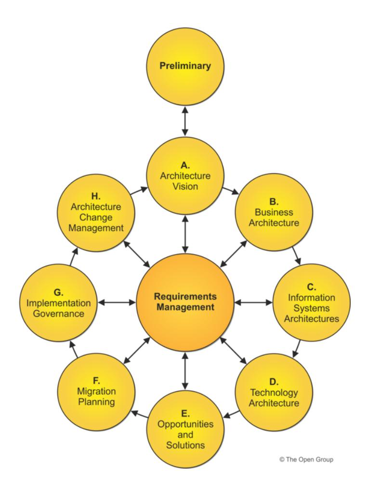

Figure 2.1: TOGAFArchitecture Development Method (ADM) cycle [\[7](#page-61-7)]

in figure [2.1](#page-24-0) [[7\]](#page-61-7). According to The Open Group, the different phases of the ADM correspond to modeling different aspects of the enterprise. The "Business Architecture", "Information Systems Architectures", and "Technology Architecture", are (as the name suggests) concerned with modeling the business, information systems and technology infrastructure of the enterprise, respectively. The other phases are related to modeling the motivation and strategy of the enterprise ("Preliminary", "Architecture Vision", "Requirement Management"), or modeling the implementation and migration of the EA ("Opportunities and Solutions", "Migration planning", "Implementation Governance", and "Architecture Change Management") [[1\]](#page-61-1).

The TOGAF standard defines the scope of an architecture in terms of time period, depth (level of details), breadth (included processes), and architectural domains. According to TOGAF an EA should include the business, data, application, and technology domains [\[7](#page-61-7)].

### **2.2.2 ArchiMate**

ArchiMate is an EA modeling language that is introduced by The Open Group. There are many enterprise architecture modeling tools that supports the ArchiMate modeling language [[22,](#page-63-5) [23,](#page-63-6) [24](#page-63-7), [25\]](#page-63-8). ArchiMate specification describes it as [[1\]](#page-61-1)

*" A visual language with a set of default iconography for describing, analyzing, and communicating many concerns of Enterprise Architectures as they change over time "*

The ArchiMate framework consists of two dimensions, the layers and the aspects. ArchiMate defines a layer as *"an abstraction of the ArchiMate framework at which an enterprise can be modeled."*, while an "Aspect" is defined as a classification of elements using a set of characteristics that does not correspond to a specific layer. Figure [2.2](#page-25-1) shows the layers and aspects of the ArchiMate framework. The core framework consists of three layers, business, application and technology layers. While the full framework adds the Strategy and the Implementation layers [\[1](#page-61-1)].

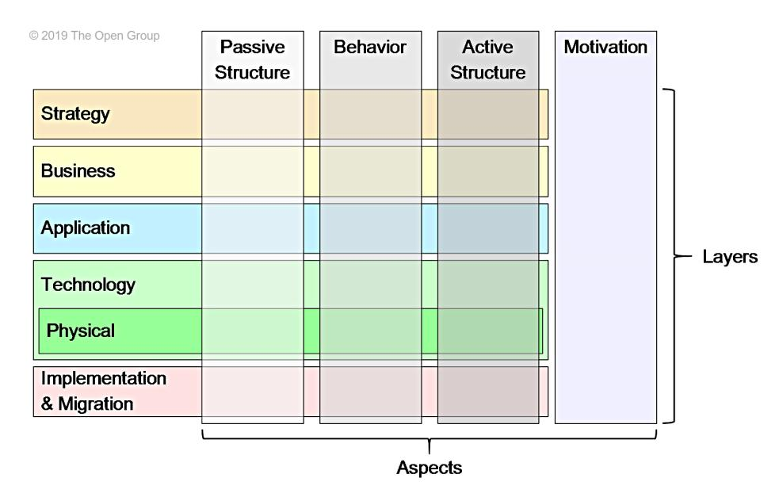

Figure 2.2: Layering and aspects of the ArchiMate Full Framework [[1\]](#page-61-1)

The core framework defines three aspects, and the full framework adds the motivation aspect. The aspects of the core framework includes the behavior aspect, this represents an action "verb" that can be performed by actors. The actors that do the behavior are the second aspect, called active structure aspect. The third aspect of the core framework is the passive structure aspect, which are the objects that a behavior can be executed on. Some elements in the ArchiMate language might not belong to a single aspect, these elements are called composite elements [\[1](#page-61-1)].

From the above, the framework can be seen as a set of cells that classify its elements. This allows creating multiple representations of the architecture from the perspectives of different stakeholders. These different representations of an EA are typically called viewpoints [\[1](#page-61-1)].

### **2.2.3 DoDAF**

The (US) Department of Defense Architecture Framework (DoDAF) is yet another framework that is developed by the DoD, as the name suggests, in the mid-2000s. It is considered to be an evolution of the Command, Control, Communications, Computers, and Intelligence Surveillance Reconnaissance (C4ISR) architecture framework [\[26](#page-63-9)] that the DoD has developed in the nineties as a successor for the TAFIM framework [\[27](#page-63-10)]. The DoD involvement in EA is influenced by the Cohen Act of 1996, which "recognizes the need for Federal Agencies to improve the way they select and manage IT resources and states" [[8\]](#page-62-0).

DoDAF can be seen as a collection of methods and best practices that guides the process of creating an architecture. This allows for a common understanding when sharing different architectural artifacts within the department [[8\]](#page-62-0).

DoDAF framework provides a 6-Step process to guide the architects in the process of creating an EA. DoDAF stresses that the architecture development process should be iterative, as additional requirements or knowledge may be gathered [\[8](#page-62-0)].

The 6-Step process, as shown in figure [2.3,](#page-27-1) consists of initial requirements and scoping phases. Then, followed by a typically repeated steps of determining architecture characteristics, assembling architectural data and objective analyses phases. Finally, the last step of the process is the result presentation phase [[8\]](#page-62-0).

DoDAF focuses on supporting decision makers, by providing them with the means to easily access important information for the underlying complex

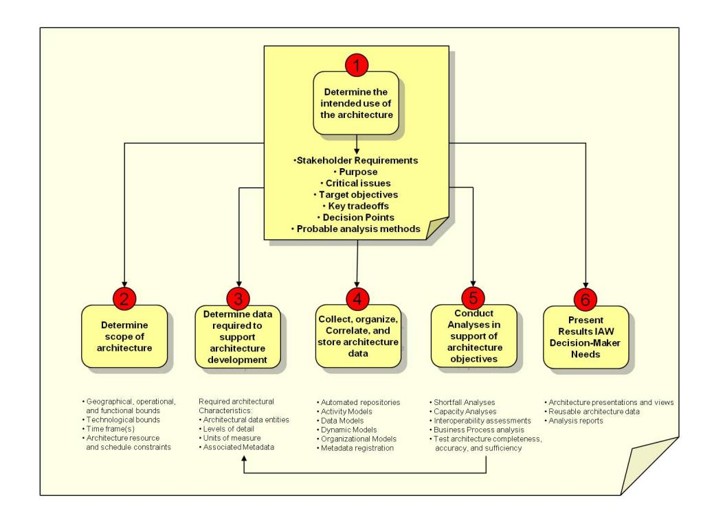

Figure 2.3: DoDAF 6-Step Architecture Development Process [[8\]](#page-62-0)

architecture. DoDAF aims to present the information in a way that is understandable for the different stakeholders. This is done by the use of viewpoints, which allows different parts of the organization to focus on a specific part of the architecture while keeping an eye on the whole picture [[8\]](#page-62-0). The DoDAF defines eight viewpoints that are shown in Figure [2.4](#page-28-0) [\[8](#page-62-0)].

### **2.2.4 IAF**

The Integrated Architecture Framework (IAF) was developed in 1993 by the consultancy company called Capgemini[∗](#page-27-2) . According to Wout et al. [[11\]](#page-62-3), the framework is based on the experience of their architects working of multiple projects for different clients. Additionally, they stated that the IAF is already used in thousands of projects and is adopted by companies and organizations outside Capgemini.

The IAF offers a set of processes to support the development of different types of business and technology architectures. In addition to that, it focuses on the architecture content by specifying the concepts that are to be used in

∗ Capgemini IT services and consulting company - <http://capgemini.com/>

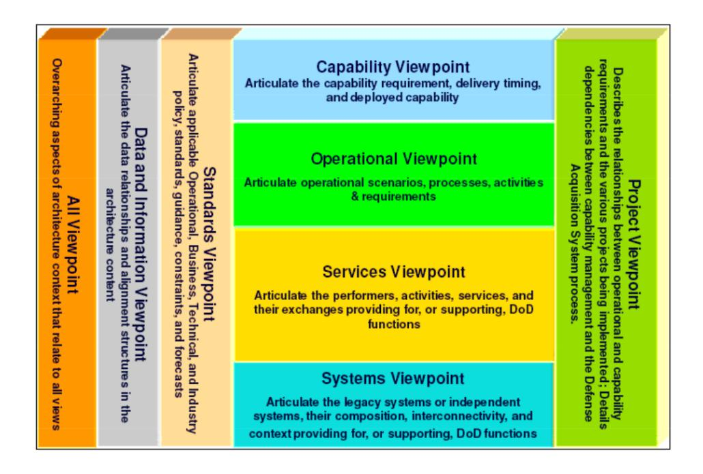

Figure 2.4: DoDAF Viewpoints [[8\]](#page-62-0)

architecture development [\[11](#page-62-3)].

Before IAF was developed, Capgemini applied what they call Architecture Development Method (ADM) - different from TOGAF ADM - for technology infrastructure architecture. The first version of IAF incorporated the ADM and on top of it included a methodology to support client-server applications architecture, Architecture Design for Distributed Information Systems (AD-DIS) [\[11](#page-62-3)].

The second version of IAF did not focus only on client-server architecture, and focused on information systems architecture in general. Additionally, the second version also introduced the contextual layer [[11\]](#page-62-3).

The third version of the IAF introduced a four layers architecture by formalizing the Business and Information architecture, in the IAF terms these layers are called aspect areas. The four aspect areas are business, information, information systems, and technology infrastructure. These four aspects are basically the same aspects that are in the current version of the IAF content [\[11](#page-62-3)]. Figure [2.5](#page-29-1) depicts the IAF content.

In addition to the four aspect areas, the IAF content framework includes four abstraction levels. The abstractions levels follows the questions 'why?, what?, how?, and with what?'. As can be seen from figure [2.5](#page-29-1), the abstraction

| 'Why'       |          |             |                        |                           |
|-------------|----------|-------------|------------------------|---------------------------|
| 'What'      | Business | Information | Information systems | Technology infrastructure |
| 'How'       |          |             |                        |                           |
| 'With what' |          |             |                        |                           |

Figure 2.5: IAF content framework [[11](#page-62-3)]

levels helps in splitting 'one problem' (an aspect area) into smaller ones that can be addressed separately [[11\]](#page-62-3).

According to Wout et al. [\[11](#page-62-3)], the IAF have an impact on the recent TOGAF releases. Capgemini used some ideas from the IAF into its contributions to TOGAF that started when they stated participating in the open group in 2008. TOGAF 9 has introduced a content framework, while previous versions mainly focused on the ADM[[28\]](#page-64-0). Since the IAF focuses on architecture content, the TOGAF content framework incorporated some of the elements from the IAF content framework [[11\]](#page-62-3).

## **2.3 Meta-Modeling**

In order to define the term meta-modeling, we look at the definition of a "model" and the "meta" prefix. According to the Object Management Group (OMG), a model can be defined as *" A formal specification of the function, structure and/or behavior of an application or system"* [[29\]](#page-64-1). The aim of using models is to help describe the system to the different stakeholders and to facilitate the communication between them [[30\]](#page-64-2).

Kühne [\[30](#page-64-2)] claims that adding the "meta" prefix indicates that an operation is performed twice. Consequently, a metamodel can be defined as "a model of models" [\[29](#page-64-1)], and meta-modeling is the process of creating a metamodel. Similarly, a meta-metamodel can be defined as a model of metamodels.

According to Kühne [\[30](#page-64-2)], a metamodel for model *M* should not model the

content of *M*, instead it should model the language that is used to model *M*. This conforms to the stricter OMG [\[31](#page-64-3)] definition of a metamodel as:

*" A metamodel is a model that defines a modeling language and is also expressed using a modeling language. "*

In the field of enterprise architecture, modeling is considered to be a focus of many EAFs, while some other frameworks focus on the process of creating and managing an EA [\[6](#page-61-6)]. An EAF defines a metamodel in order to define a structure for the architectural artifacts and ensure consistency when using them to develop an EA [\[7](#page-61-7), [8](#page-62-0), [11](#page-62-3)]. Additionally, it allows architecture tools vendors to create an easier to use tools by adding consistency and interoperability to the tools they create [[28\]](#page-64-0).

The metamodel of an EAF is defined by defining the allowed content in an architectural model. The content consists of the entity types (architectural elements), element attributes and the relationships between the different elements [[6](#page-61-6), [1,](#page-61-1) [7](#page-61-7), [8,](#page-62-0) [11](#page-62-3)]. Some frameworks even define the graphical representation of it content, e.g. ArchiMate [[1,](#page-61-1) [32](#page-64-4)], while others only define the allowed entities and the relations textually [[7](#page-61-7), [8](#page-62-0), [11](#page-62-3)].

Most EAFs doesn't provide a meta-metamodel [[1,](#page-61-1) [7](#page-61-7), [8](#page-62-0)], however, Atkinson et al. [[32\]](#page-64-4) claims that using meta-metamodel (deep modeling) can improve an EAF by making its metamodel easier to understand and use. Additionally, they show that, for ArchiMate, even though there is no explicit meta-metamodel defined with the standard, it can be noticed that the ArchiMate metamodel is actually defined following a meta-metamodel. In their study, they also use the term "Multilevel model" to refer to the deep metamodel. A multilevel model is a metamodel that supports representing multiple classification levels in a single model and allow for deep instantiation [[33\]](#page-64-5).

## **2.4 Related work**

In this section, we look into some of the existing literature that is related to this study. We focus on the literature about the EAFs and, specifically on previous Systematic Literature Reviews (SLRs) about EA and EAFs, in addition to literature about metamodeling in EA.

Hadaya et al. [[34\]](#page-64-6) proposed a methodology to evaluate EAFs that consists of 14 criteria. Their goal was to make it easier for EA practitioners to select the best framework that address their needs. In their study, they first performed a SLR on EAFs evaluation criterion. Findings from their SLR showed that previous EA literature does not define a comprehensive evaluation criteria for EAFs. The evaluation criteria they developed contains features like architecture layers taxonomy, architecture taxonomy aspect areas, metamodel completeness and complexity, development process, and others.

After the evaluation criteria is developed, they tested it with a set of six EAFs. For the purpose of this experiment, they selected EAFs that are cited often in EA literature and that the experiment participants had experience with. The six framework they used are the Zachman framework [[2\]](#page-61-2), The Open Group Architecture Framework (TOGAF) [[7\]](#page-61-7), Federal Enterprise Architecture Framework (FEAF) [\[9](#page-62-1)], (US) Department of Defense Architecture Framework (DoDAF) [[8\]](#page-62-0), Enterprise Architecture Planning (EAP) and The Enterprise Architecture IT Project. At the end of the experiment, the participants perceived most of the proposed criteria to be usable, relevant and correct [\[34](#page-64-6)].

Zhou et al. [\[35](#page-64-7)] performed a SLR on EA visualization methodology. In their study, more than a hundred paper have been included in the literature review. The result of their SLR showed that there is no comprehensive methodology for EA modeling in the selected studies. As part of their work, they also proposed a novel method for EA visualization that aims to address the shortcomings of the previous methods.

According to Zhou et al. [[35\]](#page-64-7), the most used EAFs in the selected studies were TOGAF and DoDAF with more than sixty studies using TOGAF and about twenty using DoDAF. Additionally, they also reported that ArchiMate was the most used modeling language, with more than forty papers using it.

Another SLR performed by Saint-Louis et al. [[14\]](#page-62-6) in order to investigate the deviations in EA definitions. Their study examined 145 definitions that have been collected from journal articles, and they concluded that there are considerable differences in the definitions.

Franke et al. [\[6](#page-61-6)] suggested a meta framework for EAF. This framework enables practitioners to examine if the content of a specific EAF satisfies their needs. They divided the content of EAFs into "architectural governance" and "EA modeling concepts". As part of the study, the content of multiple EAFs has been examined and the selected frameworks were classified using the proposed framework. The classification showed EAFs does not offer the same set of features and that different frameworks focus on different aspects of EA.

Additionally, Cameron et al. [[15\]](#page-62-7) investigated the usage and characteristics of various EAFs to provide a method for selecting the right EA for an organization. The study employed survey responses of 276 professionals working on their organization's EA to build a criterion for choosing the suitable EAF.

Another study that aims to help practitioners select the EAF that satisfies a specific criterion, is the study performed by Urbaczewski et al. [[36\]](#page-64-8). Five frameworks were included in this study, namely the Zachman framework, TOGAF, DoDAF, Federal Enterprise Architecture Framework (FEAF), and Treasury Enterprise Architecture Framework (TEAF). In their study, they provide guidelines for comparing EAFs based on the viewpoints and the aspects they support.

Atkinson et al. [\[32](#page-64-4)] on their paper suggested improving the ArchiMate modeling standard through the use of multilevel modeling. The study used deep modeling to describe ArchiMate and then discuss the potential improvements using the concepts of deep modeling in EA. They claimed that deep modeling can simplify the usage of the ArchiMate language and improve its expressiveness.

At KTH, many studies has been conducted in the field of EA. EA research at KTH has focused on the analysis of EA, specifically on assessing non-functional requirements such as quality [\[37](#page-65-0), [38\]](#page-65-1), modifiability (maintainability) [[39](#page-65-2), [40](#page-65-3)], and more [\[6](#page-61-6), [41](#page-65-4)].

### **2.5 Summary**

In this chapter, the relevant literature has been presented. The related work section showed the focus of the literature on helping practitioners navigate the jungle of EAFs by allowing them to choose the best-fit framework for their purpose. However, there is still a gap in analyzing the modeling elements of the EAFs, as the abovementioned studies only focused on the general content offered by the EAFs. In this study, we aim to analyze and classify the elements of the commonly used EAFs, and determine the core elements of EA modeling.

Additionally, the background and history of multiple EAFs has been presented as well. Since this study analyzes the architectural content of EA modeling, only the EAFs that have an available metamodel are considered.

## **Chapter 3**

## **Methodology**

This chapter provides an overview of the research methodology that is used in this research. Section [3.1](#page-33-1) describes the overall research process. In this study, a SLR was performed in order to find the most commonly used EA modeling frameworks. Section [3.2](#page-34-0) details the approach used to perform a SLR. Finally, Section [3.3](#page-38-1) focuses on the taxonomy development method that is used in this research in order to create a taxonomy of the elements that the different frameworks provide.

### **3.1 Research Process**

In order to answer the research question, the work on this study has been divided into 4 phases, as shown in figure [3.1.](#page-33-2)

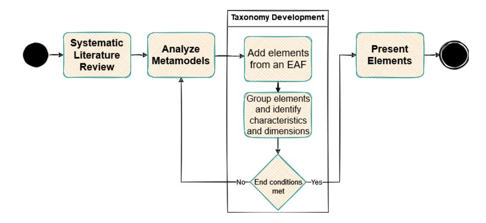

Figure 3.1: Research Process

The first step is to study the relevant literature about enterprise architecture in general, and the provided metamodels of the commonly used EAFs. In order to do so, a SLR has been conducted following the guidelines of Kitchenham et al. [[42](#page-65-5)]. The exact methodology for the SLR is described into more details in section [3.2](#page-34-0). The outcome of this step was a set of EA modeling frameworks that each of them provides a publicly available metamodel.

Secondly, the most commonly used EAFs were selected, and their metamodels were studied and analyzed in order to come up with a list of the entity types that are supported in the selected modeling frameworks.

After that, Nickerson et al. [[43\]](#page-65-6) was used to classify the elements into a taxonomy. The classification was based on the similarities between the different EAFs. Section [3.3](#page-38-1) describes the taxonomy development method which consists of multiple iterations to define characteristics group elements from the different EAFs.

Finally, the elements and the taxonomy were reported, presented and discussed.

## **3.2 Systematic Literature Review**

A SLR is *"a methodologically rigorous review of research results that aims to aggregate all existing evidence on a research question"* [[44\]](#page-65-7). In the evidencebased research paradigm, SLR is regarded as the primary synthesis method of existing research related to a specific topic [[44\]](#page-65-7). A SLR is considered to be a "secondary study" that examines all the "primary" studies relevant to the research question of the SLR[[42](#page-65-5)].

The evidence-based approach was initially started in medicine domain, and shortly after that, multiple other domains started adopting it [[45\]](#page-66-0), including software engineering. In 2004, Kitchenham et al. [[45\]](#page-66-0) suggested that software engineering should also join the evidence-based movement, Evidence-Based Software Engineering (EBSE).

There are multiple guidelines issued by different institutions on how to conduct a SLR in a specific domain [[45\]](#page-66-0). In this research, we followed the guidelines published by Kitchenham et al. [\[42](#page-65-5)] that focuses on, and widely used for SLR in the field of software engineering. Additionally, multiple SLR in the field of EA are using the methodology (e.g. [\[35](#page-64-7), [46](#page-66-1), [47\]](#page-66-2)) as the two fields have some common activities, such as modeling. The guidelines were followed in order to conduct a SLR that aims at identifying the EA modeling frameworks that are commonly used in research and that provide a public metamodel. Kitchenham et al. [[42\]](#page-65-5) divides the SLR into three phases, planning, conducting, and documenting the review.

### **3.2.1 Planning the review**

Planning the review, is concerned with defining and formulating the research question(s) and the review protocol [\[48\]](#page-66-3). The review protocol defines the methods of conducting the SLR, this includes defining search strategy, study selection procedure and quality assessment procedure among other steps. The planning phase should also include an initial step that confirms the need for the SLR [\[42](#page-65-5)].

This study defines two research questions in section [3.1,](#page-33-1) however the SLR is intended to address only the first research question. The aim of the research question is to assess the adoption of a technology, that is, the different EAFs.

Additionally, the research question structure is as follows:

• **Population:** Not restricted.

• **Intervention:** Specific EAF

• **Comparison:** Other methodologies or EAFs

• **Outcomes:** EAFs usage

### **3.2.2 Conducting the review**

While conducting the review, the following steps were followed as per Kitchenham et al. [\[42\]](#page-65-5) guidelines:

#### **Identification of Research**

In order to identify the primary studies related to this SLR, the following search strategy was defined. The electronic sources below were used to perform the search:

- ACM Digital library [dl.acm.org](http://dl.acm.org)
- Google Scholar [scholar.google.se](http://scholar.google.se)
- IEEExplore [ieeexplore.ieee.org](http://ieeexplore.ieee.org)
- ScienceDirect <www.sciencedirect.com>

#### • Springer Link [link.springer.com](http://link.springer.com)

Moreover, the following search terms were used to find relevant studies, "enterprise architecture management", "enterprise architecture framework", "enterprise architecture modeling", "enterprise architecture implementation", and "developing enterprise architecture".

Each of the above search term produced tens of thousands of results for each of the electronic sources. For each electric source, the results were sorted by relevance to the search term (an estimation of how much a specific document in the results is related to the search query [\[49](#page-66-4)]). After that, the top 20 papers were selected for the SLR. A total of 500 studies have been identified using the search strategy described above.

#### **Selecting primary studies**

In order to be able to select only the relevant studies from the results of the above search strategy, the following inclusion and exclusion criteria were defined:

- Inclusion criteria:
  - 1. Studies in English.
  - 2. Studies with full text available using KTH access.
  - 3. Research articles, conference proceedings, and book chapters.
  - 4. Studies with focus on EAFs.
  - 5. Studies aiming to apply concepts from, address limitations of, or critically evaluate an EAF.
- Exclusion criteria:
  - 1. Studies not in English.
  - 2. Secondary studies, i.e. excluding any SLR.

#### **Assessing the quality of the selected studies**

In addition to the inclusion and exclusion criteria, the following criteria were set to assess the quality of the selected studies.

- 1. Is the goal of the study stated and explained?
- 2. Is the context in which the study was performed described?

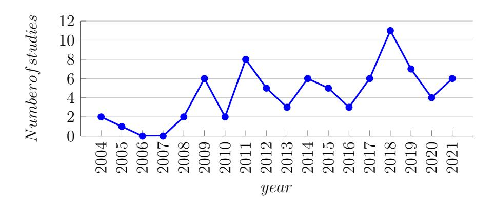

Figure 3.2: Number of studies performed by year

- 3. Is the choice of the selected EAF(s) motivated?
- 4. Is the direction for future work discussed?
- 5. Is the validity and reliability of the study discussed?

After applying the inclusion and exclusion criteria and ignoring duplicate studies, 78 studies has been included in the SLR. The selected studies were conducted between 2004 and 2021. Figure [3.2](#page-37-0) shows the number of selected studies by year. The figure shows an overall upward trend in the number of studies matching our search terms, which might reflect a general increase in EA research. The full list of studies that are included in the SLR is shown in Appendix [A](#page-69-0).

#### **Extracting data from the selected studies**

In order to be able to answer our research question, data about EAFs usage has been extracted from the primary studies. Table [3.1](#page-37-1) shows the data form that was used to record the data from the selected studies.

| Data item                        | Value |
|----------------------------------|-------|
| Study Identifier                 |       |
| Industry                         |       |
| Used EAFs                        |       |
| Have other EAFs been considered? |       |
| If yes, which ones?              |       |

Table 3.1: Data form

Table [3.1](#page-37-1) only shows what data points were collected from the studies. The collected data from the selected studies using the data form above is shown in Appendix [B](#page-74-0).

#### **Synthesizing the extracted data**

After collecting the data from the primary studies, the results have been summarized. The synthesized data is presented in chapter [4](#page-43-0).

### **3.2.3 Documenting the review**

The last phase described in the guidelines is concerned with documenting the review in a form of report and evaluating the report [\[42\]](#page-65-5). In this study, we slightly deviate from the report outline presented in the guidelines [[42\]](#page-65-5). The main difference is that the review questions chapter is moved into the introduction chapter ([1\)](#page-17-0) and the included studies were only listed in the Appendix [\(A\)](#page-69-0). This is mainly in order to incorporate the parts of the research questions that are not answered by the SLR. Finally, the evaluation of the report is left to be performed as part of the examination for master's degree theses (includes a peer review).

### **3.3 Taxonomy development**

Taxonomy development is the process of classifying or categorizing objects into different groups or taxonomies. Classification is considered to be a fundamental problem in a lot of disciplines. In this study, we want to classify the elements that are available in the selected EAF metamodels based on the similarities between those frameworks. An elements' taxonomy will help to determine what element types each framework offer. Additionally, it will be important when extracting common elements between the different frameworks, since the different frameworks provides elements on different abstraction levels.

There are multiple approaches that can be followed in order to generate a taxonomy, e.g. [[43,](#page-65-6) [50,](#page-66-5) [51](#page-66-6)]. In this study, Nickerson et al. [[43\]](#page-65-6) was followed to generate the taxonomy. It is a widely used methodology in information systems literature, with over 700 citations to date.

Nickerson et al. [\[43](#page-65-6)] method works by first defining a basis for the choosing characteristics, i.e. meta-characteristic and end conditions. It supports conceptual-to-empirical, empirical-to-conceptual, or a combination of both approaches. These approaches are typically used multiple times until the end conditions are met, and a different approach can be chosen in each iteration. The approach in each iteration is typically determined by assessing the availability of data versus the researchers' knowledge of the domain [\[43](#page-65-6)]. The taxonomy development method proposed by Nickerson et al. [\[43](#page-65-6)] is shown in the figure [3.3](#page-39-0).

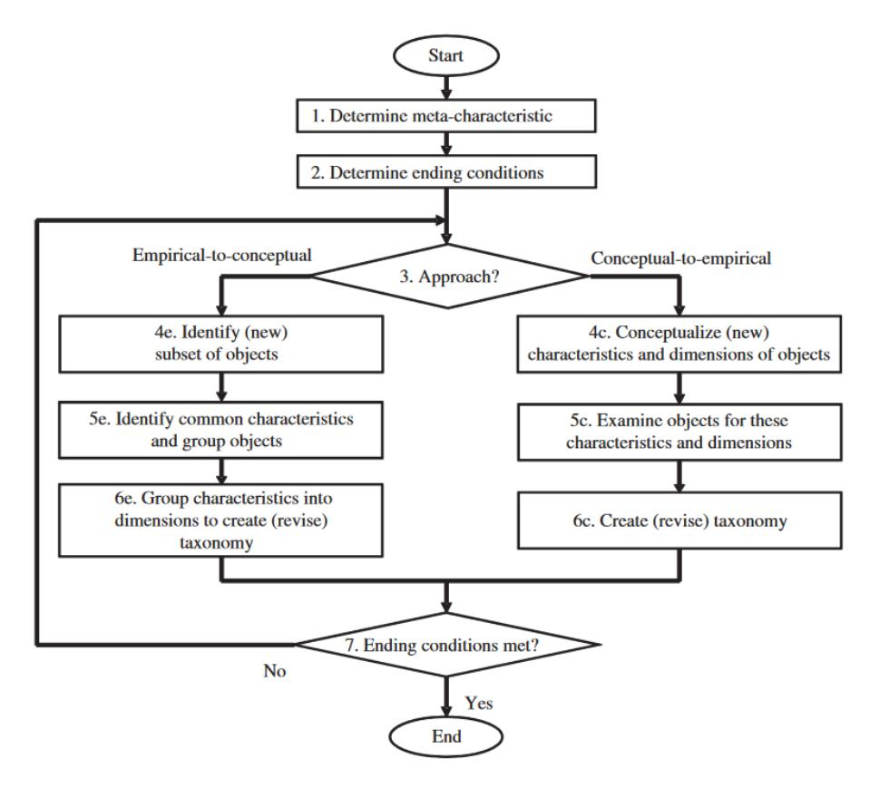

Figure 3.3: Nickerson et al. [[43](#page-65-6)] taxonomy development method

The following meta-characteristic is defined and used to generate the characteristics of the taxonomy, "Structural elements similarities between the different metamodels". This meta-characteristic is related to the goal of the second research questions defined in section [1.3.1](#page-19-0).

We based our ending condition on those defined by Nickerson et al. [[43\]](#page-65-6). In this study, the taxonomy development method will end when the following ending conditions have been met:

- All elements for the selected EAFs are examined.
- For all dimensions, each characteristic have at least one element classified under it.
- All dimensions and characteristics are unique.
- In the last iteration, no modification, additions or deletions has been made to the dimensions nor the characteristics.
- The taxonomy is comprehensive, extensible, and concise.

In this study, we followed the empirical-to-conceptual approach. The reason for that is the fact that we have the elements that each of the EAFs includes in its metamodel. In total, three iterations were performed using this approach. The first iteration included elements from two of the selected EAFs (TOGAF and ArchiMate), and each of the following iterations added elements from one additional EAF (DoDAF and IAF, in that order). The characteristics that resulted from these iterations are described and divided into dimensions in table [3.2](#page-41-0) below.

By classifying elements from the different EAFs using the dimensions shown in table [3.2](#page-41-0), we addressed the issue that the different frameworks have elements at different abstraction levels. This has helped in identifying the common elements between the different EAFs. Finally, a hierarchical structure for the common elements (including abstraction levels) was created and used to create a multilevel model for the common elements. Both the elements' hierarchical structure and the multilevel model are shown in section [4.2](#page-44-0) of the results.

| Iteration | Dimension | Characteristics                                                         |
|-----------|-----------|-------------------------------------------------------------------------|
|           |           | The element describes or used by a business activity                    |
|           |           | (Business).                                                             |
|           |           | The element describes data that is owned or used by                     |
|           |           | the organization (Data).                                                |
|           | Layer     | The element describes or used by the organization's                     |
|           |           | information systems (Application).                                      |
|           |           | The element describes or used by the organization's                     |
|           |           | infrastructure (Technology).                                            |
| 1         |           | The element can describe or be used by an orga                          |
|           |           | nization business activity, information systems, or      |
|           |           | infrastructure (Generic).                                               |
|           |           | The element is a behavior that is performed within, or                  |
|           |           | in relation to the organization (Behavior)                              |
|           | Behavior  | The element is something that belongs, or related to                    |
|           |           | the organization (Resource).                                            |
|           |           | The element is the reason for a business, or architec                   |
|           |           | tural decision within the organization (Motivation).                    |
|           |           | The element refers to a work or action that can be done                 |
|           |           | in relation to the organization (Activity).                             |
|           |           | The element describes an ability to perform an action                   |
|           |           | (Ability).                                                              |
|           |           | The element refers to something has happened or can                     |
|           |           | happen (Event).                                                         |
| 2         | Behavior* | The element refers to someone or something that can                     |
|           |           | perform an action (Performer).                                          |
|           |           | The element refers to something that is used or |
|           |           | produced by an action (Object).                                         |
|           |           | The element describes a desired result of performing                    |
|           |           | an action (Desired Result).                                             |
|           |           | The element provides guidance on why or how an                          |
|           |           | action should be performed (Guidance).                                  |
|           |           | The element describes the reason or the context of an                   |
|           |           | architectural or business decision (Why).                               |
|           |           | The element describes a concept or a requirement                        |
|           |           | (What).                                                                 |
| 3         | W3H       | The element describes a logical structure that fulfills                 |
|           |           | a requirement (How).                                                    |
|           |           | The element is a real life physical element (With                       |
|           |           | What).                                                                  |

\* In the second iteration, the behavior dimension has been changed to include more granular characteristics.

Table 3.2: Taxonomy characteristics in the different iterations

## **Chapter 4**

## **Results and Analysis**

In this chapter, we present the results and discuss them. The results are divided into two sections, each section dedicated to the results related to one of our research questions.

## **4.1 Most used EA modeling frameworks**

As shown in chapter [3](#page-33-0), in order to find the most used EA frameworks in scientific research, a SLR was performed and required data was collected from the relevant studies using the data form shown in table [3.1.](#page-37-1) After synthesizing the collected data (Appendix [B,](#page-74-0) the result showed that the most used EAF is TOGAF with 40 study using it. The second most used EAF is ArchiMate with 37 studies. Table [4.1](#page-44-1) show the top 10 used EAFs in the selected studies using the EAF.

After identifying the most used EAFs in the selected studies, each framework is then analyzed in order to identify which EAFs focuses on EA modeling. The material that is used in the analysis includes the different EAFs specifications [[1,](#page-61-1) [7,](#page-61-7) [8,](#page-62-0) [11](#page-62-3), [9](#page-62-1), [52](#page-67-0), [10](#page-62-2)].

The Zachman framework, and Gartner Framework are considered proprietary frameworks [\[34](#page-64-6)] so they were not included in the analysis. Additionally, TEAF was also be excluded as it doesn't have any specification available at the time of this study, even though previous research has cited a specification from the U.S. Department of the Treasury website[∗](#page-43-2) .

On the other hand, Generalised Enterprise Reference Architecture and Methodology (GERAM) (released as ISO15704) provides a set of requirements that other EAFs should meet. Thus, the framework is actually

∗ https://www.treasury.gov/cio

| EAF       | Number of studies |
|-----------|-------------------|
| TOGAF     | 40                |
| ArchiMate | 37                |
| Zachman   | 22                |
| DoDAF     | 15                |
| FEAF      | 12                |
| IAF       | 4                 |
| Gartner   | 3                 |
| MODAF     | 3                 |
| TEAF      | 2                 |
| GERAM     | 2                 |

Table 4.1: Most used EAFs in the selected studies

considered to be a meta-framework, and is intended to aid the development of EAFs [\[52](#page-67-0), [53\]](#page-67-1). Moreover, many studies have analyzed and mapped existing EAFs to GERAM, such as [[54](#page-67-2), [55](#page-67-3), [56](#page-67-4), [57](#page-67-5), [58](#page-68-0), [59](#page-68-1)].

The following list shows the identified EA modeling frameworks that are used the most in the studies included in the SLR:

- 1. TOGAF
- 2. ArchiMate
- 3. DoDAF
- 4. FEAF
- 5. IAF
- 6. The (British) Ministry of Defence Architecture Framework (MODAF)

Even though the FEAF is included in the list above, as it focuses on EA modeling, it doesn't provide a metamodel for the architectural content. The framework instead provides a set of reference models.

## **4.2 Elements Taxonomy and Common Elements**

As mentioned in chapter [3,](#page-33-0) the elements from TOGAF, ArchiMate, DoDAF, and IAF are used to create a taxonomy of elements. The taxonomy is created in three iterations, and has the three dimensions, "Layer", "Behavior", and "W3H".

The "Layer" dimension classifying items into business, data, application, technology and generic elements. On the other hand, the "Behavior" dimension classifying items into behavior (ability, event, activity), resource (performer, object), and motivation (guidance, desired result) elements. Similarly, the "W3H" dimension classifies elements into contextual (Why), conceptual (What), logical (How), and physical elements (With What). Figure [4.1](#page-45-0) provides a visual representation for the created taxonomy.

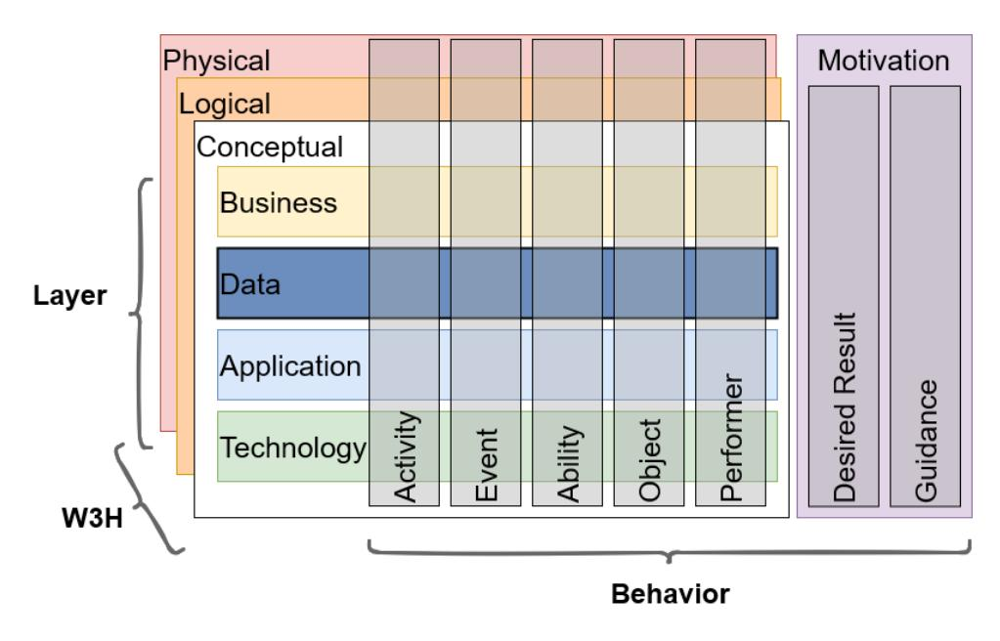

Figure 4.1: Taxonomy dimensions

Table [4.2](#page-46-0) shows the final result of the created taxonomy for the common elements in the different frameworks. Each column in the table represents a characteristic of the taxonomy, and the characteristics are grouped by the dimensions mentioned above. An element (row) can be classified in one and only one of the characteristics of each dimension (marked with an *x*). The final taxonomy result shows that within the common elements of the four EAFs, most elements focus on describing the business aspects, activities, and concepts when looking at the "Layer", "Behavior", and "W3H" dimensions respectively. The classification of the elements during the different iterations of the taxonomy development is available in Appendix [C.](#page-77-0)

|                     | Layer |   |   |   | Behavior |    |    |   |   |   | W3H |   |    |    |   |   |
|---------------------|-------|---|---|---|----------|----|----|---|---|---|-----|---|----|----|---|---|
| Element             | B     | D | A | T | G        | Ab | Ac | E | O | P | DR  | G | Ct | Cp | L | P |
| Role                | x     |   |   |   |          |    |    |   |   | x |     |   |    | x  |   |   |
| Actor               | x     |   |   |   |          |    |    |   |   | x |     |   |    |    |   | x |
| Data                |       | x |   |   |          |    |    |   | x |   |     |   |    | x  |   |   |
| Business Object     | x     |   |   |   |          |    |    |   | x |   |     |   |    | x  |   |   |
| Business Service    | x     |   |   |   |          |    | x  |   |   |   |     |   |    | x  |   |   |
| Application Ser  |       |   | x |   |          |    | x  |   |   |   |     |   |    | x  |   |   |
| vice                |       |   |   |   |          |    |    |   |   |   |     |   |    |    |   |   |
| Technology Ser   |       |   |   | x |          |    | x  |   |   |   |     |   |    | x  |   |   |
| vice                |       |   |   |   |          |    |    |   |   |   |     |   |    |    |   |   |
| Business Event      | x     |   |   |   |          |    |    | x |   |   |     |   |    | x  |   |   |
| Goal                |       |   |   |   | x        |    |    |   |   |   | x   |   | x  |    |   |   |
| Objective           |       |   |   |   | x        |    |    |   |   |   | x   |   | x  |    |   |   |
| Organization Unit   | x     |   |   |   |          |    |    |   |   | x |     |   |    |    |   | x |
| Physical Applica    |       |   | x |   |          |    |    |   |   | x |     |   |    |    |   | x |
| tion Component      |       |   |   |   |          |    |    |   |   |   |     |   |    |    |   |   |
| Physical Technol    |       |   |   | x |          |    |    |   |   | x |     |   |    |    |   | x |
| ogy Component       |       |   |   |   |          |    |    |   |   |   |     |   |    |    |   |   |
| Contract            | x     |   |   |   |          |    |    |   | x |   |     |   |    | x  |   |   |
| Business Process    | x     |   |   |   |          |    | x  |   |   |   |     |   |    | x  |   |   |
| Logical Business | x     |   |   |   |          |    | x  |   |   |   |     |   |    |    | x |   |
| Component           |       |   |   |   |          |    |    |   |   |   |     |   |    |    |   |   |
| Logical Applica  |       |   | x |   |          |    | x  |   |   |   |     |   |    |    | x |   |
| tion Component      |       |   |   |   |          |    |    |   |   |   |     |   |    |    |   |   |
| Logical Technol  |       |   |   | x |          |    | x  |   |   |   |     |   |    |    | x |   |
| ogy Component       |       |   |   |   |          |    |    |   |   |   |     |   |    |    |   |   |
| Principle           |       |   |   |   | x        |    |    |   |   |   |     | x | x  |    |   |   |
| Requirement         |       |   |   |   | x        |    |    |   |   |   |     | x | x  |    |   |   |
| Constraint          |       |   |   |   | x        |    |    |   |   |   |     | x | x  |    |   |   |
| Course of Action    | x     |   |   |   |          |    | x  |   |   |   |     |   |    | x  |   |   |
| Capability          | x     |   |   |   |          | x  |    |   |   |   |     |   |    | x  |   |   |
| Project             |       |   |   |   | x        |    | x  |   |   |   |     |   |    | x  |   |   |

**Layer**: B Business, D Data, A Application, T Technology, G Generic.

**Behavior**: Ab Ability, Ac Activity, E Event, O Object, P Performer, DR Desired Result, G Guidance.

**W3H**: Ct Contextual, Cp Conceptual, L Logical, P Physical.

Table 4.2: Classification of the common elements

As mentioned in section [3.3](#page-38-1), the taxonomy above provided a common abstraction for the different frameworks. After the taxonomy was created, the closest concepts (elements) in the different frameworks were grouped together to find the common elements that are shown in table [4.2](#page-46-0).

Tables [4.3](#page-47-0) provides some examples for mapping the closest concepts in the different EAFs. The table shows that even though some concepts are not explicitly available in a framework, some more granular elements fall under it. For example, TOGAF doesn't explicitly define an abstract "Performer" element, but as the taxonomy above shows, there are multiple elements available in TOGAF that can be classified as "Performers". The same thing can be noticed in TOGAF again with the "Business Object" element, there is no "Business Object" defined, but both the "Contract" and "Product" elements falls under "Business Object" definition.

On the other hand, DoDAF uses the same term to describe both physical and logical application components, while other frameworks provide separate elements. Similarly, IAF uses the term "Business Service" to describe both externally exposed business service and internal business processes.

| Concept                    | TOGAF       | ArchiMate   | DoDAF       | IAF            |
|----------------------------|-------------|-------------|-------------|----------------|
| Business                   | Business    | Business    | Service     | Business       |
| Service                    | Service     | Service     |             | Service        |
| Business                   | Process     | Business    | Process     | Business       |
| Process                    |             | Process     |             | Service        |
| Logical                    | Logical     | Application | System      | Logical IS  |
| Application                | Application | Function    |             | Component      |
| Component                  | Component   |             |             |                |
| Physical                   | Physical    | Application | System      | Physical IS |
| Application Application |             | Component   |             | Component      |
| Component                  | Component   |             |             |                |
| Performer                  | ***         | Active      | Performer   | ***            |
|                            |             | Structure   |             |                |
| Business                   | ***         | Business    | Information | Business       |
| Object                     |             | Object      |             | Object         |
| Driver                     | Driver      |             | N/A         | Business       |
|                            |             |             |             | Driver         |

N/A Concept not available in the EAF.

Table 4.3: An Extract from mapping the closest concepts in TOGAF, ArchiMate, DoDAF and IAF

\*\*\* Concept not explicitly available, but multiple elements fall under it.

Figure [4.2](#page-48-0) shows the hierarchical structure of the common elements identified. At the top elements are divided into Behavior, Resource and Motivation elements, i.e. using the Behavior dimension. Then elements are divided into different layers, Business, Data, Application, and Technology layers.

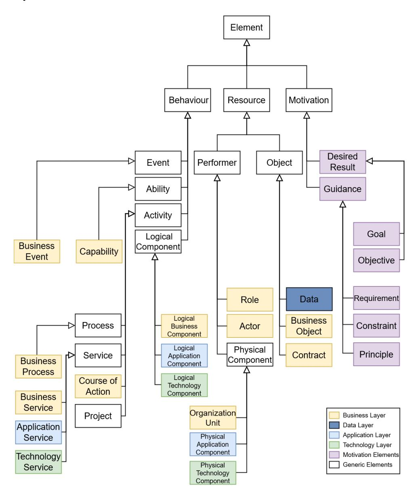

Figure 4.2: Structure of common Elements

When creating the multilevel model for the common elements, we use the hierarchical structure of the element shown in figure [4.2](#page-48-0) to assign elements to their corresponding level. Elements at the lowest level are assigned to *M*2 [∗](#page-49-1) and with each level we increase the model level until we reach *M*6 for the top abstract element "Element". Figure [4.3](#page-49-0) shows the multilevel model for the generic common elements. On the other hand, figure [4.4](#page-50-0) shows the rest of the multilevel, which includes the elements from the different layers. In both figures, the relationships between the elements were derived from those defined by TOGAF, ArchiMate, and DoDAF metamodels.

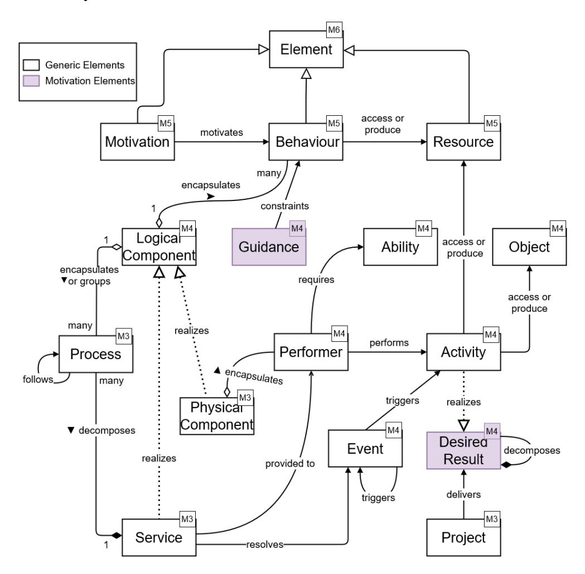

Figure 4.3: Multilevel model for generic common elements, M3-M6

∗ *M*0 and *M*1 has not been assigned to any of the elements, since they typically refer to the real-world user objects and the elements of a specific EA model, respectively.

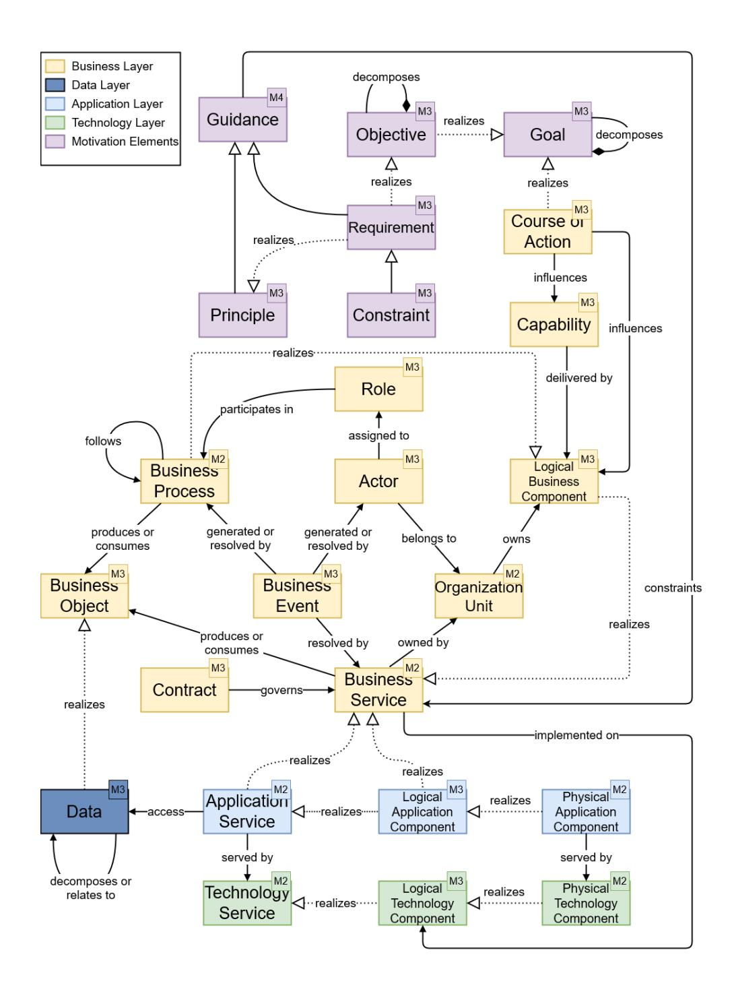

Figure 4.4: Multilevel model for layered common elements, M2-M4

## **Chapter 5**

## **Discussion**

In this chapter, we discuss the results presented in chapter [4](#page-43-0) and how they are connected to previous work. We start by discussing the findings of our research questions and the implications of those findings. We then follow by discussing the limitations of our work, threats to validity, and what future work can be done in relation to this study in section [5.1,](#page-55-0) section [5.2,](#page-55-1) and section [5.3](#page-56-0) respectively.

The first research question of this study aims at identifying the most used EA modeling frameworks in the relevant literature. In order to answer that question, a SLR was performed as detailed in secion [3.2.](#page-34-0) The result of our SLR showed that in the selected studies, the most used EA modeling frameworks are TOGAF, ArchiMate, DoDAF, FEAF, IAF, and MODAF, in that order.

Our findings support the claims of previous studies [\[15](#page-62-7), [60,](#page-68-2) [21\]](#page-63-4) that TOGAF is the most used EAF and that it is considered the go-to EAF. The results showed that both TOGAF and ArchiMate are significantly more used than the other EAFs. More than half the studies included in the SLR used TOGAF and almost half of them used ArchiMate as shown in table [4.1](#page-44-1). Additionally, Appendix [B](#page-74-0) shows that about 20% of the studies used both EAFs combined.

When looking at previous studies that classify EAFs into modeling and non-modeling frameworks [\[6](#page-61-6), [61](#page-68-3), [60](#page-68-2)], we can see that their findings supports the result shown above to a high degree. However, all the studies we found didn't consider IAF in the list of EAFs that were classified. This might be because IAF, compared to the others, has not been used as much in the literature as per our SLR findings. Additionally, studies performed before 2011 didn't consider TOGAF to support architectural modeling, as previous versions of it didn't include the content metamodel that was added in 2011.

The goal of the second research question is to identify common architectural elements in EA modeling frameworks. In order to do this, we first had to identify EAFs with a publicly available metamodel that describes the available elements to include in an EA. This resulted in the following list, TOGAF, ArchiMate, DoDAF, IAF, and MODAF. Only FEAF has been excluded from our list of top used EA modeling frameworks that has resulted from the first research question. The reason for that is that FEAF only focuses on reference models and does not provide a metamodel as mentioned in the results above. Additionally, MODAF was also not included when analyzing the common elements, this is mainly due to time limitation as it is, compared to the others, the least used EAF as the SLR showed. Add to that, the fact that MODAF has been withdrawn at the beginning of 2021 and replaced with the NATO Architecture Framework (NAF) [[10\]](#page-62-2).

Accordingly, TOGAF, ArchiMate, DoDAF, IAF has been examined to identify the common element and the first step into that direction was to create an elements' taxonomy as shown in section [3.3.](#page-38-1) The created taxonomy consists of the three dimensions that are shown in figure [4.1](#page-45-0) (Layer, Behavior, W3H). It can be seen that there is a similarity between our taxonomy dimensions cube and the ArchiMate layers shown in [2.2](#page-25-1) as well as the IAF content framework abstraction levels shown in figure [2.5](#page-29-1). The reason for this is that our taxonomy is developed such that it detects the similarities between the different frameworks, the meta-characteristic of our taxonomy.

The "Layer" dimension is influenced by TOGAF, IAF, and Archimate since DoDAF doesn't provide a classification for the elements into different layers like the other EAFs does. The dimension includes business, application, and technology layers which are available in all the three EAFs as well as the data layer which is included in both TOGAF and IAF. Similarly, the "Behavior" dimension is influenced by the aspect areas of ArchiMate, also shown in figure [2.2,](#page-25-1) and the elements from DoDAF. Our dimension have more granular characteristics than the ArchiMate aspect areas, mainly thanks to the high level abstract elements available in DoDAF; such as "Activity" and "Desired Result" which group multiple concepts together. The last dimension is what we call "W3H" which is derived from how IAF, and to some extent TOGAF, group their elements into conceptual, logical, physical, and contextual elements.

The answer to our second research question, i.e. the list of common elements, can be found in table [4.2](#page-46-0). Our results show that the four abovementioned EAF share a total of 24 elements in addition to 13 abstract elements, as shown in figure [4.2](#page-48-0). During the study, we noticed that TOGAF has the lowest number of elements defined in its content metamodel when compared to the other three EAFs. TOGAF content metamodel only defines a total of 38 elements, while ArchiMate defines 59 elements, IAF and DoDAF has more than 80 elements defined.

Additionally, our findings shows that business architecture has more elements in common between the different frameworks as shown in figure [4.4](#page-50-0). This can be traced back to TOGAF and IAF; since DoDAF does not provide an elements' layers taxonomy, and ArchiMate have a relatively close number of elements in business, application and technology layers

Moreover, during the study, we noticed the ambiguity of the different terms in EAs modeling as different terms in the different EAF sometimes refers to the same concept as shown in table [4.3](#page-47-0). In section [4.2](#page-44-0) we also showed how IAF uses the term "Business Service" to describe both internal processes and externally provided services. According to IAF, the business service element can be used on different levels of details depending on the goal of the architecture [\[11](#page-62-3)]. This adds to the findings of previous studies that showed the deviations in both the definition of EA [\[14](#page-62-6)] and what is considered an EAF [[6\]](#page-61-6).

As one of the outcomes of this research, we aimed to create levels of metamodels that represents the common elements in the EA modeling notations. However, we believe that the term multilevel model describes what we want to achieve more, as it allows representing multiple levels of classification. Additionally, when compared to conventional meta-modeling, multilevel modeling can produce representations that are both simpler and more accurate [[33\]](#page-64-5).

In figure [4.3](#page-49-0) and figure [4.4](#page-50-0) of the results, we show how the common elements can be used to create a multilevel model. This should be considered as the multilevel model of the core EA modeling elements. We believe that, for the different domains (or even organizations), the multilevel model can (or even should) be extended by adding Domain-Specific Elements (DSEs).

Figure [5.1](#page-54-0), show how our multilevel model can be extended and used in the manufacturing domain. The figure shows a multilevel model with elements from *M*1 to *M*4 and uses elements and sample architecture model from the ArchiMate specifications [\[1](#page-61-1)]. The *M*1 level describes a manufacturing plant with an "Assembly Line" that uses some materials to produce "Vehicle Telematics Appliance". The product is then transported from the manufacturing plant to either the national or local distribution centers.

Finally, to the best of our knowledge, this is the first attempt to identify a common EA modeling elements, as there is no previous work has been found.

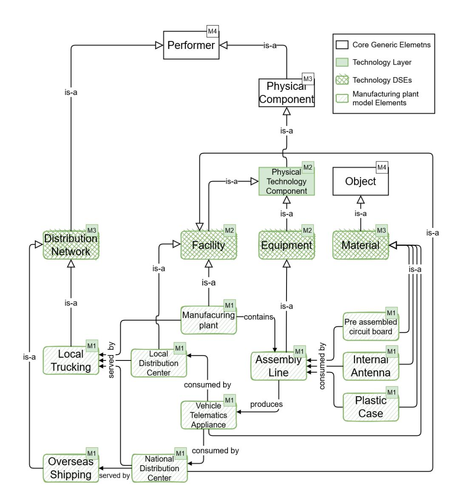

Figure 5.1: Model extension with manufacturing DSEs and a sample model, M1-M4

However, previous studies [[6,](#page-61-6) [61](#page-68-3), [60\]](#page-68-2) provided a classification for EAFs based on what aspects of EA an EAF focus on. Additionally, previous work [[34,](#page-64-6) [15](#page-62-7), [36\]](#page-64-8) has also tried to help organizations to select the EAF that best suites their needs by defining evaluation criteria for EAFs. Our work goes one step deeper into EAFs and provides a taxonomy for the elements that are defined in the different EAFs. Using the created taxonomy, organizations will also be able to see what different elements types are available in the different EAFs as this might also be helpful when trying to select an EAF to model their EA.

## **5.1 Limitations**

In this section, we discuss the limitations of our work. First, in this study, we focused only on analyzing the common elements used in EA modeling. Even though we tried to describe these elements in a multilevel model, the relationships used in the model were not extracted using the same method we used to extract the elements.

Additionally, as mentioned in the discussion, MODAF was not included when developing the taxonomy and analyzing the common elements. This was mainly due to time limitations. Including the elements MODAF might result in the generation of more dimensions in the taxonomy, or identifying more abstract elements. Moreover, to ensure that no additional dimensions are added to the taxonomy in the last iteration, more iterations were needed, i.e. more frameworks and more time.

Finally, it would have been beneficial if the opinions of enterprise architects has been included and considered during this study. That would help to define the common elements from the end users points of view.

## **5.2 Threats to Validity**

In this section, we discuss the internal and external validity of our work. The methodology followed in this research utilize the SLR approach with a predefined search protocol that is used to find and select the EAFs to analyze. The predefined protocol minimizes the selection bias, which can be a threat to both internal and external validity of the study.

However, as described in [3.2,](#page-34-0) there were numerous studies included in the results of each of the used search terms, and only few of them were selected using the relevance score that each digital source assigns to each study. This can threaten the internal validity of our work, as different digital sources might have different algorithms (that are susceptible to change) to assess the relevance of the studies.

Moreover, even though the created taxonomy (figure [4.1](#page-45-0)), multilevel model (figure [4.4\)](#page-50-0), and the elements structure (figure [4.2](#page-48-0)) accurately describe the chosen EAFs, it may not generalize to other modeling frameworks. This is mainly because of the small sample of EAFs used to generate these artifacts, only four EAFs has been used.

### **5.3 Future work**

As the next step of this research, the relationships between the elements should be analyzed similarly to what we did for the elements to identify the common relationships. Additionally, some EAFs define the attributes of the different elements in its content metamodel, e.g. TOGAF and DoDAF. Identifying the common attributes of the different elements using a similar methodology will mean that a full metamodel can be created with all the common elements, their attributes and the possible relationships between the different elements.

Additionally, only the literature and the specification of the different EAFs under study were used to answer the research questions. Therefore, we recommend adding an expert point of view to the analysis of the different EA modeling notations. This can be done through interviews or surveys with enterprise architects with actual experience creating and modeling EA. This can help identify which concepts are actually used in the industry, as there may be some elements that are not used, or elements that do not exist in the selected EAFs.

## **5.4 Sustainability and Ethics**

In this section, we discuss the sustainability and ethical consequences of our work. During the study, all the data that is used to generate the taxonomy and the multilevel metamodel was data that is published along with the specification of the EAFs that we used. The specifications of TOGAF, ArchiMate and DoDAF are publicly available, while that of IAF was accessible through KTH library.

Additionally, the results of our study extracted the elements that are common for EA modeling, this means that EA models created using these should be reusable between the different enterprises. Moreover, we showed how the different domains can extend our multilevel metamodel to include DSEs as shown in figure [5.1.](#page-54-0) This in turn can make the metamodel domain-specific extensions reusable and exchangeable between both EAFs and different enterprises. Therefore, we believe that the findings of our study to contribute to make both EA models and DSEs extensions more sustainable.

Finally, we can not see any direct sustainability nor ethical concerns to our work. However, we believe that the findings of this work can contribute to more efficient EA modeling for the enterprises and hence better alignment with its business strategy. This in itself is of course not a concern, but since some enterprises might disregard social and ethical aspects of their offering, it can lead to a misuse of our findings.

## **Chapter 6**

## **Conclusions**

In this study, we performed an analysis of the top most used EAFs in the EA literature and extracted the core elements of EA modeling. The main goal of the study was to distill common elements of EA modeling, but to do that we needed to identify the most used EA modeling frameworks. Our results showed that, TOGAF, ArchiMate, DoDAF, and IAF are the most used modeling frameworks in the field of EA.

Secondly, a taxonomy of elements was created as part of the study using elements from the frameworks above. The created taxonomy helped in identifying what concepts are available in the different EAFs. Then, we managed to identify the common elements that are available in the different EAFs mentioned above. Finally, the common elements are presented in both hierarchical structure and in a multilevel model that shows how the different elements can interact with each other. Also, we showed how our model can be extended to support the needs of different domains.

We believe that the findings of this research will be interesting for EA researchers and practitioners working on developing and maintaining EA modeling frameworks. The existing EA modeling framework might use the list of common elements identified in this study as their core elements, while moving the rest of the elements they defined to different extensions for DSEs.

Additionally, the taxonomy of elements created as part of this study can be used to identify what element types are provided by the different EA modeling frameworks. This can increase the ability for EA practitioners to identify the EA modeling framework that match their needs.

Moreover, in this work we highlighted the core elements as well as how they can relate to each other. This can make it easier for the end-users to pick the appropriate elements for their use cases, as it reduce the clutter caused be all the unrelated DSEs. Also, this can be used by EA modeling tools developers to improve their tools and only suggest elements that are relevant to the end-user.

## **References**

- [1] The Open Group. *Archimate ® 3.1 Specification*. The Open Group series. Van Haren Publishing, 2019. ISBN: 1-947754-30-0. URL: <https://publications.opengroup.org/c197>.
- [2] J. A. Zachman. "A framework for information systems architecture." In: *IBM Systems Journal* 26.3 (1987), pp. 276–292. DOI: [10.1147/sj.](https://doi.org/10.1147/sj.263.0276) [263.0276](https://doi.org/10.1147/sj.263.0276).
- [3] Hanifa Shah and Mohamed Kourdi. "Frameworks for Enterprise Architecture." In: *IT Professional* 9 (Oct. 2007), pp. 36–41. DOI: [10.](https://doi.org/10.1109/MITP.2007.86) [1109/MITP.2007.86](https://doi.org/10.1109/MITP.2007.86).
- [4] Svyatoslav Kotusev. "The History of Enterprise Architecture: An Evidence-Based Review." In: *Journal of Enterprise Architecture* 12 (Apr. 2016), pp. 29–37. URL: [http : / / kotusev . com / The %](http://kotusev.com/The%20History%20of%20Enterprise%20Architecture%20-%20An%20Evidence-Based%20Review.pdf) [20History%20of%20Enterprise%20Architecture%20-](http://kotusev.com/The%20History%20of%20Enterprise%20Architecture%20-%20An%20Evidence-Based%20Review.pdf) [%20An%20Evidence-Based%20Review.pdf](http://kotusev.com/The%20History%20of%20Enterprise%20Architecture%20-%20An%20Evidence-Based%20Review.pdf).
- [5] M.W.A. Steen, D.H. Akehurst, H.W.L. ter Doest, and M.M. Lankhorst. "Supporting viewpoint-oriented enterprise architecture." In: *Proceedings. Eighth IEEE International Enterprise Distributed Object Computing Conference, 2004. EDOC 2004.* 2004, pp. 201–211. DOI: [10.1109/EDOC.2004.1342516](https://doi.org/10.1109/EDOC.2004.1342516).
- [6] Ulrik Franke, David Hook, Johan Konig, Robert Lagerstrom, Per Narman, Johan Ullberg, Pia Gustafsson, and Mathias Ekstedt. "EAF2- A Framework for Categorizing Enterprise Architecture Frameworks." In: *2009 10th ACIS International Conference on Software Engineering, Artificial Intelligences, Networking and Parallel/Distributed Computing*. 2009, pp. 327–332. DOI: [10.1109/SNPD.2009.98](https://doi.org/10.1109/SNPD.2009.98).
- [7] The Open Group. *The TOGAF® Standard, Version 9.2*. TOGAF Series. Van Haren Publishing, 2018. ISBN: 1-947754-11-9. URL: [https://](https://publications.opengroup.org/c182) [publications.opengroup.org/c182](https://publications.opengroup.org/c182).

- [8] Department of Defense. *DoD Architecure Framework Version 2.02*. 2010. URL: [https://dodcio.defense.gov/Library/DoD-](https://dodcio.defense.gov/Library/DoD-Architecture-Framework/)[Architecture-Framework/](https://dodcio.defense.gov/Library/DoD-Architecture-Framework/) (visited on 09/20/2021).
- [9] *Federal Enterprise Architecture Framework v2*. Jan. 2013. URL: [https : / / obamawhitehouse . archives . gov / sites /](https://obamawhitehouse.archives.gov/sites/default/files/omb/assets/egov_docs/fea_v2.pdf) [default/files/omb/assets/egov\\_docs/fea\\_v2.pdf](https://obamawhitehouse.archives.gov/sites/default/files/omb/assets/egov_docs/fea_v2.pdf) (visited on 11/25/2021).
- [10] UK MOD. *MOD Architectural Framework*. Dec. 2012. URL: [https:](https://www.gov.uk/guidance/mod-architecture-framework) [/ / www . gov . uk / guidance / mod - architecture](https://www.gov.uk/guidance/mod-architecture-framework)  [framework](https://www.gov.uk/guidance/mod-architecture-framework) (visited on 11/25/2021).
- [11] Jack van't Wout, Herman Hartman, Aaldert Hofman, Max Stahlecker, and Maarten Waage. *The Integrated Architecture Framework Explained: Why, What, How*. ger ; eng. 2. Aufl. Berlin, Heidelberg: Springer-Verlag, 2010. ISBN: 3642115179. DOI: [10.1007/978-3-](https://doi.org/10.1007/978-3-642-11518-9) [642-11518-9](https://doi.org/10.1007/978-3-642-11518-9).
- [12] D. Leroux, M. Nally, and K. Hussey. "Rational Software Architect: A tool for domain-specific modeling." In: *IBM Systems Journal* 45.3 (2006), pp. 555–568. DOI: [10.1147/sj.453.0555](https://doi.org/10.1147/sj.453.0555).
- [13] Object Management Group (OMG). *Meta Object Facility (MOF) Core Specification, Version 2.5.1*. 2016. URL: [https://www.omg.org/](https://www.omg.org/spec/MOF/2.5.1/PDF) [spec/MOF/2.5.1/PDF](https://www.omg.org/spec/MOF/2.5.1/PDF).
- [14] Patrick Saint-Louis, Marcklyvens C. Morency, and James Lapalme. "Defining Enterprise Architecture: A Systematic Literature Review." In: *2017 IEEE 21st International Enterprise Distributed Object Computing Workshop (EDOCW)*. 2017, pp. 41–49. DOI: [10.1109/](https://doi.org/10.1109/EDOCW.2017.16) [EDOCW.2017.16](https://doi.org/10.1109/EDOCW.2017.16).
- [15] Brian H Cameron and Eric McMillan. "Analyzing the current trends in enterprise architecture frameworks." In: *Journal of Enterprise Architecture* 9.1 (2013), pp. 60–71.
- [16] Anne Lapkin, Phillip Allega, Brian Burke, Betsy Burton, R Scott Bittler, Robert A Handler, Greta A James, Bruce Robertson, David Newman, Deborah Weiss, et al. "Gartner clarifies the definition of the term enterprise architecture." In: *Research G00156559, Gartner* (2008).

- [17] "ISO/IEC/IEEE Systems and software engineering – Architecture description." In: *ISO/IEC/IEEE 42010:2011(E) (Revision of ISO/IEC 42010:2007 and IEEE Std 1471-2000)* (2011), pp. 1–46. DOI: [10 .](https://doi.org/10.1109/IEEESTD.2011.6129467) [1109/IEEESTD.2011.6129467](https://doi.org/10.1109/IEEESTD.2011.6129467).
- [18] Robert Winter and Joachim Schelp. "Enterprise Architecture Governance: The Need for a Business-to-IT Approach." In: *Proceedings of the 2008 ACM Symposium on Applied Computing*. SAC '08. Fortaleza, Ceara, Brazil: Association for Computing Machinery, 2008, pp. 548– 552. ISBN: 9781595937537. DOI: [10.1145/1363686.1363820](https://doi.org/10.1145/1363686.1363820). URL: <https://doi.org/10.1145/1363686.1363820>.
- [19] John P. Zachman. *The Zachman Framework Evolution by John P Zachman*. 2009. URL: [https : / / www . zachman . com /](https://www.zachman.com/resource/ea-articles/54-the-zachman-framework-evolution-by-john-p-zachman) [resource/ea-articles/54-the-zachman-framework](https://www.zachman.com/resource/ea-articles/54-the-zachman-framework-evolution-by-john-p-zachman)[evolution-by-john-p-zachman](https://www.zachman.com/resource/ea-articles/54-the-zachman-framework-evolution-by-john-p-zachman) (visited on 09/20/2021).
- [20] J. A. Zachman. "Business Systems Planning and Business Information Control Study: A comparison." In: *IBM Systems Journal* 21.1 (1982), pp. 31–53. DOI: [10.1147/sj.211.0031](https://doi.org/10.1147/sj.211.0031).
- [21] Svyatoslav Kotusev. "Enterprise Architecture Is Not TOGAF." In: *British Computer Society (BCS)* (Jan. 2016). URL: [http : / / www .](http://www.bcs.org/content/conWebDoc/55547) [bcs.org/content/conWebDoc/55547](http://www.bcs.org/content/conWebDoc/55547).
- [22] *Archi – Open Source ArchiMate Modelling*. URL: [https://www.](https://www.archimatetool.com/) [archimatetool.com/](https://www.archimatetool.com/) (visited on 12/25/2021).
- [23] Avolution. *ABACUS Enterprise Architecture Tool*. URL: [https :](https://www.avolutionsoftware.com/abacus/) [/ / www . avolutionsoftware . com / abacus/](https://www.avolutionsoftware.com/abacus/) (visited on 12/25/2021).
- [24] *QualiWare X Enterprise Architecture and Business Management Tool*. URL: [https : / / www . qualiware . com / enterprise](https://www.qualiware.com/enterprise-architecture)  [architecture](https://www.qualiware.com/enterprise-architecture) (visited on 12/25/2021).
- [25] UNICOM Systems TeamBLUE. *UNICOM System Architect®*. URL: [https : / / www . teamblue . unicomsi . com / products /](https://www.teamblue.unicomsi.com/products/system-architect/) [system-architect/](https://www.teamblue.unicomsi.com/products/system-architect/) (visited on 12/25/2021).
- [26] Svyatoslav Kotusev. "Enterprise architecture frameworks: the fad of the century." In: *British Computer Society (BCS)* (2016). URL: [http://](http://www.bcs.org/content/conWebDoc/56347) [www.bcs.org/content/conWebDoc/56347](http://www.bcs.org/content/conWebDoc/56347).
- [27] Frank Goethals. "An Overview of Enterprise Architecture Framework Deliverables." In: *SSRN* (2005). DOI: [10.2139/ssrn.870207](https://doi.org/10.2139/ssrn.870207).

- [28] The Open Group. *TOGAF® Version 9.1*. TOGAF Series. Van Haren Publishing, 2011. ISBN: 9789087536794. URL: [https : / /](https://publications.opengroup.org/g116) [publications.opengroup.org/g116](https://publications.opengroup.org/g116).
- [29] Object Management Group (OMG). *MDA Guide Version 1.0.1*. 2003. URL: [http://www.omg.org/cgi-bin/doc?omg/03-06-](http://www.omg.org/cgi-bin/doc?omg/03-06-01.pdf) [01.pdf](http://www.omg.org/cgi-bin/doc?omg/03-06-01.pdf).
- [30] Thomas Kühne. "Matters of (Meta-) Modeling." In: *Software & Systems Modeling* 5.4 (Dec. 2006), pp. 369–385. ISSN: 1619-1374. DOI: [10.](https://doi.org/10.1007/s10270-006-0017-9) [1007/s10270-006-0017-9](https://doi.org/10.1007/s10270-006-0017-9). URL: [https://doi.org/10.](https://doi.org/10.1007/s10270-006-0017-9) [1007/s10270-006-0017-9](https://doi.org/10.1007/s10270-006-0017-9).
- [31] Object Management Group (OMG). *MDA Guide revision 2.0*. 2014. URL: [https://www.omg.org/cgi-bin/doc?ormsc/14-](https://www.omg.org/cgi-bin/doc?ormsc/14-06-01.pdf) [06-01.pdf](https://www.omg.org/cgi-bin/doc?ormsc/14-06-01.pdf).
- [32] Colin Atkinson and Thomas Kühne. "A Deep Perspective on the ArchiMate Enterprise Architecture Modeling Language." In: *Enterp. Model. Inf. Syst. Archit. Int. J. Concept. Model.* 15 (2020), 2:1–2:25. DOI: [10.18417/emisa.15.2](https://doi.org/10.18417/emisa.15.2). URL: [https://doi.org/10.](https://doi.org/10.18417/emisa.15.2) [18417/emisa.15.2](https://doi.org/10.18417/emisa.15.2).
- [33] Sybren De Kinderen, Monika Kaczmarek-Heß, and Kristina Rosenthal. "Towards an Empirical Perspective on Multi-Level Modeling and a Comparison with Conventional Meta Modeling." In: *2021 ACM/IEEE International Conference on Model Driven Engineering Languages and Systems Companion (MODELS-C)*. 2021, pp. 531–535. DOI: [10.](https://doi.org/10.1109/MODELS-C53483.2021.00082) [1109/MODELS-C53483.2021.00082](https://doi.org/10.1109/MODELS-C53483.2021.00082).
- [34] Pierre Hadaya, Abderrahmane Leshob, Philippe Marchildon, and Istvan Matyas-Balassy. "Enterprise architecture framework evaluation criteria: a literature review and artifact development." In: *Service Oriented Computing and Applications* 14.3 (Sept. 2020), pp. 203–222. ISSN: 1863-2394. DOI: [10.1007/s11761-020-00294-x](https://doi.org/10.1007/s11761-020-00294-x). URL: <https://doi.org/10.1007/s11761-020-00294-x>.
- [35] Zhengshu Zhou, Qiang Zhi, Shuji Morisaki, and Shuichiro Yamamoto. "A Systematic Literature Review on Enterprise Architecture Visualization Methodologies." In: *IEEE Access* 8 (2020), pp. 96404–96427. DOI: [10.1109/ACCESS.2020.2995850](https://doi.org/10.1109/ACCESS.2020.2995850).
- [36] Lise Urbaczewski and Stevan Mrdalj. "A comparison of enterprise architecture frameworks." In: *Issues in information systems* 7.2 (2006), pp. 18–23.

- [37] Magnus Österlind, Pontus Johnson, Kiran Karnati, Robert Lagerström, and Margus Välja. "Enterprise Architecture Evaluation Using Utility Theory." In: *2013 17th IEEE International Enterprise Distributed Object Computing Conference Workshops*. 2013, pp. 347–351. DOI: [10.1109/EDOCW.2013.45](https://doi.org/10.1109/EDOCW.2013.45).
- [38] Pontus Johnson, Robert Lagerström, Per Närman, and Mårten Simonsson. "Extended Influence Diagrams for System Quality Analysis." In: *Journal of Software* 2 (2007).
- [39] Mathias Ekstedt, Ulrik Franke, Pontus Johnson, Robert Lagerström, Teodor Sommestad, Johan Ullberg, and Markus Buschle. "A Tool for Enterprise Architecture Analysis of Maintainability." In: *2009 13th European Conference on Software Maintenance and Reengineering*. 2009, pp. 327–328. DOI: [10.1109/CSMR.2009.44](https://doi.org/10.1109/CSMR.2009.44).
- [40] Robert Lagerstrom and Pontus Johnson. "Using Architectural Models to Predict the Maintainability of Enterprise Systems." In: *2008 12th European Conference on Software Maintenance and Reengineering*. 2008, pp. 248–252. DOI: [10.1109/CSMR.2008.4493320](https://doi.org/10.1109/CSMR.2008.4493320).
- [41] Pontus Johnson, Robert Lagerström, Per Närman, and Mårten Simonsson. "Enterprise architecture analysis with extended influence diagrams." In: *Information Systems Frontiers* 9.2 (July 2007), pp. 163– 180. ISSN: 1572-9419. DOI: [10.1007/s10796-007-9030-y](https://doi.org/10.1007/s10796-007-9030-y). URL: <https://doi.org/10.1007/s10796-007-9030-y>.
- [42] Barbara Kitchenham and Stuart Charters. "Guidelines for performing systematic literature reviews in software engineering." In: (2007).
- [43] Robert C Nickerson, Upkar Varshney, and Jan Muntermann. "A method for taxonomy development and its application in information systems." In: *European Journal of Information Systems* 22.3 (2013), pp. 336–359. DOI: [10.1057/ejis.2012.26](https://doi.org/10.1057/ejis.2012.26).
- [44] Barbara Kitchenham, O. Pearl Brereton, David Budgen, Mark Turner, John Bailey, and Stephen Linkman. "Systematic literature reviews in software engineering – A systematic literature review." In: *Information and Software Technology* 51.1 (2009). Special Section - Most Cited Articles in 2002 and Regular Research Papers, pp. 7–15. ISSN: 0950- 5849. DOI: [https : / / doi . org / 10 . 1016 / j . infsof .](https://doi.org/https://doi.org/10.1016/j.infsof.2008.09.009) [2008.09.009](https://doi.org/https://doi.org/10.1016/j.infsof.2008.09.009). URL: [https://www.sciencedirect.com/](https://www.sciencedirect.com/science/article/pii/S0950584908001390) [science/article/pii/S0950584908001390](https://www.sciencedirect.com/science/article/pii/S0950584908001390).

- [45] B.A. Kitchenham, T. Dyba, and M. Jorgensen. "Evidence-based software engineering." In: *Proceedings. 26th International Conference on Software Engineering*. 2004, pp. 273–281. DOI: [10.1109/ICSE.](https://doi.org/10.1109/ICSE.2004.1317449) [2004.1317449](https://doi.org/10.1109/ICSE.2004.1317449).
- [46] Roberto Garcia and Adina Aldea. "On Enterprise Architecture Patterns: A Systematic Literature Review." In: Jan. 2020, pp. 666–678. DOI: [10.](https://doi.org/10.5220/0009392306660678) [5220/0009392306660678](https://doi.org/10.5220/0009392306660678).
- [47] Babak Darvish Rouhani, Mohd Naz'ri Mahrin, Fatemeh Nikpay, Rodina Binti Ahmad, and Pourya Nikfard. "A systematic literature review on Enterprise Architecture Implementation Methodologies." In: *Information and Software Technology* 62 (2015), pp. 1–20. ISSN: 0950- 5849. DOI: [https : / / doi . org / 10 . 1016 / j . infsof .](https://doi.org/https://doi.org/10.1016/j.infsof.2015.01.012) [2015.01.012](https://doi.org/https://doi.org/10.1016/j.infsof.2015.01.012). URL: [https://www.sciencedirect.com/](https://www.sciencedirect.com/science/article/pii/S0950584915000282) [science/article/pii/S0950584915000282](https://www.sciencedirect.com/science/article/pii/S0950584915000282).
- [48] B.A. Kitchenham. "Systematic reviews." In: *10th International Symposium on Software Metrics, 2004. Proceedings.* 2004, pp. xii–xii. DOI: [10.1109/METRIC.2004.1357885](https://doi.org/10.1109/METRIC.2004.1357885).
- [49] Junqi Zhang, Yiqun Liu, Shaoping Ma, and Qi Tian. "Relevance Estimation with Multiple Information Sources on Search Engine Result Pages." In: *Proceedings of the 27th ACM International Conference on Information and Knowledge Management*. CIKM '18. Torino, Italy: Association for Computing Machinery, 2018, pp. 627–636. ISBN: 9781450360142. DOI: [10 . 1145 / 3269206 . 3271673](https://doi.org/10.1145/3269206.3271673). URL: <https://doi.org/10.1145/3269206.3271673>.
- [50] Lorenz Harst, Lena Otto, Patrick Timpel, Peggy Richter, Hendrikje Lantzsch, Bastian Wollschlaeger, Katja Winkler, and Hannes Schlieter. "An empirically sound telemedicine taxonomy – applying the CAFE methodology." In: *Journal of Public Health* (May 2021). ISSN: 1613- 2238. DOI: [10.1007/s10389- 021- 01558- 2](https://doi.org/10.1007/s10389-021-01558-2). URL: [https:](https://doi.org/10.1007/s10389-021-01558-2) [//doi.org/10.1007/s10389-021-01558-2](https://doi.org/10.1007/s10389-021-01558-2).
- [51] Muhammad Usman, Ricardo Britto, Jürgen Börstler, and Emilia Mendes. "Taxonomies in software engineering: A Systematic mapping study and a revised taxonomy development method." In: *Information and Software Technology* 85 (2017), pp. 43–59. ISSN: 0950-5849. DOI: [https : / / doi . org / 10 . 1016 / j . infsof . 2017 . 01 .](https://doi.org/https://doi.org/10.1016/j.infsof.2017.01.006) [006](https://doi.org/https://doi.org/10.1016/j.infsof.2017.01.006). URL: [https://www.sciencedirect.com/science/](https://www.sciencedirect.com/science/article/pii/S0950584917300472) [article/pii/S0950584917300472](https://www.sciencedirect.com/science/article/pii/S0950584917300472).

- [52] "GERAM: The Generalised Enterprise Reference Architecture and Methodology." In: *Handbook on Enterprise Architecture*. Ed. by Peter Bernus, Laszlo Nemes, and Günter Schmidt. Berlin, Heidelberg: Springer Berlin Heidelberg, 2003, pp. 21–63. ISBN: 978-3-540-24744- 9. DOI: [10 . 1007 / 978 - 3 - 540 - 24744 - 9 \\_ 2](https://doi.org/10.1007/978-3-540-24744-9_2). URL: [https :](https://doi.org/10.1007/978-3-540-24744-9_2) [//doi.org/10.1007/978-3-540-24744-9\\_2](https://doi.org/10.1007/978-3-540-24744-9_2).
- [53] Peter Bernus, Ovidiu Noran, and Arturo Molina. "Enterprise architecture: Twenty years of the GERAM framework." In: *Annual Reviews in Control* 39 (2015), pp. 83–93. ISSN: 1367-5788. DOI: [https://doi.](https://doi.org/https://doi.org/10.1016/j.arcontrol.2015.03.008) [org/10.1016/j.arcontrol.2015.03.008](https://doi.org/https://doi.org/10.1016/j.arcontrol.2015.03.008). URL: [https:](https://www.sciencedirect.com/science/article/pii/S1367578815000097) [//www.sciencedirect.com/science/article/pii/](https://www.sciencedirect.com/science/article/pii/S1367578815000097) [S1367578815000097](https://www.sciencedirect.com/science/article/pii/S1367578815000097).
- [54] Ovidiu Noran. "An analysis of the Zachman framework for enterprise architecture from the GERAM perspective." In: *Annual Reviews in Control* 27.2 (2003), pp. 163–183. ISSN: 1367-5788. DOI: [https://](https://doi.org/https://doi.org/10.1016/j.arcontrol.2003.09.002) [doi . org / 10 . 1016 / j . arcontrol . 2003 . 09 . 002](https://doi.org/https://doi.org/10.1016/j.arcontrol.2003.09.002). URL: [https://www.sciencedirect.com/science/article/](https://www.sciencedirect.com/science/article/pii/S1367578803000269) [pii/S1367578803000269](https://www.sciencedirect.com/science/article/pii/S1367578803000269).
- [55] Ovidiu Noran. "A Mapping of Individual Architecture Frameworks (GRAI, PERA, C4ISR, CIMOSA, ZACHMAN, ARIS) onto GERAM." In: *Handbook on Enterprise Architecture*. Ed. by Peter Bernus, Laszlo Nemes, and Günter Schmidt. Berlin, Heidelberg: Springer Berlin Heidelberg, 2003, pp. 65–210. ISBN: 978-3-540-24744-9. DOI: [10 .](https://doi.org/10.1007/978-3-540-24744-9_3) [1007/978-3-540-24744-9\\_3](https://doi.org/10.1007/978-3-540-24744-9_3). URL: [https://doi.org/](https://doi.org/10.1007/978-3-540-24744-9_3) [10.1007/978-3-540-24744-9\\_3](https://doi.org/10.1007/978-3-540-24744-9_3).
- [56] Ovidiu Noran. "A systematic evaluation of the C4ISR AF using ISO15704 Annex A (GERAM)." In: *Computers in Industry* 56.5 (2005), pp. 407–427. ISSN: 0166-3615. DOI: [https://doi.org/](https://doi.org/https://doi.org/10.1016/j.compind.2004.12.005) [10 . 1016 / j . compind . 2004 . 12 . 005](https://doi.org/https://doi.org/10.1016/j.compind.2004.12.005). URL: [https : / /](https://www.sciencedirect.com/science/article/pii/S0166361505000072) [www . sciencedirect . com / science / article / pii /](https://www.sciencedirect.com/science/article/pii/S0166361505000072) [S0166361505000072](https://www.sciencedirect.com/science/article/pii/S0166361505000072).
- [57] Theodore J. Williams and Hong Li. "PERA and GERAM—enterprise reference architectures in enterprise integration." In: *Information Infrastructure Systems for Manufacturing II: IFIP TC5 WG5.3/5.7 Third International Working Conference on the Design of Information Infrastructure Systems for Manufacturing (DIISM'98) May 18–20, 1998, Fort Worth, Texas*. Ed. by John J. Mills and Fumihiko Kimura.

- Boston, MA: Springer US, 1999, pp. 3–30. ISBN: 978-0-387-35385- 2. DOI: [10 . 1007 / 978 - 0 - 387 - 35385 - 2 \\_ 1](https://doi.org/10.1007/978-0-387-35385-2_1). URL: [https :](https://doi.org/10.1007/978-0-387-35385-2_1) [//doi.org/10.1007/978-0-387-35385-2\\_1](https://doi.org/10.1007/978-0-387-35385-2_1).
- [58] Pallab Saha. "Analyzing The open group architecture framework from the GERAM perspective." In: (). URL: [https://www.opengroup.](https://www.opengroup.org/architecture/wp/saha/TOGAF_GERAM_Mapping.pdf) [org/architecture/wp/saha/TOGAF\\_GERAM\\_Mapping.](https://www.opengroup.org/architecture/wp/saha/TOGAF_GERAM_Mapping.pdf) [pdf](https://www.opengroup.org/architecture/wp/saha/TOGAF_GERAM_Mapping.pdf).
- [59] Kamal Chaharsooghi and Mohammad Ahmadi Achachlouei. "Developing life-cycle phases for the DoDAF using ISO15704 Annex A (GERAM)." In: *Computers in Industry* 62.3 (2011), pp. 253–259. ISSN: 0166-3615. DOI: [https://doi.org/10.1016/j.compind.](https://doi.org/https://doi.org/10.1016/j.compind.2010.07.002) [2010.07.002](https://doi.org/https://doi.org/10.1016/j.compind.2010.07.002). URL: [https://www.sciencedirect.com/](https://www.sciencedirect.com/science/article/pii/S0166361510001065) [science/article/pii/S0166361510001065](https://www.sciencedirect.com/science/article/pii/S0166361510001065).
- [60] Mohamed Ali Mohamed, Galal Hassan Galal-Edeen, Hesham Ahmed Hassan, and Ehab Ezzat Hasanien. "An evaluation of enterprise architecture frameworks for e-government." In: *2012 Seventh International Conference on Computer Engineering Systems (ICCES)*. 2012, pp. 255–260. DOI: [10.1109/ICCES.2012.6408524](https://doi.org/10.1109/ICCES.2012.6408524).
- [61] Susanne Leist and Gregor Zellner. "Evaluation of Current Architecture Frameworks." In: *Proceedings of the 2006 ACM Symposium on Applied Computing*. SAC '06. Dijon, France: Association for Computing Machinery, 2006, pp. 1546–1553. ISBN: 1595931082. DOI: [10.1145/](https://doi.org/10.1145/1141277.1141635) [1141277 . 1141635](https://doi.org/10.1145/1141277.1141635). URL: [https : / / doi . org / 10 . 1145 /](https://doi.org/10.1145/1141277.1141635) [1141277.1141635](https://doi.org/10.1145/1141277.1141635).

## **Appendix A**

## **Studies selected in the SLR**

| Study ID | Title                                                                           | Year |  |  |  |  |  |
|----------|---------------------------------------------------------------------------------|------|--|--|--|--|--|
| S01      | Using Enterprise Architecture Model Analysis and Descrip                        | 2018 |  |  |  |  |  |
|          | tion Logics for Maturity Assessment                                             |      |  |  |  |  |  |
| S02      | Looking for a five-legged sheep: identifying enterprise       | 2018 |  |  |  |  |  |
|          | architects' skills and competencies                                             |      |  |  |  |  |  |
| S03      | Extending IT-based Competitive Strategy Framework using                         | 2019 |  |  |  |  |  |
|          | Architecture Vision and Business Architecture of TOGAF                          |      |  |  |  |  |  |
|          | Architecture Development Method (ADM)                                           |      |  |  |  |  |  |
| S04      | Ordering stakeholder viewpoint concerns for holistic enter                      | 2018 |  |  |  |  |  |
|          | prise architecture: the W6H framework                                           |      |  |  |  |  |  |
| S05      | Can metamodels link development to design intent?                               | 2016 |  |  |  |  |  |
| S06      | Analysis of Enterprise Architecture Frameworks in the Context                   | 2011 |  |  |  |  |  |
|          | of E-participation                                                              |      |  |  |  |  |  |
| S07      | Extending Enterprise Architecture Modeling Languages:               | 2012 |  |  |  |  |  |
|          | application to telecommunications service creation                              |      |  |  |  |  |  |
| S08      | A method to define an Enterprise Architecture using the | 2004 |  |  |  |  |  |
|          | Zachman Framework                                                               |      |  |  |  |  |  |
| S09      | How enterprise architectures can support integration                            | 2005 |  |  |  |  |  |
| S10      | Enterprise Architecture for e-Government                                        | 2017 |  |  |  |  |  |
| S11      | Modeling digital preservation capabilities in enterprise archi                  | 2011 |  |  |  |  |  |
|          | tecture                                                                         |      |  |  |  |  |  |
| S12      | Ontology-based enterprise architecture model analysis                           | 2014 |  |  |  |  |  |
| S13      | Enterprise architecture and e-government projects in Punjab,                    | 2014 |  |  |  |  |  |
|          | Pakistan                                                                        |      |  |  |  |  |  |

| S14 | Where Enterprise Architecture and Early Software Engineer                                                                                                 | 2018 |
|-----|-----------------------------------------------------------------------------------------------------------------------------------------------------------|------|
|     | ing Meet: An approach to use cases definition                                                                                                             |      |
| S15 | Mapping the business model canvas to ArchiMate                                                                                                            | 2012 |
| S16 | A Proposal to a Framework for Governance of ICT Aiming At Smart Cities with a Focus on Enterprise Architecture                                         | 2018 |
| S17 | An integrated approach for RUP, EA, SOA and BPM implementation                                                                 | 2011 |
| S18 | Developing the Extended Enterprise with the FADEE                                                                                                         | 2004 |
| S19 | Towards the adoption of international standards in enterprise architecture measurement                                                                 | 2019 |
| S20 | Enterprise Architecture Model For Implementation Knowl edge Management System (KMS)                                                                    | 2011 |
| S21 | Using Enterprise Architecture Management Patterns to Complement TOGAF                                                                   | 2009 |
| S22 | An Enterprise Architecture Development Method in Chinese Manufacturing Industry                                                                        | 2009 |
| S23 | Developing effective project management for enterprise architecture projects                                                            | 2010 |
| S24 | An enterprise architecture approach to building a service oriented enterprise                                                                          | 2009 |
| S25 | Presenting A Method for Benchmarking Application in the Enterprise Architecture Planning Process Based on Federal Enterprise Architecture Framework | 2008 |
| S26 | Enterprise Architecture Analysis Using Zachman Framework                                                                                                  | 2018 |
| S27 | Application of Cyclomatic Complexity in Enterprise Architec ture Frameworks                                                                            | 2019 |
| S28 | Electrical Engineering Enterprise's Architecture Modeling as a Basis for its Transformation into Industry 4.0                                          | 2021 |
| S29 | Towards the Next Generation Service Oriented Enterprise Architecture                                                                 | 2015 |
| S30 | Enterprise Architecture Intelligence: Combining Enterprise Architecture and Operational Data                                                        | 2014 |
| S31 | NSSA: A New Enterprise Architecture for Network Setup without Any Network Infrastructure                                                               | 2011 |
| S32 | Capability Diagnostics of Enterprise Service Architectures Using a Dedicated Software Architecture Reference Model                                     | 2011 |
| S33 | Integrating Business Models and Enterprise Architecture                                                                                                   | 2014 |

| S34 | Enterprise Information System Planning Using TOGAF Architecture Development Method on XYZ College                                                         | 2020 |  |
|-----|-----------------------------------------------------------------------------------------------------------------------------------------------------------------------------|------|--|
| S35 | The Impact of managerial Enterprise Architecture decisions on software development employees                                                                             |      |  |
| S36 | Enterprise Architecture 4.0 – A Vision, an Approach and Software Tool Support                                                                                         |      |  |
| S37 | Using Axiomatic Design in the Process of Enterprise Architecting                                                                                    |      |  |
| S38 | Microservice Architecture from Enterprise Architecture Man agement Perspective                                                                                           |      |  |
| S39 | An Integrated Conceptual Model for Information System Security Risk Management and Enterprise Architecture Management Based on TOGAF | 2016 |  |
| S40 | The Simplified Enterprise Architecture Management Method ology for Teaching Purposes                                                                                     | 2018 |  |
| S41 | Towards an Enterprise Architecture Framework for Commu nity Policing                                                                                                     | 2017 |  |
| S42 | Context Driven Approach for Enterprise Architecture Frame work                                                                                                           | 2017 |  |
| S43 | OpenSEA – Using Common Logic to Provide a Semantic Enterprise Architecture Framework                                                                                     | 2011 |  |
| S44 | An Analysis of Enterprise Architecture Frameworks from a Coherent Enterprise Description Viewpoint                                                                       |      |  |
| S45 | Embracing Modern Technologies and Urban Development Trends: Initial Evaluation of a Smart City Enterprise Architecture Frameworks |      |  |
| S46 | An enterprise architecture framework for multi-attribute information systems analysis                                                                     |      |  |
| S47 | Enterprise Architecture Modeling in Digital Transformation Era                                                                                                           | 2020 |  |
| S48 | VR-EA: Virtual Reality Visualization of Enterprise Architec ture Models with ArchiMate and BPMN                                                                          | 2019 |  |
| S49 | Towards Graph-Based Analysis of Enterprise Architecture Models                                                                                            | 2021 |  |
| S50 | Using Enterprise Architecture Models and Bayesian Belief Networks for Failure Impact Analysis                                                                            | 2009 |  |

| S51 | An Ontological Matching Approach for Enterprise Architec ture Model Analysis                                                                                            | 2016 |  |
|-----|----------------------------------------------------------------------------------------------------------------------------------------------------------------------------|------|--|
| S52 | Ontology Transformation of Enterprise Architecture Models                                                                                                                  |      |  |
| S53 | Extending enterprise architecture modeling languages for domain specificity and collaboration: application to telecom munication service design       |      |  |
| S54 | Hospital enterprise Architecture Framework (Study of Iranian University Hospital Organization)                                                                          |      |  |
| S55 | A fuzzy group multi-criteria enterprise architecture framework selection model                                                                                          |      |  |
| S56 | Aligning Enterprise Systems Capabilities with Business Strategy: An extension of the Strategic Alignment Model (SAM) using Enterprise Architecture | 2018 |  |
| S57 | Industry 4.0 Impact Propagation on Enterprise Architecture Models                                                                                                       | 2020 |  |
| S58 | Enterprise architecture for high flexible and agile company in automotive industry                                                                                      | 2021 |  |
| S59 | SoS Explorer Application with Fuzzy-Genetic Algorithms to Assess an Enterprise Architecture – A Healthcare Case Study                                                   | 2021 |  |
| S60 | Piloting Industry 4.0 in SMEs with RAMI 4.0: an enterprise architecture approach                                                                                        | 2021 |  |
| S61 | Dynamic Metamodel Approach for Government Enterprise Architecture Model Management                                                                                      |      |  |
| S62 | An enterprise architecture framework for electronic require ments information management                                                                                | 2017 |  |
| S63 | A Label is not enough – Approach for an Enterprise Architecture Role Description Framework                                                   | 2018 |  |
| S64 | Designing IT Personnel Hard Competencies Model in the Enterprise Architecture Case Study: Forestry Research and Development Agency of Indonesia                   | 2013 |  |
| S65 | Using enterprise architecture and technology adoption models to predict application usage                                                                               | 2012 |  |
| S66 | Agile Digitale Transformation of Enterprise Architecture Models in Engineering Collaboration                                                             | 2017 |  |
| S67 | Modeling resources and capabilities in enterprise architecture: A well-founded ontology-based proposal for ArchiMate                                                    | 2015 |  |

| S68 | Modelling Strategic Alignment of Business and IT through                  |      |  |
|-----|---------------------------------------------------------------------------|------|--|
|     | Enterprise Architecture: Augmenting ArchiMate with BMM                    |      |  |
| S69 | Agile enterprise architecture modelling: Evaluating the    | 2015 |  |
|     | applicability and integration of six modelling standards                  |      |  |
| S70 | AI Service System Development Using Enterprise Architec                   | 2019 |  |
|     | ture Modeling                                                             |      |  |
| S71 | Service contract modeling in Enterprise Architecture: An               | 2021 |  |
|     | ontology-based approach                                                   |      |  |
| S72 | Developing an Enterprise Architecture Proof of Concept in a               | 2015 |  |
|     | Portuguese Hospital                                                       |      |  |
| S73 | Suggested Improvements to the DoDAF for Modeling        | 2009 |  |
|     | Architectural Security                                                    |      |  |
| S74 | A Goal-Oriented Requirements Modelling Language for        | 2009 |  |
|     | Enterprise Architecture                                                   |      |  |
| S75 | Enterprise application architecture development based on   | 2015 |  |
|     | DoDAF and TOGAF                                                           |      |  |
| S76 | Enterprise Security Planning with Department of Defense | 2011 |  |
|     | Architecture Framework (DODAF)                                            |      |  |
| S77 | Extending enterprise architecture modelling with business  | 2010 |  |
|     | goals and requirements                                                    |      |  |
| S78 | Framework, model and tool use in higher education enterprise              | 2019 |  |
|     | architecture: an international survey                                     |      |  |

# **Appendix B SLR Data form**

| Study ID | Industry             | used EAFs          | Other EAFs                |
|----------|----------------------|--------------------|---------------------------|
| S01      |                      | ArchiMate          |                           |
| S02      | e-government         | TOGAF              |                           |
| S03      |                      | TOGAF              |                           |
| S04      |                      | Zachman            |                           |
| S05      |                      | TOGAF, ArchiMate   |                           |
| S06      | e-participation      | Zachman, TOGAF, |                           |
|          |                      | ARIS               |                           |
| S07      | Telecommunications   | ArchiMate          |                           |
| S08      |                      | Zachman            |                           |
| S09      |                      | Zachman, CIMOSA    | TOGAF                     |
| S10      | e-government         | Zachman, TOGAF, |                           |
|          |                      | DODAF, FEAPO,   |                           |
|          |                      | PEAF               |                           |
| S11      | e-government         | TOGAF, Zachman     | DODAF                     |
| S12      |                      | ArchiMate          |                           |
| S13      | e-government         | Zachman            |                           |
| S14      | Software Engineering | ArchiMate          |                           |
| S15      |                      | ArchiMate          |                           |
| S16      |                      | TOGAF, ArchiMate   | FEA, DODAF, Gartner       |
| S17      |                      | TOGAF              |                           |
| S18      |                      | Zachman            |                           |
| S19      |                      | ArchiMate          |                           |
| S20      | e-government         | TOGAF              | IAF, FEAF, Gartner, |
|          |                      |                    | Zachman, magenta          |

| S21 |                        | TOGAF                  | FEAF, Zachman,  |
|-----|------------------------|------------------------|--------------------|
|     |                        |                        | DoDAF              |
| S22 | Manufacturing          | TOGAF                  |                    |
| S23 |                        | FEAF                   |                    |
| S24 |                        | Zachman                |                    |
| S25 |                        | FEAF                   |                    |
| S26 | Sales                  | Zachman                |                    |
| S27 |                        | DoDAF                  | FEAF, Zachman,  |
|     |                        |                        | TEAF, MODAF, UAF   |
| S28 | Electrical Engineering | ArchiMate              |                    |
| S29 |                        | GERAM                  | TOGAF, Zachman, |
|     |                        |                        | DoDAF              |
| S30 | Manufacturing          | ArchiMate              |                    |
| S31 | Military               | DoDAF                  |                    |
| S32 |                        | TOGAF                  |                    |
| S33 |                        | ArchiMate              |                    |
| S34 | Education              | TOGAF                  |                    |
| S35 |                        | TOGAF                  |                    |
| S36 |                        | ArchiMate, TOGAF       | Zachman            |
| S37 |                        | GERAM                  |                    |
| S38 |                        | ArchiMate, TOGAF       |                    |
| S39 |                        | TOGAF, ArchiMate,   |                    |
|     |                        | DoDAF, IAF             |                    |
| S40 | Education              | ArchiMate, TOGAF       |                    |
| S41 | Video Games            | TOGAF                  |                    |
| S42 |                        | ArchiMate              | TOGAF, MODAF,   |
|     |                        |                        | DoDAF, FEAF, NAF   |
| S43 |                        | TOGAF                  |                    |
| S44 |                        | ArchiMate, Zachman, |                    |
|     |                        | TOGAF, DoDAF           |                    |
| S45 | Smart City             | TOGAF, ArchiMate       |                    |
| S46 |                        | ArchiMate              |                    |
| S47 | IS/Digitalization      | ArchiMate              |                    |
| S48 |                        | ArchiMate              |                    |
| S49 |                        | ArchiMate              |                    |
| S50 |                        | ArchiMate              |                    |
| S51 |                        | ArchiMate              |                    |
|     |                        |                        |                    |

| S52 |               | ArchiMate             |                        |
|-----|---------------|-----------------------|------------------------|
| S53 |               | ArchiMate             |                        |
| S54 | Healthcare    | TOGAF                 | FEA, DoADF, Zach |
|     |               |                       | man                    |
| S55 |               | TOGAF, DoDAF,      |                        |
|     |               | FEAF, TEAF,        |                        |
|     |               | Zachman               |                        |
| S56 |               | TOGAF                 |                        |
| S57 |               | TOGAF                 |                        |
| S58 | Manufacturing | TOGAF, ArchiMate      |                        |
| S59 | Healthcare    | TOGAF                 |                        |
| S60 |               | ArchiMate             |                        |
| S61 | Government    | ArchiMate             |                        |
| S62 |               | TOGAF, Zachman        |                        |
| S63 |               | TOGAF                 |                        |
| S64 | Government    | TOGAF                 |                        |
| S65 |               | ArchiMate             |                        |
| S66 |               | Zachman               | TOGAF, FEAF,        |
|     |               |                       | DoDAF, MODAF           |
| S67 |               | ArchiMate             |                        |
| S68 |               | ArchiMate             |                        |
| S69 |               | TOGAF, ArchiMate      |                        |
| S70 |               | ArchiMate             |                        |
| S71 |               | ArchiMate             |                        |
| S72 | Healthcare    | ArchiMate, Gartner    | Zachman, TOGAF,     |
|     |               |                       | FEA                    |
| S73 |               | DoDAF                 |                        |
| S74 |               | ArchiMate             | TOGAF, IAF             |
| S75 |               | TOGAF, DoDAF          |                        |
| S76 | Military      | DoDAF                 |                        |
| S77 |               | ArchiMate             | TOGAF, IAF             |
| S78 | Education     | ArchiMate, TOGAF,  |                        |
|     |               | Gartner, Zachmann, |                        |
|     |               | CAUDIT, NORA,      |                        |
|     |               | APQC, ITANA,       |                        |
|     |               | KPMG                  |                        |

## **Appendix C**

## **Taxonomy iterations**

### **Iteration 1**

|                                |   |   | Layer |   |   | Behavior |   |   |
|--------------------------------|---|---|-------|---|---|----------|---|---|
| Element                        | B | D | A     | T | G | B        | R | M |
| Goal                           |   |   |       |   | x |          |   | x |
| Objective                      |   |   |       |   | x |          |   | x |
| Principle                      |   |   |       |   | x |          |   | x |
| Requirement                    |   |   |       |   | x |          |   | x |
| Constraint                     |   |   |       |   | x |          |   | x |
| Course of Action               | x |   |       |   |   | x        |   |   |
| Capability                     | x |   |       |   |   | x        |   |   |
| Project                        |   |   |       |   | x | x        |   |   |
| Business Service               | x |   |       |   |   | x        |   |   |
| Application Service            |   |   | x     |   |   | x        |   |   |
| Technology Service             |   |   |       | x |   | x        |   |   |
| Business Event                 | x |   |       |   |   | x        |   |   |
| Business Process               | x |   |       |   |   | x        |   |   |
| Business Function              | x |   |       |   |   | x        |   |   |
| Logical Application Component  |   |   | x     |   |   | x        |   |   |
| Logical Technology Component   |   |   |       | x |   | x        |   |   |
| Organization Unit              | x |   |       |   |   |          | x |   |
| Physical Application Component |   |   | x     |   |   |          | x |   |
| Physical Technology Component  |   |   |       | x |   |          | x |   |
| Data Object                    |   | x |       |   |   |          | x |   |
| Business Object                | x |   |       |   |   |          | x |   |

| Contract | x |  |  | x |  |
|----------|---|--|--|---|--|
| Product  | x |  |  | x |  |

### **Iteration 2**

|                         |   |   | Layer |   |   | Behavior |    |   |   |   |    |   |  |  |
|-------------------------|---|---|-------|---|---|----------|----|---|---|---|----|---|--|--|
| Element                 | B | D | A     | T | G | Ab       | Ac | E | O | P | DR | G |  |  |
| Goal                    |   |   |       |   | x |          |    |   |   |   | x  |   |  |  |
| Objective               |   |   |       |   | x |          |    |   |   |   | x  |   |  |  |
| Principle               |   |   |       |   | x |          |    |   |   |   |    | x |  |  |
| Requirement             |   |   |       |   | x |          |    |   |   |   |    | x |  |  |
| Constraint              |   |   |       |   | x |          |    |   |   |   |    | x |  |  |
| Course of Action        | x |   |       |   |   |          | x  |   |   |   |    |   |  |  |
| Capability              | x |   |       |   |   | x        |    |   |   |   |    |   |  |  |
| Project                 |   |   |       |   | x |          | x  |   |   |   |    |   |  |  |
| Business Service        | x |   |       |   |   |          | x  |   |   |   |    |   |  |  |
| Application Service     |   |   | x     |   |   |          | x  |   |   |   |    |   |  |  |
| Technology Service      |   |   |       | x |   |          | x  |   |   |   |    |   |  |  |
| Business Event          | x |   |       |   |   |          |    | x |   |   |    |   |  |  |
| Business Process        | x |   |       |   |   |          | x  |   |   |   |    |   |  |  |
| Business Function       | x |   |       |   |   |          | x  |   |   |   |    |   |  |  |
| Logical Application  |   |   | x     |   |   |          | x  |   |   |   |    |   |  |  |
| Component               |   |   |       |   |   |          |    |   |   |   |    |   |  |  |
| Logical Technology   |   |   |       | x |   |          | x  |   |   |   |    |   |  |  |
| Component               |   |   |       |   |   |          |    |   |   |   |    |   |  |  |
| Organization Unit       | x |   |       |   |   |          |    |   |   | x |    |   |  |  |
| Physical Application |   |   | x     |   |   |          |    |   |   | x |    |   |  |  |
| Component               |   |   |       |   |   |          |    |   |   |   |    |   |  |  |
| Physical Technology  |   |   |       | x |   |          |    |   |   | x |    |   |  |  |
| Component               |   |   |       |   |   |          |    |   |   |   |    |   |  |  |
| Data Object             |   | x |       |   |   |          |    |   | x |   |    |   |  |  |
| Business Object         | x |   |       |   |   |          |    |   | x |   |    |   |  |  |
| Contract                | x |   |       |   |   |          |    |   | x |   |    |   |  |  |
| Product                 | x |   |       |   |   |          |    |   | x |   |    |   |  |  |
| Performer               |   |   |       |   | x |          |    |   |   | x |    |   |  |  |
| Agent                   |   |   |       |   | x |          |    |   |   | x |    |   |  |  |
| System                  |   |   |       |   | x |          |    |   |   | x |    |   |  |  |
| Platform                |   |   |       |   | x |          |    |   |   | x |    | x |  |  |
| Ability                 |   |   |       |   | x | x        |    |   |   | x |    |   |  |  |
| Skill                   | x |   |       |   |   | x        |    |   | x |   |    |   |  |  |

#### Appendix C: Taxonomy iterations | 64

| Guidance         |   |   |   | x |  |   |   |   | x |
|------------------|---|---|---|---|--|---|---|---|---|
| Directive        |   |   |   | x |  |   |   |   | x |
| Policy           |   |   |   | x |  |   |   |   | x |
| Standard         |   |   |   | x |  |   |   |   | x |
| Rule             |   |   |   | x |  |   |   |   | x |
| Agreement        |   |   |   | x |  |   |   |   | x |
| Desired Result   |   |   |   | x |  |   |   | x |   |
| Organization     | x |   |   |   |  |   | x |   |   |
| Manual           |   | x |   |   |  | x |   |   |   |
| Material         |   |   | x |   |  | x |   |   |   |
| Physical Asset   |   |   | x |   |  | x |   |   |   |
| Service Contract |   |   |   | x |  | x |   |   |   |

### **Iteration 3**

|              | Layer |   |   |   |   |    |    | Behavior | 3W1H |   |    |   |    |    |   |   |
|--------------|-------|---|---|---|---|----|----|----------|------|---|----|---|----|----|---|---|
| Element      | B     | D | A | T | G | Ab | Ac | E        | O    | P | DR | G | Ct | Cp | L | P |
| Goal         |       |   |   |   | x |    |    |          |      |   | x  |   | x  |    |   |   |
| Objective    |       |   |   |   | x |    |    |          |      |   | x  |   | x  |    |   |   |
| Principle    |       |   |   |   | x |    |    |          |      |   |    | x | x  |    |   |   |
| Requirement  |       |   |   |   | x |    |    |          |      |   |    | x | x  |    |   |   |
| Constraint   |       |   |   |   | x |    |    |          |      |   |    | x | x  |    |   |   |
| Course of | x     |   |   |   |   |    | x  |          |      |   |    |   |    | x  |   |   |
| Action       |       |   |   |   |   |    |    |          |      |   |    |   |    |    |   |   |
| Capability   | x     |   |   |   |   | x  |    |          |      |   |    |   |    | x  |   |   |
| Project      |       |   |   |   | x |    | x  |          |      |   |    |   |    | x  |   |   |
| Business     | x     |   |   |   |   |    | x  |          |      |   |    |   |    | x  |   |   |
| Service      |       |   |   |   |   |    |    |          |      |   |    |   |    |    |   |   |
| Application  |       |   | x |   |   |    | x  |          |      |   |    |   |    | x  |   |   |
| Service      |       |   |   |   |   |    |    |          |      |   |    |   |    |    |   |   |
| Technology   |       |   |   | x |   |    | x  |          |      |   |    |   |    | x  |   |   |
| Service      |       |   |   |   |   |    |    |          |      |   |    |   |    |    |   |   |
| Business     | x     |   |   |   |   |    |    | x        |      |   |    |   |    | x  |   |   |
| Event        |       |   |   |   |   |    |    |          |      |   |    |   |    |    |   |   |
| Business     | x     |   |   |   |   |    | x  |          |      |   |    |   |    | x  |   |   |
| Process      |       |   |   |   |   |    |    |          |      |   |    |   |    |    |   |   |
| Logical      | x     |   |   |   |   |    | x  |          |      |   |    |   |    |    | x |   |
| Business     |       |   |   |   |   |    |    |          |      |   |    |   |    |    |   |   |
| Component    |       |   |   |   |   |    |    |          |      |   |    |   |    |    |   |   |
| Logical      |       |   | x |   |   |    | x  |          |      |   |    |   |    |    | x |   |
| Application  |       |   |   |   |   |    |    |          |      |   |    |   |    |    |   |   |
| Component    |       |   |   |   |   |    |    |          |      |   |    |   |    |    |   |   |
| Logical      |       |   |   | x |   |    | x  |          |      |   |    |   |    |    | x |   |
| Technology   |       |   |   |   |   |    |    |          |      |   |    |   |    |    |   |   |
| Component    |       |   |   |   |   |    |    |          |      |   |    |   |    |    |   |   |
| Organization | x     |   |   |   |   |    |    |          |      | x |    |   |    |    |   | x |
| Unit         |       |   |   |   |   |    |    |          |      |   |    |   |    |    |   |   |
| Physical     |       |   | x |   |   |    |    |          |      | x |    |   |    |    |   | x |
| Application  |       |   |   |   |   |    |    |          |      |   |    |   |    |    |   |   |
| Component    |       |   |   |   |   |    |    |          |      |   |    |   |    |    |   |   |

| Physical     |   |   | x |   |   |  |   | x |   |   |   |   | x |
|--------------|---|---|---|---|---|--|---|---|---|---|---|---|---|
| Technology   |   |   |   |   |   |  |   |   |   |   |   |   |   |
| Component    |   |   |   |   |   |  |   |   |   |   |   |   |   |
| Data Object  |   | x |   |   |   |  | x |   |   |   |   | x |   |
| Business     | x |   |   |   |   |  | x |   |   |   |   | x |   |
| Object       |   |   |   |   |   |  |   |   |   |   |   |   |   |
| Contract     | x |   |   |   |   |  | x |   |   |   |   | x |   |
| Product      | x |   |   |   |   |  | x |   |   |   |   | x |   |
| Performer    |   |   |   | x |   |  |   | x |   |   |   | x |   |
| Agent        |   |   |   | x |   |  |   | x |   |   |   | x |   |
| System       |   |   |   | x |   |  |   | x |   |   |   | x |   |
| Platform     |   |   |   | x |   |  |   | x |   | x |   | x |   |
| Ability      |   |   |   | x | x |  |   | x |   |   |   | x |   |
| Skill        | x |   |   |   | x |  | x |   |   |   |   | x |   |
| Guidance     |   |   |   | x |   |  |   |   |   | x | x |   |   |
| Directive    |   |   |   | x |   |  |   |   |   | x | x |   |   |
| Policy       |   |   |   | x |   |  |   |   |   | x | x |   |   |
| Standard     |   |   |   | x |   |  |   |   |   | x | x |   |   |
| Rule         |   |   |   | x |   |  |   |   |   | x | x |   |   |
| Agreement    |   |   |   | x |   |  |   |   |   | x | x |   |   |
| Desired Re   |   |   |   | x |   |  |   |   | x |   | x |   |   |
| sult         |   |   |   |   |   |  |   |   |   |   |   |   |   |
| Organization | x |   |   |   |   |  |   | x |   |   |   |   | x |
| Manual       |   | x |   |   |   |  | x |   |   |   |   | x |   |
| Material     |   |   | x |   |   |  | x |   |   |   |   | x |   |
| Physical     |   |   | x |   |   |  | x |   |   |   |   | x |   |
| Asset        |   |   |   |   |   |  |   |   |   |   |   |   |   |
| Service      |   |   |   | x |   |  | x |   |   |   |   | x |   |
| Contract     |   |   |   |   |   |  |   |   |   |   |   |   |   |
| Business     | x |   |   |   |   |  | x |   |   |   |   | x |   |
| Service      |   |   |   |   |   |  |   |   |   |   |   |   |   |
| Collab       |   |   |   |   |   |  |   |   |   |   |   |   |   |
| oration      |   |   |   |   |   |  |   |   |   |   |   |   |   |
| Contract     |   |   |   |   |   |  |   |   |   |   |   |   |   |

#### Appendix C: Taxonomy iterations | 67

| IS Service |  | x |   |  |  | x |  |  | x |  |
|---------------|--|---|---|--|--|---|--|--|---|--|
| Collab        |  |   |   |  |  |   |  |  |   |  |
| oration       |  |   |   |  |  |   |  |  |   |  |
| Contract      |  |   |   |  |  |   |  |  |   |  |
| Technology    |  |   | x |  |  | x |  |  | x |  |
| Service       |  |   |   |  |  |   |  |  |   |  |
| Collab        |  |   |   |  |  |   |  |  |   |  |
| oration       |  |   |   |  |  |   |  |  |   |  |
| Contract      |  |   |   |  |  |   |  |  |   |  |