Degree Project in Computer Science and Engineering Second cycle, 30 credits

# **Run-time specialization for compiled languages using online partial evaluation**

**JOHAN ADAMSSON**

## **Run-time specialization for compiled languages using online partial evaluation**

JOHAN ADAMSSON

Master's Programme, Computer Science, 120 credits

Date: December 7, 2023

Supervisors: David Broman, Viktor Palmkvist

Examiner: Elena Troubitsyna

School of Electrical Engineering and Computer Science

Swedish title: Specialisering av kompilerade språk i körtid med hjälp av online

partiell evaluering

## **Abstract**

Partial evaluation is a program transformation technique that specializes a program with respect to part of its input. While the specialization is typically performed ahead-of-time, moving it to a later stage may expose additional opportunities and allow for faster residual programs to be constructed. In this thesis, we present a method for specializing programs at run-time, for compiled code, using an online partial evaluator. Although partial evaluation has several applications, the evaluation of the method primarily focuses on its performance benefits.

The main research problem addressed in this thesis is that of incorporating an online partial evaluator in compiled code. The partial evaluator is a sourceto-source translator that takes and produces an abstract syntax tree (AST). Our approach consists of three parts, namely that of partially evaluating, obtaining a partially evaluable representation and run-time code emitting. Concretely, we use the concept of lifting to store an AST in the compiled code that the partial evaluator then specializes at run-time. The residual code is thereafter naively just-in-time (JIT) compiled through dynamically linking it back to the executable as a shared library.

We evaluate the method on several programs and show that the specialized programs sometimes are faster even with a low recursion depth. Though, while the results are promising, the overhead is typically significant and therefore the break-even points are large. Further research, for example using an efficient JIT compiler, is required to better evaluate the performance benefits of the approach.

### **Keywords**

Run-time Specialization, Partial Evaluation, Online Partial Evaluation

### **Sammanfattning**

Partiell evaluering är en programtransformationsteknik som specialiserar ett program givet delar av dess indata. Typisk sätt specialiseras program innan de exekveras, men genom att flytta specialisering till då programmet körs kan ytterligare information utnyttjas och därmed snabbare residualprogram konstrueras. I det här examensarbetet presenteras en metod för att specialisera program i körtid med online partiell evaluering, specifikt för kompilerade program. Metoden utvärderas främst utefter prestanda, men det ska nämnas att partiell evaluering har fler tillämpningar än så.

Det huvudsakliga problemet som examensarbetet undersöker är inkorporeringen av en programspecialiserare (partial evaluator) i kompilerad kod. Den programspecialiserare som används tar både som indata och producerar ett abstrakt syntaxträd (AST). Vårt tillvägagångssätt består av tre delar, nämligen programspecialisering, erhållning av en representation som kan specialiseras och slutligen kodgenerering i körtid. Mer specifikt används konceptet lyftning för att spara ett AST i den kompilerade koden som därefter partiellt evalueras av programspecialiseraren under körtid. Som ett sista steg just-in-time (JIT) kompileras residualprogrammet. Detta görs på ett naivt vis genom att programmet kompileras till ett delat bibliotek som därefter dynamiskt länkas tillbaka till huvudprogrammet.

Metoden utvärderas på flera program och vi visar att de specialiserade programmen i vissa fall var snabbare och det även med små rekursionsdjup. Resultaten är lovande, men den overhead som metoden ger upphov till är ofta signifikant vilket gör att det krävs många iterationer innan det specialiserade programmet blir snabbare. Ytterligare forskning och tester, till exempel med en effektiv JIT kompilator, är nödvändig för att bättre kunna utvärdera metodens prestandafördelar.

### **Nyckelord**

Körtidsspecialisering, Partiell Evaluering, Online Partiell Evaluering

iv | Sammanfattning

### **Acknowledgments**

I would like to begin by thanking my supervisors David Broman and Viktor Palmkvist for the excellent guidance and helpful discussions throughout the thesis. Secondly, I would like to thank the rest of the Miking research group for their feedback and willingness to help. In particular Oscar Eriksson and Lars Hummelgren with their insights on partial evaluation and the JIT compilation approach respectively. Finally, I would like to thank the rest of the thesis writers in the group for the great company and feedback.

Stockholm, December 2023 Johan Adamsson

vi | Acknowledgments

## **Contents**

| 1 |     | Introduction                                 | 1 |
|---|-----|----------------------------------------------|---|
|   | 1.1 | Preliminaries                                | 2 |
|   | 1.2 | Problem                                      | 2 |
|   | 1.3 | Purpose                                      | 4 |
|   | 1.4 | Goals                                        | 4 |
|   | 1.5 | Research Methodology                         | 4 |
|   | 1.6 | Delimitations                                | 5 |
|   | 1.7 | Ethics and sustainability                    | 5 |
|   | 1.8 | Structure of the thesis                      | 6 |
| 2 |     | Background                                   | 7 |
|   | 2.1 | Partial Evaluation                           | 7 |
|   |     | 2.1.1<br>What is Partial Evaluation?         | 7 |
|   |     | 2.1.2<br>Definition                          | 9 |
|   |     | 2.1.3<br>Strategies<br>10                    |   |
|   |     | 2.1.4<br>Specialization time<br>12           |   |
|   |     | 2.1.5<br>Termination<br>12                   |   |
|   |     | 2.1.6<br>Classes of partial evaluators<br>13 |   |
|   |     | 2.1.7<br>Measuring performance<br>13         |   |
|   | 2.2 | Related work<br>14                           |   |
|   |     | 2.2.1<br>Modelyze<br>14                      |   |
|   |     | 2.2.2<br>JIT Specialization<br>15            |   |
|   |     | 2.2.3<br>Run-time Specialization<br>16       |   |
|   |     | 2.2.4<br>Multi-stage Programming<br>17       |   |
|   |     | 2.2.5<br>AnyDSL<br>18                        |   |
|   | 2.3 | Summary<br>19                                |   |
| 3 |     | Approach<br>21                               |   |
|   | 3.1 | Partial evaluation<br>21                     |   |

|   | 3.2 | Obtaining partially evaluable representations<br>22 |
|---|-----|-----------------------------------------------------|
|   | 3.3 | Run-time code emitting<br>23                        |
| 4 |     | Design and Implementation<br>25                     |
|   | 4.1 | Overview<br>25                                      |
|   | 4.2 | Partial evaluator<br>26                             |
|   | 4.3 | Obtaining partially evaluable representations<br>27 |
|   |     | 4.3.1<br>Lifting<br>27                              |
|   |     | 4.3.2<br>Implementation<br>28                       |
|   |     | 4.3.3<br>Lifting via type<br>30                     |
|   |     | 4.3.4<br>Building the argument to peval<br>33       |
|   | 4.4 | Run-time code emitting<br>35                        |
|   |     | 4.4.1<br>Overview<br>35                             |
|   |     | 4.4.2<br>Implementation<br>36                       |
|   |     |                                                     |
| 5 |     | Evaluation<br>39                                    |
|   | 5.1 | Experimental setup<br>39                            |
|   |     | 5.1.1<br>Performing the experiments<br>39           |
|   |     | 5.1.2<br>Test programs<br>40                        |
|   |     | 5.1.3<br>Setting<br>42                              |
|   | 5.2 | Result<br>42                                        |
|   |     | 5.2.1<br>Pow<br>43                                  |
|   |     | 5.2.2<br>Matrix multiplication<br>43                |
|   |     | 5.2.3<br>Dot product<br>44                          |
|   |     | 5.2.4<br>Naive string matching<br>46                |
|   |     | 5.2.5<br>Optimized string matching<br>48            |
|   |     | 5.2.6<br>Correctness<br>48                          |
|   |     | 5.2.7<br>Caveat<br>48                               |
|   | 5.3 | Threats to validity<br>51                           |
| 6 |     | Discussion<br>53                                    |
|   | 6.1 | General<br>53                                       |
|   | 6.2 | Matrix multiplication & Dot product<br>54           |
|   | 6.3 | String matching<br>55                               |
|   | 6.4 | Expressiveness<br>56                                |
|   |     |                                                     |
| 7 |     | Conclusions and Future work<br>57                   |
|   | 7.1 | Conclusions<br>57                                   |
|   | 7.2 | Future work<br>58                                   |

|   | References                                 | 59 |
|---|--------------------------------------------|----|
| A | OCaml programs                             | 65 |
| B | Additional results                         | 67 |
| C | Test programs                              | 69 |
|   | C.1<br>Pow                                 | 70 |
|   | C.2<br>String matchers                     | 70 |
|   | C.3<br>Matrix multiplication & Dot product | 72 |

## **List of Figures**

| 4.1 | High-level<br>overview<br>on<br>how<br>the<br>keyword<br>'specialize'<br>is<br>compiled.                                                                                                                                                                                                                                                                                                  | 26 |
|-----|-------------------------------------------------------------------------------------------------------------------------------------------------------------------------------------------------------------------------------------------------------------------------------------------------------------------------------------------------------------------------------------------|----|
| 4.2 | Lifting and lowering to go between different stage representa<br>tions. On the right-hand side an example is shown where the<br>AST of the integer<br>is lowered to simply<br>3<br>3                                                                                                                                                                                                      | 28 |
| 4.3 | Dynamic linking overview                                                                                                                                                                                                                                                                                                                                                                  | 36 |
| 5.1 | The performance results of the pow tests                                                                                                                                                                                                                                                                                                                                                  | 44 |
| 5.2 | The performance results of the matrix multiplication tests                                                                                                                                                                                                                                                                                                                                | 45 |
| 5.3 | The performance results of the dot product tests                                                                                                                                                                                                                                                                                                                                          | 46 |
| 5.4 | The performance results of the naive string matcher tests                                                                                                                                                                                                                                                                                                                                 | 47 |
| 5.5 | The performance results of the optimized string matcher tests                                                                                                                                                                                                                                                                                                                             | 48 |
| 5.6 | Comparing<br>specializing<br>with<br>native<br>sequences<br>versus<br>not<br>specializing and using intrinsic sequences. The graphs shown<br>are for the<br>static input from the results presented in the<br>best<br>previous sections. Specifically needle size<br>in both the naive<br>4<br>and optimized string matchers, and matrix size of<br>in the<br>3<br>matrix multiplication. | 50 |
| B.1 | A larger test for matrix multiplication, showing where the<br>specialized<br>version<br>breaks-even<br>with<br>the<br>baseline.<br>The<br>matrices have side<br>and values drawn from<br>100).<br>3<br>[0,                                                                                                                                                                                | 67 |
| B.2 | Graphs of the execution time for a single matrix multipli<br>cation, specialized versus not, as a function of the matrix<br>size. The matrices multiplied together are null matrices. The                                                                                                                                                                                                 |    |
|     | recursion depth is<br>50.                                                                                                                                                                                                                                                                                                                                                                 | 68 |

## **List of Tables**

| 2.1 | Classification of related works                      | 19 |
|-----|------------------------------------------------------|----|
| 5.1 | System specification for computer running benchmarks | 42 |

## <span id="page-18-0"></span>**Listings**

| 2.1 | A simple power function used to calculate the sum of all cubes<br>from 1 to x.   | 7  |
|-----|----------------------------------------------------------------------------------|----|
| 2.2 | The specialized power function, for the exponent                                 | 8  |
|     | n<br>= 3                                                                         |    |
| 2.3 | Evaluating<br>pow<br>with<br>all<br>inputs<br>directly<br>is<br>equivalent<br>to |    |
|     | evaluating the specialized pow on the remaining input                            | 8  |
| 2.4 | Pseudocode<br>for<br>how<br>an<br>If-expression<br>is<br>handled<br>by<br>the    |    |
|     | different strategies. Only shows the second phase of the offline                 |    |
|     | partial evaluator, i.e. assumes an annotated expression is given.                | 11 |
| 3.1 | Specializing an addition function, with one term set to<br>3.                    |    |
|     | Exemplifies what the actual call to the specializer should look                  |    |
|     | like.                                                                            | 22 |
| 4.1 | Partially evaluating the power function with respect to some                     |    |
|     | exponent,<br>n,<br>given dynamically by a user.<br>The keyword                   |    |
|     | is used to indicate that the subsequent expression<br>specialize                 |    |
|     | should be partially evaluated at run-time.                                       | 25 |
| 4.2 | Lifting a TmApp using the quoting notation                                       | 29 |
| 4.3 | Lifting a TmApp using the constructor application approach                       | 29 |
| 4.4 | Example of what lifting an unknown variable at compile-time,                     |    |
|     | should resolve to at run-time                                                    | 30 |
| 4.5 | Lifting variables of type int                                                    | 31 |
| 4.6 | Lifting variables of the sequence type                                           | 31 |
| 4.7 | Clarifying example of lifting an unknown integer sequence via                    |    |
|     | its type                                                                         | 32 |
| 4.8 | Simplified AST representation of 'pow n' using the single                        |    |
|     | expression<br>approach.<br>Corresponds<br>to<br>the<br>lower<br>box<br>of        |    |
|     | Figure<br>4.1<br>where<br>powAst has been replaced.                              | 34 |
| 4.9 | Simplified AST representation of 'pow n', using the environ                      |    |
|     | ment approach.<br>Corresponds to the lower box of Figure<br>4.1                  |    |
|     | where<br>powAst has been replaced.                                               | 34 |
|     |                                                                                  |    |

#### xvi | Listings

| 4.10 | Small example exemplifying how code duplication may occur           |    |
|------|---------------------------------------------------------------------|----|
|      | using the environment approach                                      | 35 |
| A.1  | The interface file that specifies the structure of the plugin file, |    |
|      | and the interface that the main program interacts with the          |    |
|      | loaded plugin through.                                              | 65 |
| A.2  | Example of the structure for a plugin.ml file                       | 65 |
| C.1  | Boilerplate code for evaluating the performance fo the test         |    |
|      | programs.                                                           | 69 |
| C.2  | The power program used in<br>pow                                    | 70 |
| C.3  | The naive string matcher used in<br>naive-str-match .               | 70 |
| C.4  | The optimized string matcher used in<br>opt-str-matcher             | 71 |
| C.5  | The matrix multiplication program used in<br>mat-mul                | 72 |
| C.6  | The dot product program used in<br>dot-prod .                       | 73 |

## <span id="page-20-0"></span>**Chapter 1**

## **Introduction**

A common challenge within computer science is finding a balance between generality and efficiency. For example, programs optimized for performance typically lack in generality as the problem context is used to achieve better results. Conversely, programs with high levels of generality are often less efficient. One research area where this challenge is apparent is in domainspecific languages (DSLs), as they aim to provide a high-level of abstraction over a problem domain while still generating efficient solutions [\[1\]](#page-78-1).

In the case of DSLs, this challenge has previously been addressed by means of partial evaluation [\[2,](#page-78-2) [3\]](#page-78-3), a program transformation technique that specializes a program with respect to part of its input [\[4,](#page-78-4) [5,](#page-78-5) [6\]](#page-78-6). In particular a general program can be specialized for a specific problem to yield a more efficient one, by identifying points where the known inputs can be used to optimize the program for performance while effectively reducing its generality. This process can involve various techniques such as precomputing static expressions and unrolling loops.

While partial evaluation is typically performed ahead-of-time, this thesis investigates the issue of partially evaluating at run-time. Doing so allows for more information, such as user input, to be exploited and thus additional specialization opportunities may be exposed [\[7,](#page-78-7) [8,](#page-79-0) [9,](#page-79-1) [10\]](#page-79-2). The issue of run-time partial evaluation has previously been investigated using various approaches. Notable examples include template-based ones such as Tempo [\[11,](#page-79-3) [12,](#page-79-4) [13\]](#page-79-5) and DyC [\[14,](#page-79-6) [15\]](#page-79-7), approaches where partial evaluation is interleaved with interpretation like in Psyco [\[16\]](#page-79-8), and approaches where a partial evaluator can be invoked much like a function call as in Modelyze [\[3\]](#page-78-3).

This thesis proposes an approach to run-time specialization using partial evaluation for compiled code. The key contribution is to extend the work of Modelyze to the compiled setting, whereas Modelyze only supports an interpreted mode. Moreover, a prototype is developed and evaluated on several test programs.

### <span id="page-21-0"></span>**1.1 Preliminaries**

This thesis deals with the issue of partially evaluating at run-time for compiled code in general, and it does so for a typed, higher-order, functional programming language in particular. It is carried out within the open source Miking[∗](#page-21-2) framework that uses a programming language (MCore) based on a typed Lambda Calculus. Miking is being developed at the Department of Computer Science at KTH Royal Institute of Technology.

Throughout the thesis partial evaluation (PE) will interchangeably be referred to as program specialization, similarly to the terminology of [\[4\]](#page-78-4). In the same manner, partially evaluating a program may be referred to as specializing said program, and a partial evaluator (specializer) is the program performing the partial evaluation.

## <span id="page-21-1"></span>**1.2 Problem**

As mentioned previously, partial evaluation is typically performed ahead-oftime as a source-to-source translation. Though, since partial evaluators rely on the information available to them, moving the time of specialization to a later stage may expose additional specialization opportunities. For example, data loaded at run-time can only be exploited by a partial evaluator run in that stage. But while the specialization opportunities may be greater at run-time, the overhead becomes a consideration. Therein lies one of the main problems explored in this thesis, namely balancing the overhead (cost of specialization) and the performance benefit of the specialized program.

Additionally, while partial evaluation alone brings its own set of difficulties, the problem is investigated in the context of compiled code which introduces further complexity. For example, obtaining a representation at runtime that can be partially evaluated is not trivial. Below, the problem statement is specified.

<span id="page-21-2"></span><sup>∗</sup><https://miking.org/>

#### **Problem statement**

The research problem of this thesis is to:

• *incorporate an online partial evaluator in compiled code for a typed, higher-order, functional programming language to increase performance*

This issue raises important sub-questions:

- 1. When is run-time partial evaluation beneficial? That is, the break-even points for the programs to be evaluated.
- 2. Can this be done for a usefully expressive subset of the language?
- 3. What are the termination properties?

Partial evaluation is not a universal tool in the sense that all programs benefit from it, but rather a useful tool for programs with certain properties. For example, a program that repeatedly calls a function with the same arguments may benefit from being specialized. However, there is typically a break-even point, i.e. how many calls must the program make to that function, with those same arguments, for the partial evaluation to be beneficial? Hence, the first sub-question. In the approach of this thesis there are two factors contributing to the overhead, namely that of partially evaluating and just-intime compiling (JIT). As is discussed later, the approach we use to JIT compile is rather naive, and in particular slow. Therefore, we consider two cases for this question. One where the overhead of JIT compiling is included, and one where it is not.

The second sub-question relates to the fact that a partial evaluator must, like a normal interpreter, handle every construct in the programming language. This of course means that for larger languages the partial evaluator becomes more complex and the task of implementing one more difficult. Moreover, when specializing at run-time there are additional factors to consider that may limit the expressiveness of the language. Therefore, it is an important question to bear in mind.

The third question is always important to answer when working with partial evaluators. Some partial evaluators provide no, or few, termination guarantees making them unsuitable for use in critical systems. On the other hand, those that provide no termination guarantee may leave more control in the hands of the user, making it more suitable to specialists.

### <span id="page-23-0"></span>**1.3 Purpose**

The purpose of this thesis is to investigate the feasibility of using partial evaluation at run-time to increase performance, specifically for compiled languages. This is of academic interest seeing as no other study, to the best of our knowledge, has investigated this with a similar approach. Thereby providing additional knowledge to the scientific community. If successful the approach may be applied elsewhere or be improved upon by others. If not it may inspire others to investigate the issue further.

To the host organization specifically the thesis is of interest for several reasons as outlined in the introduction. It tests the feasibility of the approach as a way to, for example, avoid recomputation and optimize general programs for specific contexts.

### <span id="page-23-1"></span>**1.4 Goals**

The goal of this project is to incorporate an online partial evaluator in compiled code to be used at run-time. To achieve this, the goal has been broken down into the following three sub-goals:

- 1. Partially evaluating using a regular online partial evaluator
- 2. Obtaining a partially evaluable representation
- 3. Just-in-time compiling the result of the partial evaluator

The partial evaluator is regular in the sense that it operates on a source representation and produces a source representation. The implications from this leads to the two latter sub-goals. First, the source representation is no longer available after compilation and as such some strategy must be employed to obtain one at run-time. Second, since a source representation is produced by the partial evaluator it must be compiled. The deliverable of the project is a method to specialize during run-time for compiled code, including a prototype of it developed as part of the Miking project.

### <span id="page-23-2"></span>**1.5 Research Methodology**

This thesis conducts a form of problem-solving research. As such, related work with similar aims are first studied and compared. This includes partial evaluation techniques in general, and run-time variants with dynamic specialization in particular. Thereafter, a method is specified and implemented within Miking. The method consists of three parts, as mentioned in Section [1.4,](#page-23-1) and further discussed in Chapter [3.](#page-40-0) Finally, the implemented method is evaluated empirically through benchmarks, explained in Section [5.1.](#page-58-1)

The chosen method is appropriate as there is a rich literature in the areas, and the principal task is instead to combine and apply the knowledge.

## <span id="page-24-0"></span>**1.6 Delimitations**

There is currently no way of Just-in-time (JIT) compiling within Miking, and this project does not focus on that point primarily. Instead, a more primitive approach to emitting code at run-time is used, specifically by means of dynamic linking. The more interesting point for this thesis is that of how much the specialized code improves the execution time, as well as how much overhead the actual specializer adds. But of course, the JIT compilation plays an important part in the whole process.

Moreover, the partial evaluation is not automatic, but rather triggered by an explicit keyword in the source code. This goes against some of the ideas that e.g. Jones, Gomard, and Sestoft [\[4\]](#page-78-4) bring forward, but on the contrary, as noted by Würthinger et al. [\[17\]](#page-79-9) code not designed for partial evaluation explicitly is difficult to handle and may make matters worse. Seeing as the automatic determination of when and where to specialize is not a primary focus of the problem at hand, this thesis delimits itself to hand-annotated specialization points.

## <span id="page-24-1"></span>**1.7 Ethics and sustainability**

The work of this thesis centers around investigating whether the approach to run-time specialization can give performance improvements. From a sustainability point of view, that can be of great benefit as it reduces the load on the resources running the programs. That in turn allows for a smaller energy consumption. Of course, one cannot be entirely certain on the impact due to e.g. various rebound effects that may happen.

Moreover, the work of this thesis may open the field of optimization to a wider demographic of people. Specialization through partial evaluation effectively allows for finding more optimized programs without requiring much background or domain specific knowledge from the user. For example, in Consel and Danvy [\[18\]](#page-80-0) the authors showcase how one can achieve, rather naively and automatically, a pattern matching algorithm on par with that of the Knuth, Morris and Pratt (KMP) algorithm by help of partial evaluation. Overall, a broader accessibility to program optimization is a good thing that can result from this thesis.

### <span id="page-25-0"></span>**1.8 Structure of the thesis**

Chapter [2](#page-26-0) presents relevant background information on partial evaluation and describes the related works of run-time specialization. Chapter [3](#page-40-0) presents the overall approach used to solve the problem. Chapter [4](#page-44-0) details the design and implementation of the artifact. Chapter [5](#page-58-0) presents the experimental results and in Chapter [6](#page-72-0) those results are discussed. Chapter [7](#page-76-0) concludes the thesis and suggests areas of future work.

## <span id="page-26-0"></span>**Chapter 2**

## **Background**

This chapter provides the basic background on partial evaluation, including a definition and a description of the different classes of partial evaluators. At the end of the chapter the related works of run-time specialization are discussed and detailed.

## <span id="page-26-1"></span>**2.1 Partial Evaluation**

*Partial evaluation*, also known as *program specialization*, is a program transformation technique for specializing a program with respect to part of its input [\[4\]](#page-78-4). This section describes the technique in more detail, beginning with an overview and an example before detailing the definition.

#### <span id="page-26-2"></span>**2.1.1 What is Partial Evaluation?**

<span id="page-26-3"></span>To gain an intuition on partial evaluation it is helpful to begin with an example. We want to calculate the sum of all the cubes between 1 and some number x, using the function sumOfCubes shown in Listing [2.1.](#page-26-3) In each recursive step of sumOfCubes a call to the general pow function is made to calculate the cube of the number at hand. Seeing as pow is only called with a fixed argument 3, a faster way to compute x 3 is to simply perform the multiplication x <sup>3</sup> = x∗x∗x directly instead of following the recursion. In this particular scenario, it was not difficult to find a way to specialize the function for a specific argument. However, the more interesting question is how to specialize functions in a more general manner, for any program and any fixed input?

Listing 2.1: A simple power function used to calculate the sum of all cubes from 1 to x.

```
1 pow 0 _ = 1
2 pow n x = x * pow (n−1) x
3
4 sumOfCubes 1 = 1
5 sumOfCubes x = pow 3 x + sumOfCubes (x−1)
```

The key insight behind program specialization is to extend normal interpretation with the ability to handle unknown data. For example, an interpreter would typically raise an error when evaluating pow if not both n and x are defined in its environment. A partial evaluator on the other hand would not. Instead, it generates code such that the expressions that depend on unknown variables can be computed later when every variable is known. Put another way, partial evaluators are designed to handle partial environments [\[19\]](#page-80-1). So, a partial evaluator takes a program and a partial environment and specializes it to produce a *residual* program. That is, a program containing what is left to compute. For instance, specializing pow with respect to n = 3 results in the expected residual program pow3 shown in Listing [2.2.](#page-27-0) Notice that running pow with all input directly is equivalent to first specializing pow with respect to part of its input, and then running the residual with the remaining input, as Listing [2.3](#page-27-1) shows.

<span id="page-27-0"></span>Listing 2.2: The specialized power function, for the exponent n = 3 <sup>1</sup> pow3 = x\*x\*x

<span id="page-27-1"></span>Listing 2.3: Evaluating pow with all inputs directly is equivalent to evaluating the specialized pow on the remaining input

```
1 pow 3 4 = pow3 4
```

It is also helpful to look at the two extremes of specializing. Namely, partial evaluation of a program with respect to all of its input, produces a constant residual. Meaning, it takes no input, does no computation and produces the same output when run as normal interpretation would have. The other extreme, partial evaluation of a program with respect to none of its input amounts to, essentially, the identity function. This means that a partial evaluator both has the ability to *interpret* a program, and *compile* (translate) it. [\[5\]](#page-78-5)

The purpose of the technique is that the residual program may execute faster than the original, and if the input that the program was specialized for changes infrequently, the overall execution time may be sped up substantially. It has been applied to a wide domain of problems to increase performance of programs. Examples include pattern matching using regular expressions [18, 20], scientific computing [2, 21, 22] and compiling table-directed input [4].

#### <span id="page-28-0"></span>2.1.2 Definition

The following definition of partial evaluation is adapted from the ones presented in [4] and [10] to use a notation more closely resembling that of this thesis. Moreover, only the domain of MCore programs are considered here, even though the definition is generalizable to different implementation, source and target languages.

Let p be a program from the set of programs written in MCore. The meaning of p is denoted (p). That is, p is evaluated using an MCore interpreter. Now, let p take as input  $in \in Input$  that can be partitioned into  $in_s$  and  $in_d$ . The idea is that  $in_s$  represent the input known at specialization time, and  $in_d$  represent the rest of the input that is made available later, typically in run-time. Known input is often referred to as static and unknown as dynamic, hence  $in_s$  and  $in_d$ . Specializing the program p with respect to the input  $in_s$ , using a partial evaluator peval amounts to:

<span id="page-28-1"></span>
$$(peval (p in_s)) = p_{in_s}$$
 (2.1)

Where  $(p \ in_s)$  should be thought of as a partial application. For the residual program  $p_{in_s}$ , the following holds:

<span id="page-28-2"></span>
$$(p_{in_s} in_d) = (p in_s in_d) \tag{2.2}$$

Meaning, it is equivalent to run the original program on all input directly, and to first specialize the original program with respect to part of the input, and then run the residual on the remaining input.

Combining Equation (2.1) and Equation (2.2) leads us to the defining equation:

$$(p in_s in_d) = ((peval (p in_s)) in_d)$$
 (2.3)

The MCore program peval is a partial evaluator if and only if the equation holds for every program p and for every input to p. This gives us the definition of what it means to be a partial evaluator (within MCore).

#### <span id="page-29-0"></span>**2.1.3 Strategies**

This section describes the two main strategies to program specialization. In general, as the specializer executes, it continuously makes the decision between either reducing or residualizing the reducible expression (redex for short) it is currently considering [\[6\]](#page-78-6). That is, choosing between performing a computation on the redex, or generating code such that the computation can be performed later. In order to reduce a redex, the specializer must ensure that it has the necessary information at that point. This is where two different strategies emerge. Jones, Gomard, and Sestoft [\[4\]](#page-78-4) explain that the fundamental difference lies in that *online partial evaluation* makes this decision based on the program's syntax and concrete computed values, whereas *offline partial evaluation* only does so based on the program's syntax. Below both strategies are described, and at the end an example is given.

#### **Online**

Online partial evaluation, also referred to as *one-phase specialization* [\[10\]](#page-79-2), makes the decision between reducing or residualizing on the fly as it proceeds. So, to reduce an expression the online specializer inspects each variable associated with the expression and ensures that their values are known. If one is not, residual code must be emitted. In that sense its behavior is much like one would imagine a naive specializer functions, and it is also a very accurate way of working [\[6\]](#page-78-6).

#### **Offline**

The offline strategy, also referred to as *two-phase specialization* [\[10\]](#page-79-2), first performs a binding-time analysis (BTA) of the program that annotates each expression, signaling whether it is static or dynamic. Such a binding-time analysis firstly involves finding a division of the input variables by classifying them as either static or dynamic[∗](#page-29-1) [\[4\]](#page-78-4). Compare to Section [2.1.2](#page-28-0) (ins, ind) = in. The idea is that expressions marked as static can *always* be reduced during specialization, whereas those marked as dynamic might not [\[6\]](#page-78-6). Similarly, variables that are classified as static in the division are guaranteed to be known at specialization time [\[4\]](#page-78-4). Note that concrete values are not used here, and so naturally the BTA is approximative and must therefore be conservative. For this reason the offline strategy is less accurate than the online one.

<span id="page-29-1"></span><sup>∗</sup>This initial division could for example be given by the programmer.

The second phase involves the actual specialization, guided wholly by the annotated program produced in the first phase. Thus, unlike in online specialization, offline specialization need not inspect values associated with the expression to decide on its action. This means that the actual specializer is more efficient, and in fact both phases combined can be more efficient than the online approach [4].

#### Clarifying example

Listing 2.4 shows how the different strategies proceed when specializing an if-expression. The online variant inspects the condition to make its decision between residualizing or reducing the expression. In contrast, the offline partial evaluator, more precisely the second phase of it, blindly trusts the annotation the BTA provided. As a consequence, an expression like  $e = (if e_1 e_2 e_3)$  where  $e_1$  and  $e_2$  are static but  $e_3$  is dynamic, would be reducible by an online strategy when  $e_1$  is true, but not by an offline one. The reason for this is that an expression marked as static must always be reducible\*, for every path the program takes. But the expression e is not reducible whenever  $e_1$  is false, since  $e_3$  would be bound to residual code.

<span id="page-30-0"></span>Listing 2.4: Pseudocode for how an If-expression is handled by the different strategies. Only shows the second phase of the offline partial evaluator, i.e. assumes an annotated expression is given.

```
OnPE env (If e_1 e_2 e_3) =
       let r_1 = OnPE env e_1 in
2
         if r_1 is known then reduce
         else residualize
4
    -- "Ifs": annotated static if-expression
   OffPE env (Ifs e_1 e_2 e_3) =
      if OffPE env e1
8
     then OffPE env e_2
     else OffPE env e3
10
   -- "Ifd": annotated dynamic if-expression
11
   OffPE env (Ifd e_1 e_2 e_3) =
12
      -- residualize always
```

<span id="page-30-1"></span><sup>\*</sup>Equivalently, an expression marked as static will never be bound to a residual expression [4]

#### <span id="page-31-0"></span>**2.1.4 Specialization time**

Two different times of specialization can be distinguished, compile-time specialization and run-time specialization. The former being the typical one, and the latter the one of interest in this thesis. Though, both methods can be combined.

A compile-time specializer has the advantage of not being time restricted, and can therefore afford to more extensively analyze the program to better optimize it. However, the available data is limited and decisions can generally not be made involving run-time values. On the other hand, specializing during run-time does not suffer from a lack of information. It can for example exploit data that is read from a file or given as user input. The downside is instead that the overhead of specializing must be taken into consideration. The benefit of specializing at run-time must outweigh the added overhead. [\[10\]](#page-79-2)

#### <span id="page-31-1"></span>**2.1.5 Termination**

Termination is an important topic in the area of partial evaluation. Ideally a partial evaluator should terminate for every possible input [\[10\]](#page-79-2). However, it is common to only provide guarantees in cases where the original program itself would have terminated, as in [\[23,](#page-80-5) [24,](#page-80-6) [25\]](#page-80-7).

A partial evaluator may perform a more eager form of evaluation than typical interpreters. For example, specializing a conditional expression where the condition cannot be resolved may trigger specialization of all branches. Such an evaluation does not necessarily happen when normally interpreting the program, it could even be that one of the branches is never evaluated for any input. In that sense, the partial evaluator may loop when normal interpretation would not. [\[4\]](#page-78-4)

An important aspect of ensuring termination for partial evaluators is detecting loops [\[24\]](#page-80-6). To that end, various sophisticated heuristics are often used [\[4\]](#page-78-4). For example, in the Fuse system by Weise et al. [\[24\]](#page-80-6), they keep a cache and a call stack to help guide the decisions of the partial evaluator. Fuse decides to unroll recursive function calls only if there is no matching specialization in the cache and when the program is not in a speculative region, as determined by the call stack. A speculative region is a region e.g. inside a conditional branch where the guard is unknown. Also, note Fuse still does not guarantee termination in all situations without an arbitrary recursion bound [\[24\]](#page-80-6).

#### <span id="page-32-0"></span>2.1.6 Classes of partial evaluators

Other than the typical form of partial evaluation, sometimes referred to as syntax-directed, there is another class of specializers, namely the *Type-directed*. The former's structure typically resembles that of an interpreter, especially when an online strategy is used, and is the variant the background has described thus far. Another way to put it, a syntax-directed approach specializes a single term by directly manipulating its abstract syntax tree [26]. Type-directed partial evaluators instead does so by recursively combining the procedures of mapping a syntactic representation to a value based on its type (reflection), and that of mapping a value (and its type) into its syntactic representation (reification) [27, 26]. The type-directed approach explicitly strongly normalizes the term, which is connected to partial evaluation since strongly normalizing a partial application is equivalent to specializing with respect to the partially applied arguments [28, 26].

A similar approach to the type-directed one, is that of Grégoire and Leroy [28], that implements strong normalization by first normalizing weakly (normal evaluation extended to support symbolic reduction for dynamic/unknown variables), followed by a read-back stage. The read-back procedure transforms the value produced in the first stage to a normalized source term, i.e. the strong normalization.

### <span id="page-32-1"></span>2.1.7 Measuring performance

An important measurement for run-time partial evaluation is that of the breakeven point, that tells us how many times a specialized program must be run for the specialization time to be amortized. Based on Marlet [10], this section presents the equations used to measure performance of the run-time specialization.

For some program p and inputs  $in=(in_s,in_d^i),\ 1\leq i\leq n$ . Meaning, we have n inputs on the form  $(in_s,in_d^i)$ . Note that  $in_s$  is shared for all inputs. Let T[x] denote the execution time of x.

Specializing the program p with respect to the static input gives a performance benefit if the time to specialize plus the time to execute the residual is less than the time it takes to execute the original program directly, for all dynamic inputs. Specified by the following equation:

$$T[\text{peval (p } in_s)] + \sum_{i=1}^n T[p_{in_s} \ in_d^i] < \sum_{i=1}^n T[\text{p } in_s \ in_d^i]$$
 (2.4)

For convenience, let the above equation for a specific program p and input  $in = (in_s, in_d^{1...n})$  be denoted  $P_p^{in}(n)$ . The break-even point, or the lowest value of n for which the above equation holds for all remaining input, can then be specified by the following equation.

<span id="page-33-4"></span>
$$bep_p^{in} = min\{n \in \mathbb{N} \mid \forall k \ge n : \mathcal{P}_p^{in}(k)\}$$
 (2.5)

#### <span id="page-33-0"></span>2.2 Related work

This section describes the related work in the area of run-time specialization. First, the closest related work and the inspiration for this thesis, *Modelyze*, is described. In the following four sections additional related works are presented, beginning with *JIT specialization*, followed by *Run-time specialization*, *Multi-stage programming* and *AnyDSL*. At the end a summary is presented with a table classifying the different approaches.

#### <span id="page-33-1"></span>2.2.1 Modelyze

Modelyze\* is a host language for embedding domain-specific languages (DSLs) [3]. It has for example been used in developing equation-based modeling languages to simulate cyber-physical systems. An interpreter for Modelyze is openly available on GitHub†. One of the key elements of that interpreter is the built-in online partial evaluator that can be used to specialize expressions at run-time. In Broman and Siek [3, Figure 11] a usage is showcased where the equation evaluations of a pendulum system are partially evaluated to increase the performance of its simulation.

Concretely, Modelyze introduces the keyword peval that invokes the partial evaluator on the expression that follows. For example, the following code: def pow3 = peval pow(3) produces the pow3 residual, similar to Listing 2.2, page 8. It partially evaluates using the two-step process of first normalizing partial applications weakly, followed by a read-back procedure that produces the strong normalization, as in [28]. In this sense, the semantics and usage of the peval construct in Modelyze is the same as what this thesis presents. An exception being us calling the keyword specialize to disambiguate that our approach performs the specialization at run-time, as opposed to at compile-time like the typical partial evaluator. The key

<span id="page-33-2"></span><sup>\*</sup>https://www.modelyze.org/

<span id="page-33-3"></span><sup>†</sup>https://github.com/david-broman/modelyze

contribution of this thesis is to extend the approach of Modelyze to a compiled setting.

#### <span id="page-34-0"></span>**2.2.2 JIT Specialization**

One related work is that of Rigo [\[16\]](#page-79-8) and Bolz, Leuschel, and Rigo [\[7\]](#page-78-7). In the former, Rigo's Psyco for Python, the run-time specialization is heavily interlinked with the execution of the program, and is in charge of compiling Python bytecode to machine code. Whenever a function call is made, the specializer takes control of the execution and starts compiling the function. The specializer may when desirable query the run-time for more information about a variable, for example its value or type[∗](#page-34-1) . In doing so, the specializer can determine what function is applied and act accordingly, for example by generating faster machine code for numerical additions. Bolz, Leuschel, and Rigo [\[7\]](#page-78-7), builds on similar concepts as Psyco, for example on coupling specialization with the execution, but does so for Prolog instead of Python.

The main difference from the two aforementioned and this thesis is the context at which the specialization is performed. They work in an interpreted context, whereas this thesis investigates run-time specialization for compiled code. This introduces additional complexities such as obtaining the representation to specialize on. The typical source representation that partial evaluators operate on gets compiled away. Another difference between ours and Psyco specifically is that their approach directly generates target code and can thus not be used as a normal partial evaluator.

Both of the above relate their work to that of Sullivan [\[29\]](#page-81-0) who described the idea behind dynamic partial evaluation, that is, partial evaluation done completely during run-time and as a side effect of regular evaluation. For example, when a function is called the dynamic partial evaluator both evaluates the expression to return a value, and specializes the expression based on the involved variable's type. In this thesis, the partial evaluation is not as connected with the evaluation of the program. Instead, it is treated as a function, where the programmer chooses when to specialize, what to specialize and what values to specialize for. Moreover, another clear difference is that all of [\[7,](#page-78-7) [16,](#page-79-8) [29\]](#page-81-0) work with a dynamic language, where specializing on type information could be of interest, whereas this thesis works with a statically typed language.

<span id="page-34-1"></span><sup>∗</sup>Psyco is constructed for a dynamically typed language. As such x + y is not necessarily numerical addition, but could also be string concatenation depending on the types of x and y.

#### <span id="page-35-0"></span>2.2.3 Run-time Specialization

Another important area to mention is the run-time specialization systems that use a template-based approach. A prominent one being Tempo [11, 12, 13]. Tempo uses an offline partial evaluation strategy and supports both compile-time and run-time specialization of C programs. For the run-time specialization, Tempo automatically creates source templates parametrized with holes that are filled by the specializer during execution. These templates are built using a binding-time analysis and compiled before execution. A separate function per specialization point is in charge of choosing between the relevant templates before copying (linking) them and filling their holes with run-time values. One could refer to these functions as generating extensions\*. This method minimizes the work performed when running the program, but it also means that many decisions are made ahead-of-time with less information available. Thus, this specialization is less accurate as the number of possible specializations could be infinite [13].

Other's taking a similar approach to Tempo include DyC [14, 15], Cyclone [30, 31] and Byte-code specialization (BCS) [9]. The two former both constructed standalone compilers for the purpose. The latter tries to overcome the difficulties of portability and efficiency of the specialized program by working on bytecode and using JIT compilation. The BCS system does not, unlike the other mentioned in this section thus far, need user annotations to perform specialization.

The ML compiler Fabius also supports run-time specialization [8, 32]. Fabius is similar to the BCS system in that it does not use templates, but solely creates generating extensions that emit specialized code at run-time. The process is similar to offline partial evaluation. Fabius first performs a staging analysis (similar to BTA) of the program. From that analysis the generating extension is created by normally compiling the early (static) computations, and generating instructions that emit code for the late (dynamic) computations. An interesting approach in Fabius is the use of currying to signal the division of input, into early and late. With this approach, no additional syntax is required.

Overall, the approaches presented in this section thus far differ from ours in that they use an offline specialization strategy, whereas ours is online and completely performed at run-time. Tempo, DyC and Cyclone use precompiled templates that are copied at run-time. Fabius and BCS use generic

<span id="page-35-1"></span><sup>\*</sup>Generating extensions (GE) are the result of specializing the specializer with respect to a program. (peval prog)) = peval $_{prog}$ , essentially a custom specializer for a specific program that allows creating  $prog_{in_s}$  without processing the program text again. Though, note that GEs do not necessarily have to be built by self applying the partial evaluator.

generating extensions that produce a specialized program given the static values.

A final related work to run-time specialization is that of Sperber and Thiemann [\[33\]](#page-81-4) where the authors describe how an existing partial evaluator can be composed with a compiler to directly generate bytecode. An interesting aspect is that their partial evaluator produces code in A-normal form (ANF) [\[33\]](#page-81-4). This allows them to use a simpler compiler as ANF is well suited for effective compilation. The partial evaluator in this thesis also produces code in ANF.

#### <span id="page-36-0"></span>**2.2.4 Multi-stage Programming**

With multi-stage programming (MSP) the execution of a program can be divided into separate stages, by delaying the execution of some expressions. Concretely, this involves specifying for each expression whether it should be computed immediately, or be delayed to a future stage. Delaying the execution of an expression involves dynamically generating code to perform that computation later. The point is that the dynamically generated code can take advantage of run-time information, such as the value of the exponent in a power computation, to produce specialized programs from general ones. [\[34,](#page-81-5) [35\]](#page-81-6)

Examples of MSP systems include MetaOCaml [\[36\]](#page-81-7), BER MetaOCaml [\[37\]](#page-81-8) and MetaML [\[35\]](#page-81-6). Another example is Lightweight Modular Staging (LMS) [\[38\]](#page-81-9). LMS is slightly different from the previous mentions as it is implemented at the library level as opposed to a standalone implementation. Moreover, it only requires types to specify the staging of a program.

To specify the staging of a program, MSP languages typically provide constructs conceptually similar to that of Lisp's quasiquote, unquote and eval. The quasiquote is used to indicate that an expression should be delayed, the unquote to combine delayed expressions and eval to run code [\[35\]](#page-81-6). We will use such a syntax in Section [4.3](#page-46-0) to explain the process of obtaining a partially evaluable representation. The reason being that our approach, in a sense, treats the whole program as a delayed expression such that it can be passed to the partial evaluator at run-time.

The approach of this thesis shares some additional similarities with MSP systems. For example, the specialization of a program with respect to partial input can be viewed as running the first stage of the program, and generating the code for the second [\[35\]](#page-81-6). The key difference is that the partial evaluator stages the program automatically, whereas MSP systems requires that the program's staging is hand-annotated. That is, with our approach the original program can be kept as is.

#### <span id="page-37-0"></span>**2.2.5 AnyDSL**

AnyDSL is a framework that utilizes partial evaluation to allow the implementation of high-performance domain-specific libraries. Specifically, it uses an online partial evaluator that specializes a CPS IR at compiletime. The partial evaluation is guided by user annotations that specifies the conditions for when a specific function should be specialized. For example, one could annotate the power function to only be specialized whenever the exponent is known. However, some automatic annotations are added to always specialize functions with higher-order arguments adhering to some conditions. Moreover, AnyDSL provides a set of code generating primitives such as *vectorize* and *parallel* for specifying target-specific mappings. These primitives are expressed as higher-order functions and can be partially evaluated. This allows the separation of an algorithm from its scheduling, without losing much performance as the algorithm can be specialized with respect to a scheduling at compile-time. [\[2\]](#page-78-2)

The use case of AnyDSL is similar to the motivation behind this thesis. That is, using partial evaluation as a tool to generate efficient solutions in domain-specific languages. However, differently from our approach, AnyDSL only supports compile-time specialization. Moreover, while both approaches use annotations to guide the specialization, theirs is more fine-grained and are made on the definition of a function whereas ours is on the call site. Additionally, we never automatically specialize function calls.

### <span id="page-38-0"></span>**2.3 Summary**

Table 2.1: Classification of related works

<span id="page-38-1"></span>

|                               | Strategy |         | Specialization time |        |         |        |
|-------------------------------|----------|---------|---------------------|--------|---------|--------|
| Related work                  | Online   | Offline | Compile-time        | RT Int | RT Comp | Annot. |
| Tempo [11,<br>13,<br>12]      |          | x       | x                   |        | x       | x      |
| DyC [14,<br>15]               |          | x       |                     |        | x       | x      |
| BCS [9]                       |          | x       |                     |        | JIT     |        |
| Fabius [32,<br>8]             |          | x       |                     |        | x       | x      |
| Cyclone [30,<br>31]           |          | x       |                     |        | x       | x      |
| Sperber [33]                  |          | x       |                     |        | x       | x      |
| Psyco [16]                    | x        |         |                     | x      |         |        |
| Prolog [7]                    | x        |         |                     | x      |         |        |
| Sullivan [29]                 | x        |         |                     | x      |         |        |
| MSP [35,<br>36,<br>38,<br>37] |          |         |                     |        | x       | x      |
| AnyDSL [2]                    |          | x       | x                   |        |         | x      |
| Modelyze [3]                  | x        |         |                     | x      |         | x      |
| This thesis                   | x        |         |                     |        | x       | x      |

In Table [2.1](#page-38-1) each related work is classified according to the following.

- Specialization strategy: Online or offline? See Section [2.1.3](#page-29-0)
- Specialization time: Compile- or run-time? See Section [2.1.4.](#page-31-0) Additionally, run-time has been further divided into run-time interpreted and run-time compiled.
- Annotation: Are programmer annotations required to guide specialization?

## <span id="page-40-0"></span>**Chapter 3**

## **Approach**

This chapter introduces the approach by providing an overview of the system's parts along with a discussion around the high-level design decisions made.

In general, the approach can be divided into three different parts. Namely, partial evaluation, representation building and run-time code emitting. Below we discuss each part individually.

### <span id="page-40-1"></span>**3.1 Partial evaluation**

The main purpose behind using a partial evaluator at run-time is to exploit additional information only available at that stage. As such, using an offline strategy defies that purpose somewhat since approximative annotations are made before the specialization takes place. Therefore, an online strategy is employed in this thesis.

The implementation of the partial evaluator builds upon an existing implementation, by the host organization's PhD student Oscar Eriksson, that uses a type-directed approach, similar to that of [\[28\]](#page-80-10) which was described in Section [2.1.6.](#page-32-0) Concretely, it differs from [\[28\]](#page-80-10) in that the partial evaluator performs an A-normal form transformation while specializing. This is done in order to avoid recomputation, and is quite similar to how the offline specializer Similix handles the problem [\[39\]](#page-82-0). Additionally, as noted by Sperber and Thiemann [\[33\]](#page-81-4), it is easier to compile code in ANF, an aspect of particular interest in this thesis.

Note that the partial evaluator used is a typical source-to-source translator, operating on the MCore abstract syntax tree (AST). For the purpose of this thesis, another reasonable approach would be to construct a partial evaluator that directly produces code for one of Miking's backends, like OCaml. The primary reason behind this decision is that MCore is a high-level language that is compiled to several backends, such as OCaml and C, and therefore using a single partial evaluator makes the system more modular.

The partial evaluator is invoked much like a function call with a keyword and an argument. This hands the responsibility of when and what to specialize to the programmer. The element of specialization, or equivalently the argument to the specializer, is an MCore expression together with an environment holding the values of free variables in the expression. Another approach could be to use closures as the element of specialization, similarly to Fuse [\[24\]](#page-80-6). This is further discussed in the next chapter.

The keyword is called specialize, as to differentiate it from normal partial evaluation. As an example, pow3 = specialize (pow 3), creates the pow3 residual shown in Listing [2.2.](#page-27-0)

## <span id="page-41-0"></span>**3.2 Obtaining partially evaluable representations**

The partial evaluator works on a representation generally not available after compilation, an AST. Therefore, such a representation must be created or somehow obtained at run-time. Consider a small example below:

<span id="page-41-1"></span>Listing 3.1: Specializing an addition function, with one term set to 3. Exemplifies what the actual call to the specializer should look like.

```
1 let add = lam x. lam y. addi x y
2 let add3 = specialize (add 3)
3
4 −− The actual call to peval at run−time, an empty
     environment (since no free−vars), together with an
     expression containing everything the partial evaluator
     needs to handle the expression "add 3"
5 peval ([]) (TmLet {
6 ident="add",
7 body = TmLam ...,
8 inexpr= TmApp {
9 lhs = TmVar "add",
10 rhs = TmConst 3}})
```

In Listing [3.1](#page-41-1) the function add is specialized with respect to x = 3 and bound to add3. On line number 5 the actual call to the partial evaluator is shown, where the argument (add 3) is represented using an AST. The prefix "Tm" indicates an AST node, e.g. TmLam, TmApp and TmVar. addi is the builtin addition function in MCore.

The point is that the argument to peval must be obtained somehow. When interpreting the program that is not difficult as the abstract syntax tree is readily available. However, it is trickier for the compiled case. Then, the representation must be built at compile-time and stored for use at run-time. This is more difficult in some scenarios. For example consider a function such as:

```
let bar = lam f : Int −> Int −> Int. specialize (f 3)
```

bar takes one argument f, a two-argument function, and it specializes that function with respect to the first argument being 3. The issue with the example is that f is given as an argument to bar, meaning it has no static binding and there is no obvious way to know what f is (or will be) bound to at run-time. Such information is necessary in order to create a partially evaluable representation of f. Specifically this issue is related to lambdabound functions. We do not solve this problem in this thesis.

### <span id="page-42-0"></span>**3.3 Run-time code emitting**

Seeing as no JIT compiler is available, the residual is passed through the standard compiler and linked as a dynamic library. For the purpose of this thesis, this rather naive approach suffices. Though, there are some points that still complicates the matter as is further discussed in Section [4.4.](#page-54-0)

## <span id="page-44-0"></span>**Chapter 4**

## **Design and Implementation**

In this chapter, the design and implementation of the system is described in more detail. First an overview is given, and then each of the three parts of the system are discussed in more detail beginning with the partial evaluator and ending with run-time code emitting.

### <span id="page-44-1"></span>**4.1 Overview**

Consider the example MCore program below in Listing [4.1.](#page-44-2) The program takes an integer argument, n, and specializes the power function with n as exponent. In this case performing the specialization at compile-time would not be very useful, seeing as n is given dynamically by the user. As such, we would like to be able to perform the specialization when n is known, that is at run-time.

<span id="page-44-2"></span>Listing 4.1: Partially evaluating the power function with respect to some exponent, n, given dynamically by a user. The keyword *specialize* is used to indicate that the subsequent expression should be partially evaluated at runtime.

```
1 recursive let pow = lam n. lam x.
2 if eqi n 0 then 1
3 else let r = pow (subi n 1) x in
4 muli x r
5
6 let powN = lam n. specialize (pow n) in
7
8 −− Read an integer
9 let n = readInt () in
10 powN n
```

```
1 let powN = lam n.
      2 specialize (pow n)
1 let powN = lam n.
2 jitCompile
3 (peval
4 TmApp {
5 lhs = TmVar {ident = "pow"},
6 rhs = TmVar {ident = "n"}
7 }
8 )
                 liftExpr (pow n)
```

Figure 4.1: High-level overview on how the keyword 'specialize' is compiled.

To support this, the specialize keyword is translated as shown by Figure [4.1](#page-45-1) from the upper to the lower box. Concretely, specialize is translated to the invocation of the partial evaluator on an AST representation of (pow n). That representation is obtained by lifting the expression as depicted by the arrow and further explained in Section [4.3.](#page-46-0) Omitted in the figure are the details of how statically known variables, like pow, and dynamic ones, like n, are passed to the partial evaluator. That information is necessary to include if the partial evaluator is to do anything useful. The process of including this is explained later in Section [4.3.4](#page-52-0) and specifically for handling dynamic variables in Section [4.3.3.](#page-49-0) The partial evaluator itself is described in Section [4.2.](#page-45-0) Finally, since the residual is also an AST it is JIT compiled as shown by line 2 and described in Section [4.4.](#page-54-0)

## <span id="page-45-0"></span>**4.2 Partial evaluator**

The partial evaluator implementation was described previously in Section [3.1.](#page-40-1) It was developed by the host organization's PhD student Oscar Eriksson independently of this thesis and has since the writing of this section been further developed. The description below is accurate for the version used when the evaluation of the approach is performed.

The partial evaluator we use is quite eager in the sense that it will always partially evaluate in speculative regions in order to reach elementary arithmetic operations. No significant changes have been made to the partial evaluator in this thesis, just a few additions to for example support additional intrinsics. The approach of this thesis is not strictly connected to a specific partial evaluator, rather any source-to-source translator would in theory work. This is the main reason as to why an existing partial evaluator was used, instead of developing one from scratch. Moreover, it is not the main goal of the thesis, and would therefore not likely be that interesting to the scientific community. Of course, some small adaptations are made to connect the partial evaluator with our approach. For example, the partial evaluator as it is right now does not properly support match expression on nested structures. Therefore, a pattern lowering is performed on the expression before it is lifted to ensure that such expressions are transformed into a series of matches instead.

## <span id="page-46-0"></span>**4.3 Obtaining partially evaluable representations**

The partial evaluator works on a source representation that is no longer available after compilation, namely an abstract syntax tree (AST). This part of the system handles this problem by lifting the expression to be specialized.

#### <span id="page-46-1"></span>**4.3.1 Lifting**

The idea behind lifting is simple. When we are compiling and executing a program, there are two stages. The compile-time stage, and the run-time stage. The former stage typically operates on an abstract syntax tree that is*lowered* to the target representation, e.g. machine code, used in the run-time. The inverse operation of lowering, i.e. going from a run-time representation to a compiletime one, is referred to as *lifting*. Figure [4.2](#page-47-1) illustrates the concept. The core idea behind this part of the system is to lift the compile-time representation (AST) of the expression to be specialized. By doing so the original AST of the expression is obtained after it is lowered.

Alternative approaches were also considered for obtaining the AST. For example by storing it separately and then loading it at run-time. With that approach one could use a fat binary to store the native code alongside the AST, similarly to what is done in [\[40,](#page-82-1) [41\]](#page-82-2). There are a couple of reasons as to why this approach was abandoned. First, fat binaries are not very common and their operability across different platforms varies. Second, the added overhead of input/output must be factored in. Third, handling multiple

<span id="page-47-1"></span>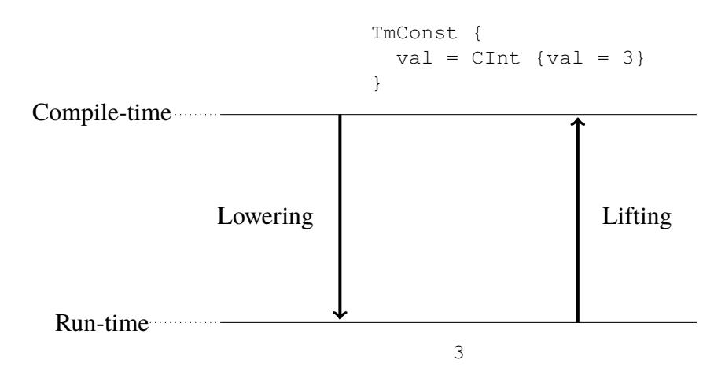

Figure 4.2: Lifting and lowering to go between different stage representations. On the right-hand side an example is shown where the AST of the integer 3 is lowered to simply 3

specialize keywords add additional complexity. Either the complete AST could be stored, and the relevant parts extracted at run-time, or store an AST for each specialization location separately. The approach of this thesis does not suffer from any of the aforementioned issues.

### <span id="page-47-0"></span>**4.3.2 Implementation**

This section begins by describing the core ideas behind the implementation through a couple of examples. Thereafter, the lifting of variables is discussed as that is slightly more involved. For the complete implementation of this part see the Miking repository[∗](#page-47-2) .

From the above discussion, what is required by *lift*, is that it satisfies lower (lift (expr)) = expr. That is, lowering a lifted expression should be equivalent to the original expression. The following notation is introduced to easier describe and exemplify the implementation. *Quoting* an expression e, denoted 'e, is used to indicate that e should not be lowered, but rather left as is in the program. Inside a quoted expression we may *splice* or *unquote* a subexpression g, denoted with a bang '(!g), to indicate that it should be evaluated and embedded in the quoted expression. For example, lower('(addi 1 !(addi 2 3))) = addi 1 5.

Now, if we are to lift an AST representing the application between two

<span id="page-47-2"></span><sup>∗</sup>[https://github.com/miking-lang/miking/blob/e14389ae1d6bcd](https://github.com/miking-lang/miking/blob/e14389ae1d6bcd0bc17b1e684c6e0cd1bc172c79/stdlib/peval/lift.mc) [0bc17b1e684c6e0cd1bc172c79/stdlib/peval/lift.mc](https://github.com/miking-lang/miking/blob/e14389ae1d6bcd0bc17b1e684c6e0cd1bc172c79/stdlib/peval/lift.mc)

expressions, we can use the above notation to describe the behavior of liftExpr, as shown in Listing [4.2.](#page-48-0)

Listing 4.2: Lifting a TmApp using the quoting notation

```
1 sem liftExpr =
2 | TmApp {lhs=lhs, rhs=rhs, info=info, ty=ty} −>
3 '(TmApp {
4 lhs = !(liftExpr lhs),
5 rhs = !(liftExpr rhs),
6 ...
7 })
```

Within Miking no direct quoting exists, and it is instead implemented through the usage of constructor applications. For example, lifting a TmApp is done through replacing it with a constructor application between the TmApp constructor, and its original argument lifted. The original application term is then the result after lowering. In this sense, one way to look at quoting is that if e is an expression, then 'e is the abstract syntax tree of e.

In MCore a constructor application is represented by the TmConApp AST. So, from the previous description the following holds lower (TmConApp {ident = "TmApp", body = liftExpr arg}) = TmApp arg. This idea is more concretely shown in Listing [4.3,](#page-48-1) with the implementation of liftExpr TmApp.

<span id="page-48-1"></span>Listing 4.3: Lifting a TmApp using the constructor application approach

```
1 sem liftExpr =
2 | TmApp {lhs=lhs, rhs=rhs, info=info, ty=ty} −>
3 let conArg = TmRecord {
4 bindings = [
5 ("lhs", liftExpr lhs),
6 ("rhs", liftExpr rhs),
7 ("ty", liftTy (TyUnknown {...})),
8 ("info", liftInfo (NoInfo ()))]
9 } in
10 TmConApp {
11 ident = "TmApp",
12 body = conArg
13 }
```

Listing [4.2](#page-48-0) and Listing [4.3](#page-48-1) are equivalent and syntactically similar, but the former is easier to read and will be used henceforth. In the latter additional fields are also included, such as info and ty. They are not strictly necessary to perform the partial evaluation, but required to construct the application term. In the implementation they are as such lifted to their most basic forms of 'NoInfo and 'TyUnknown respectively. This might change in the future, for example, if the partial evaluator is able to propagate types, the type checking step of Section [4.4](#page-54-0) can be skipped, thus increasing the speed of the JIT compilation.

The same idea, with constructor applications, is employed to lift most expressions in MCore. The only exception is when dealing with variables. Remember again that the purpose behind performing the specialization at run-time is to exploit additional, run-time only, information. In particular, this means that variables that are unknown when lifting, must be treated differently. Simply lifting a variable to a TmVar is not helpful, as mentioned in the discussion of Figure [4.1.](#page-45-1) Instead, what we would like is that e.g. the exponent of n in Figure [4.1](#page-45-1) is passed to the partial evaluator as a TmConst. To achieve this, we lift variables via their type.

#### <span id="page-49-0"></span>**4.3.3 Lifting via type**

The lifting of variables is the last example of how this part of the system is implemented. This includes how values that are unknown at compile-time are lifted via their type, in order for the partial evaluator to use those values at runtime. As such, this section is central as it describes how additional information can be exploited by delaying the specialization to run-time.

When lifting variables there are two cases to consider, when the variable is known at compile-time, and when it is not. If the variable is known we can simply use its definition to lift it, using the same approach as in the previous section. The latter case is more interesting, like in Listing [4.1.](#page-44-2) When the value of a variable is not statically known, it must be lifted during run-time instead. We do this by generating code based on the type of the variable. This is sufficient for all types except functions, we return to that at the end of this section.

<span id="page-49-1"></span>Consider an initial example. In the case of Listing [4.1,](#page-44-2) we know that the argument n of powN must be an integer as pow uses n in integer arithmetic, e.g. subi. If the value of the exponent was known, it would have been represented with a TmConst, and as such that is the term it should be represented as at runtime when passed to the partial evaluator. A simplified example is given in Listing [4.4.](#page-49-1) In the example the keyword specialize is applied to an integer argument n. As discussed above the argument should resolve to what is shown on line 6 at run-time.

Listing 4.4: Example of what lifting an unknown variable at compile-time, should resolve to at run-time

```
1 let example = lam n:Int. specialize n
2
3 −− After transformation of specialize keyword
4 let example = lam n:
5 −− ...
6 peval (TmConst {val=CInt {val = n}})
```

By again using the quoting notation to describe the behavior, lifting an integer variable via its type can be defined as in Listing [4.5.](#page-50-0) There we unquote the intVar such that the concrete value is inserted into the AST.

Listing 4.5: Lifting variables of type int

```
1 sem liftViaType intVar =
2 | TyInt _ −>
3 Some ('(TmConst {
4 val = CInt {
5 val = !(intVar)}}))
```

The reason the result is wrapped in a Some is due to the inability of lifting function types. With this approach the calling function knows when the lifting succeeds, we return to this later. Lifting the types of TyFloat, TyBool, TyChar, et cetera is similar. A slightly more involved example is that of TySeq, shown in Listing [4.6.](#page-50-1) If we know that the unknown variable will be a sequence, e.g. [1,2,3], then we know that it should be lifted to a TmSeq {tms : [Expr], ...}, where each element of the sequence has also been lifted via its type. However, if we are unable to lift the type of the sequence's elements, nothing is done. This eventually leads to the variable seqVar not having an associated value in the environment passed to the partial evaluator. The next section discusses this further.

Listing 4.6: Lifting variables of the sequence type

```
1 sem liftViaType seqVar =
2 | TySeq {ty = elemTy} −>
3 match elemTy with supportedTypes then
4 let elemVar = nameSym "x" in
5 Some ('(TmSeq {
6 tms =
7 map (lam !elemVar.
8 !(liftViaType (TmVar elemVar) elemTy))
9 !seqVar
10 }))
11 else None ()
```

In Listing [4.6](#page-50-1) we do exactly as discussed above. The sequence variable is lifted to TmSeq, where tms is the sequences of run-time values lifted to their AST representation. The former is represented here using a mapping over the sequence variables. With line 3 we ensure that the element type is supported, so supportedTypes would e.g. be (TyInt \_ | TyBool \_ | ...). On line 4 we create a fresh symbol using nameSym. It is helpful to look at an example to understand this. Listing [4.7](#page-51-0) shows the transformation of the specialize keyword when applied to a variable integer sequence. Moreover, in the last part of the example it shows the result when calling the example function with a concrete integer sequence.

<span id="page-51-0"></span>Listing 4.7: Clarifying example of lifting an unknown integer sequence via its type

```
1 let example = lam ns:[Int]. specialize ns
2
3 −− After compiling the specialize keyword
4 let example = lam ns:
5 −− ...
6 peval (TmSeq {
7 tms= map (lam x. TmConst {val = CInt {val = x}}) ns
8 })
9
10 −− With concrete values, say ns = [1,2] we get
11 −− ...
12 peval (TmSeq {
13 tms= [TmConst {val = CInt {val = 1}},
14 TmConst {val = CInt {val = 2}}]
15 })
```

Finally, as noted previously, there is a case where we are unable to lift an unknown variable via its type. Namely, when the type is that of a function, TyArrow. Then we cannot do anything naively since we do not know what the actual function will be. For example, if we have let funPeval = lam f:(Int −> Int). specialize f, then funPeval can be called with multiple different functions, where each is to be lifted differently. In some cases it could likely be determined which exact function is passed as argument by using some form of data flow analysis, but in the general case it is difficult. As such, lambda bound functions are currently not lifted at all in the system, and solving that issue is instead put as future work.

#### <span id="page-52-0"></span>**4.3.4 Building the argument to peval**

So far, we have described the concept of lifting and how it is implemented in this thesis to obtain an AST representation at run-time. The remaining point of discussion is *what* expression should be lifted, or rather what shape it should have.

Going back to the example of Figure [4.1](#page-45-1) and powAst = liftExpr (pow n). Simply lifting the expression pow n to an application between a variable pow and a variable n is not very useful as it does not allow for any specialization, because the partial evaluator does not see the definition of pow. However, it is a valid representation that can be partially evaluated. So, to allow the partial evaluator to perform as much specialization as possible, the definitions of every free variable in the original expression, possibly transitively, should be available to the partial evaluator. In the example this would be the definition of pow and the value of n.

Two different approaches to achieve this are considered. Either, one single expression is created containing each transitive dependency of the original expression. That is, on the form let g = ... in let pow = ... in pow n, where pow depends on g. Free variables remaining in the single expression are lifted via their type, and inserted into a separate environment that is passed to the partial evaluator. Note that only successful lifts are inserted into the environment, i.e. variables of function type are excluded. We refer to this approach as the *single expression* approach. The alternative to this is to keep the original expression as is, and create an environment of values containing all needed definitions. We refer to this as the *environment* approach. The point is that the partial evaluator will anyhow create such an environment when specializing the single expression in the former approach, and as such it may be beneficial to do this ahead of time. To exemplify, the representation using the single expression approach is shown in Listing [4.8](#page-53-0) and for the environment approach in Listing [4.9.](#page-53-1) The examples build on the power function example of Figure [4.1](#page-45-1) and correspond to the lower, compiled, box.

<span id="page-53-0"></span>Listing 4.8: Simplified AST representation of 'pow n' using the single expression approach. Corresponds to the lower box of Figure [4.1](#page-45-1) where powAst has been replaced.

```
1 let powN = lam n.
2 jitCompile
3 (peval
4 [("n", TmConst {val=CInt{val=n}})]
5 (TmLet {
6 ident="pow",
7 body=...,
8 inexpr=TmApp{
9 lhs=TmVar {ident="pow"},
10 rhs=TmVar {ident="n"}}
11 }))
```

<span id="page-53-1"></span>Listing 4.9: Simplified AST representation of 'pow n', using the environment approach. Corresponds to the lower box of Figure [4.1](#page-45-1) where powAst has been replaced.

```
1 let powN = lam n.
2 jitCompile
3 (peval
4 [("pow", TmClos {body=...,env=...}),
5 ("n", TmConst {val=CInt{val=n}})]
6 TmApp{
7 lhs=TmVar {ident="pow"},
8 rhs=TmVar {ident="n"}}
9 )
```

The approaches are quite similar. In both, the representation is built by first lifting the expression using liftExpr, and then creating a separate environment containing all free variables lifted via their type. The difference is that in the single expression approach, only non-function types will be present in the environment that is built. That is, only lifted run-times values of for example integers or sequences. The other approach tries to perform some of the work that the partial evaluator anyhow would have done, by creating closures of the let-bound functions that the original expression depends upon. When creating the closures the two-step process described above is repeated. That is, the body of the function is lifted with liftExpr, and then all free variables are inserted into the environment of the closure after being lifted via their type. This means that the definition of some variables may occur multiple times in the environment (on different levels). Consider the small example of Listing [4.10.](#page-54-2) There, we specialize the function g with respect to its first argument being equal to f 2 3. Using the environment approach we would in particular end up with the lifted definition of f twice, once in the outermost environment, and once in the closure of g's environment. Thus, using the environment approach without doing anything special will lead to code duplication. This may or may not be worth it, depending on whether creating the environment ahead of time gives an overall performance gain.

<span id="page-54-2"></span>Listing 4.10: Small example exemplifying how code duplication may occur using the environment approach

```
1 let f = lam x. lam y. addi x y in
2 let g = lam x. lam y. subi x (f x y) in
3 specialize (g (f 2 3))
```

The approach that is chosen is the single expression variant. There are a couple of reasons for this. First, within Miking there is already an extract functionality that creates the single expression needed. Second, it is not obvious that there will be performance benefits in using the second approach. Moreover, it is more complex, for example in needing to create and lift recursive environments. In the future, it may be a path worth investigating further.

### <span id="page-54-0"></span>**4.4 Run-time code emitting**

The partial evaluator produces a source representation, namely an MCore AST. Therefore, the result of the specialization must be compiled. This part of the system is responsible for handling exactly this. Note that the implementation for this part is for the OCaml backend only. However, the general design should apply to the other backends as well.

Seeing as no JIT compiler is available, the main idea is to normally compile the residual and then dynamically link it back to the program.

#### <span id="page-54-1"></span>**4.4.1 Overview**

To begin with it is helpful to look at a schematic overview. In Figure [4.3,](#page-55-1) there are four components and the arrows indicate the dependencies between them. The components are the different OCaml source files that are created when compiling a MCore program containing a specialize keyword.

The main entry point is *main.ml*, and the only thing it does is call the main method of *sharedlib.ml*. In turn, *sharedlib.ml* contains the compiled MCore program. The result of partially evaluating an expression is compiled (to OCaml from MCore) and inserted into a temporary file, *plugin.ml*, following

<span id="page-55-1"></span>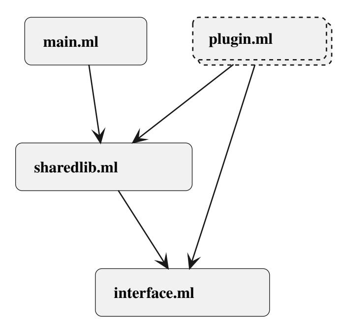

Figure 4.3: Dynamic linking overview

a template defined in the *interface.ml*. The plugin files may use definitions defined in *sharedlib.ml*. Also, note that the plugin files do not exist before the program is actually executed and as such is drawn with dashed lines in the figure. When a plugin file is dynamically loaded the main program can interact with its definition using the interface defined in *interface.ml*. Notably, the plugin must register itself with the help of the interface. This last part is due to how dynamic linking works in OCaml, specifically when using the Dynlink module.

The reason for dividing the main program into *main.ml* and *sharedlib.ml* is because a plugin must be able to use the definitions of *sharedlib.ml*. For OCaml specifically this split is a simple way of achieving that.

### <span id="page-55-0"></span>**4.4.2 Implementation**

Going back to the high level overview given in Figure [4.1,](#page-45-1) line 2 of the lower box, jitCompile. Concretely, this part of the system handles that step by doing the following.

#### 1. Compile the residual MCore expression to OCaml

The compilation of a residual is performed similarly to how it is currently done for any program in Miking. However, since a residual may contain

#### 2. Write the OCaml program into a temporary file

After compiling the MCore residual to OCaml, a *plugin.ml* is created following a format defined by the interface file, shown in Listing [A.1.](#page-84-1) The exact format is shown in Listing [A.2.](#page-84-2) The most important bit is that the residual registers itself through the interface by making an entry in a hash table.

#### 3. Compile the OCaml program to a dynamically loadable .cmxs plugin

The *plugin.ml* file is then compiled to a dynamically loadable plugin using ocamlopt with the flag -shared. The compilation of the plugin also requires the compiled interface file (.cmi) of *sharedlib.ml* that has previously been stored in a known location.

#### 4. Dynamically load the .cmxs

At this point the plugin can be dynamically loaded by the main program. To achieve this, a new intrinsic is defined in MCore that loads a .cmxs file given the path to it. One limitation to the method overall is that this intrinsic may not be called before the full program,*sharedlib.ml*, has been initialized. A possible solution to this would be to segment the *sharedlib.ml* file into separate modules, where the plugin files created only depend on the modules that have already been initialized. That is, the modules "above" the call to specialize. However, this has not been implemented yet, but the intrinsic catches the error thrown in such cases and provides hints as to how it can be solved.

#### 5. Retrieve the residual expression through the interface

Finally, after the plugin has been dynamically linked, the residual expression produced by the partial evaluator is fetched through the interface. This is also achieved by help of a new intrinsic in MCore.

## <span id="page-58-0"></span>**Chapter 5**

## **Evaluation**

In this chapter, the evaluation of the thesis is presented. First, an overview is given on the experimental setup including the evaluation programs and the specification of the system where the tests are carried out. Thereafter, the performance results are presented program by program, followed by a section on the correctness results. The final section of the chapter compares specialized programs that use native sequence operations, against programs that are not specialized and use intrinsic sequence operations.

### <span id="page-58-1"></span>**5.1 Experimental setup**

The evaluation of the method consists of designing and constructing several test programs that are compiled and executed with and without run-time specialization. The program with run-time specialization is referred to as the specialized program, and the other as the original program. For each test program, the following is then evaluated by comparing the original and the specialized program:

- 1. Correctness, do they produce the same result?
- 2. Performance, measuring and comparing their execution times (incl. JIT compilation and specialization)

### <span id="page-58-2"></span>**5.1.1 Performing the experiments**

Two experiments per program are performed. For the first one, *Correctness*, an equality test is made between the output of the original program and the specialized program for several inputs. The inputs are generated pseudorandomly.

For the second point, *Performance*, the complete execution time is measured for both program versions through the built-in timer functions of the language. Additionally, the time it takes to partially evaluate and JIT compile is measured for the specialized program. An important aspect for this second point is to find the *break-even point*, i.e. how many times a specialized program must be executed to amortize the time it took to specialize, see Equation [\(2.5\)](#page-33-4). Since the naive JIT compilation is slow and impractical, we also compute the break-even point after deducting the time of JIT compiling. To find the breakeven point for a specific program, the same experiment is run many times with increasing dynamic input size. Then, if there is a break-even point, it is simply the intersection at which the specialized program outperforms the original program.

For each input configuration, multiple repeated runs are performed and the final measurements of total execution time, total peval time and total JIT time are taken as the mean over all runs. At least 10 repeated runs are performed per input configuration.

#### <span id="page-59-0"></span>**5.1.2 Test programs**

The test programs represent cases where partial evaluation typically would be beneficial. The reasoning behind this is twofold. Firstly, while partial evaluation generally can be applied to any program, it is not always wise to do so from a performance point of view. Ideally, the program should have certain properties, such as exhibiting interpretive behavior [\[4\]](#page-78-4). By testing the method on programs that have those properties, it is easier to draw conclusions on its applicability. Secondly, since the place of specialization is programmer guided, it is not as interesting to investigate cases where specialization has no or little impact.

The evaluation of the approach is conducted on five different programs. In common for all is that the argument(s) used in the specialization is supplied at run-time. Below the five programs are presented, starting with the frequently mentioned power program. Appendix [C](#page-88-0) contains the implementation of the test programs in MCore.

#### • **Pow**

One of the most common programs in the literature on partial evaluation. The test is implemented such that x power computations are performed with the same exponent n, one for every base 1..x. The power program uses the method of repeated squaring. The test is simply referred to as pow.

#### • **Matrix multiplication**

In general, matrix multiplication is an interesting candidate for specialization since a row in the first matrix is multiplied with every column of the second matrix. Only knowing the first matrix may still allow for simplifications in the dot product calculations, e.g. if the first matrix contains a zero row. Therefore, sparser matrices are better suited for specialization as more simplifications can be made. Especially so since simplifying implies that the partial evaluator inspects the factors of a multiplication, to see if any of them are zero or one. If the matrices are dense, most of these checks are useless and simply add overhead. In this test, referred to as mat-mul, two different matrices are multiplied together some number of times. This works similarly to the power program in that we increase the amount of times the matrices are multiplied together to find a break-even point.

#### • **Dot product**

This test builds on the same observation as the previous one did, but performs only one matrix multiplication instead of multiple. Since the number of times a row is involved in a multiplication is equal to the number of columns of the second matrix, we increase the size of the matrices to scale the problem. This test is referred to as dot-prod. A similar test case was used in e.g. [\[11,](#page-79-3) [32\]](#page-81-3). Do note that only integers are used in this and the above-mentioned tests and only square matrices are considered. The matrix multiplication implementation used for these two tests was borrowed from the Miking repository[∗](#page-60-0) .

#### • **Naive string matching**

Another class of problem that is common in the literature, and amenable to specialization is that of string/pattern matching. Specifically, the program here should answer whether some string A (referred to as the needle) exists in some string B (referred to as the haystack). The answer is boolean, and the program exits as soon as it finds a match. The implementation is naive in the sense that it simply checks whether the needle is a prefix of any substring of the haystack.

<span id="page-60-0"></span><sup>∗</sup>[https://github.com/miking-lang/miking/blob/6bee5d45284293](https://github.com/miking-lang/miking/blob/6bee5d4528429314c0687ac37f8c1781b3f5a953/test/examples/accelerate/matmul.mc) [14c0687ac37f8c1781b3f5a953/test/examples/accelerate/matmul.mc](https://github.com/miking-lang/miking/blob/6bee5d4528429314c0687ac37f8c1781b3f5a953/test/examples/accelerate/matmul.mc)

#### • **String matching**

This second string matcher was implemented following [\[18\]](#page-80-0), where the algorithm is designed and adapted such that a partial evaluator can exploit more static information about the needle than for the naive implementation. The idea is to compare this test against the above one, not in terms of absolute time spent, but rather how much of a relative speedup they achieve. With this test, some insights may be gained in the importance of designing the code with a specializer in mind. When necessary, this test program is referred to as opt-str-match (optimized string matcher) and the previous one as naivestr-match (naive string matcher). A final note on the input. The needle for both the string matchers is constructed in such a way that it will never exist in the haystack. A new haystack was created for each input configuration, by drawing alphanumeric characters from /dev/urandom.

#### <span id="page-61-0"></span>**5.1.3 Setting**

All programs are compiled using ocamlopt, using the flag -O2. The tests are run on a computer with the following specification:

<span id="page-61-2"></span>Table 5.1: System specification for computer running benchmarks

| Operating System | Ubuntu 22.04.2 LTS                        |
|------------------|-------------------------------------------|
| CPU              | Intel®<br>Core™<br>i5-8365U CPU @ 1.60GHz |
| RAM              | 16 GiB                                    |

As mentioned previously, the partial evaluator used in this thesis uses a bounded recursion approach to guarantee termination. For all the tests here, the recursion bound is set to 4. The bound was set after initial experimentation with different bounds, concluding that 4 was sufficient to evaluate the approach.

## <span id="page-61-1"></span>**5.2 Result**

In this section the results of the evaluation are presented. For all tests except dot-prod, a heatmap figure is used to visualize the speedup of the specialized program with respect to the baseline, given varying sizes of static and dynamic input. Note that each heatmap includes the time of JIT compiling unless otherwise specified, and that the JIT compilation takes significantly longer than a typical JIT compiler, see Section [1.6.](#page-24-0) Additionally, a plot of the execution time given some specific static input is included.

#### <span id="page-62-0"></span>**5.2.1 Pow**

The benchmarking results of pow are shown in Figure [5.1a.](#page-63-1) Specifically, it shows the speedup of specializing said program as a fraction Toriginal/Tspec for different exponents and number of computations. We can observe that specializing is beneficial in some cases, for example when the exponent is 5 and 20 × 10<sup>6</sup> computations are performed. Moreover, it seems that the greatest speedups are centered around the maximum recursion depth of the partial evaluator, 4. For other exponents a lesser impact is visible in that the ratio between the baseline and the specialized version decreases as the number of power computations increases. For the exponent 1 this delta is the smallest as the removed overhead is the smallest. Another reason why the ratio lowers is that the overall execution time increases when the number of computations increases. So, even when no speedup is gained from specializing the same pattern would appear.

Overall, Figure [5.1a](#page-63-1) shows that the specialized programs are faster but require many iterations to overcome the overhead of partially evaluating and JIT compiling. This last point is more clearly visible from Figure [5.1b,](#page-63-1) where the execution time for the test with exponent 6 is plotted. The slopes of the graphs for the specialized versions are less steep, indicating a smaller constant factor for the specialized programs (time complexity wise). Besides the total execution time of the specialized program, Figure [5.1b](#page-63-1) shows the execution time of the specialized program with the JIT compilation time subtracted. The difference between the break-even points are large due to the overhead of the naive JIT approach. From the figure we can observe that the overhead seems to remain throughout at around 150 ms.

### <span id="page-62-1"></span>**5.2.2 Matrix multiplication**

For this test, the two square matrices that are multiplied together, are created with values drawn uniformly from [0, 100). This means that there is a 2% chance that a cell is either a 0 or a 1, the two values allowing for simplification of the multiplications. These are rather dense matrices, though various different ranges of values were tested, but with no significant difference to the result. This may indicate that the specialization does not unroll the dot products to a great extent. Or as we will see in the result of the next tests, that the simplification of the dot products do not make much difference.

In Figure [5.2a](#page-64-0) the speedup of the specialized program compared to a baseline version is shown. As can be noted, the specialized program was not faster for any input. This is mainly due to the large overhead of JIT compiling

<span id="page-63-1"></span>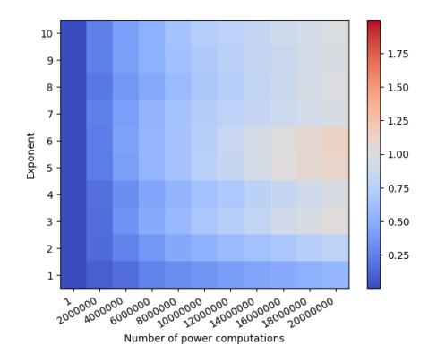

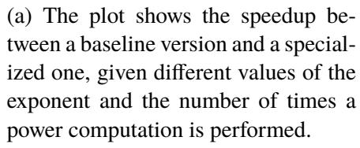

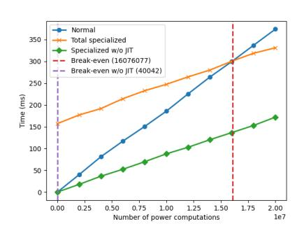

(b) A graph of the execution time of the power program as a function of the number of power computations performed. The exponent is 6. Parenthesized is the break-even point.

Figure 5.1: The performance results of the pow tests

the residual. However, the residual program itself is faster than its baseline counterpart, but the size of the dynamic input was not large enough for a breakeven point to be reached. This is evident from Figure [5.2b,](#page-64-0) where a graph of the execution time for the matrix with size 3 is shown. For example, the breakeven of the specialized program, not taking JIT compilation into account, is already at around 16000. In a larger additional test the break-even point with JIT was found to be at around 680000, see Figure [B.1.](#page-86-1)

### <span id="page-63-0"></span>**5.2.3 Dot product**

Figure [5.3a](#page-65-1) shows the resulting graph of the execution time given matrix size, when the matrices have values drawn uniformly from [0, 3). As can be observed, the results are poor and the overhead of JIT compiling is considerable. Even when discounting the time of JIT compiling no breakeven point is found. Though, in that case the execution time lies much closer to the original program throughout. It is no surprise that the overhead would be significant as the specialization is performed once for every row of the matrix. However, it is larger than expected and especially so in the version where no JIT compilation is taken into consideration.

In a second test, the range of values when creating the matrices was changed to [5, 105) from the [0, 3) used previously. The idea is to investigate the scenario when no simplifications can be made by the partial evaluator.

<span id="page-64-0"></span>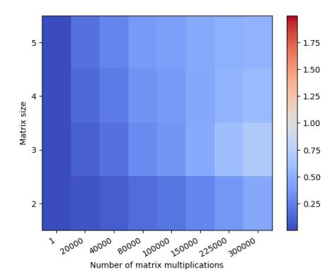

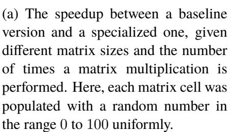

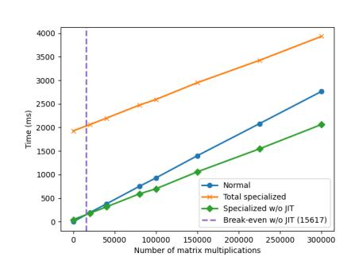

(b) Execution time of the matrix multiplication with a matrix size of 3, comparing the specialized program with and without JIT, versus not specializing. Parenthesized is the break-even point.

Figure 5.2: The performance results of the matrix multiplication tests

The resulting graph is shown in Figure [5.3b,](#page-65-1) and as the graph depicts not much change from the earlier results. In fact, only about 300 milliseconds differs between the two for the matrix size of 300 (in favor of the earlier). This indicates that almost all performance gains from simplifying the arithmetic is lost from the added overhead, and seeing as the recursion depth is bounded to 4 this is not very surprising. No break-even points are found at all as before.

In an additional more extreme test, it was investigated whether increasing the recursion depth to 50 would make any difference when multiplying two zero matrices with varying size. The complete resulting graph is presented in Figure [B.2a,](#page-87-0) and when not including the total execution time for the specialized program in Figure [B.2b.](#page-87-0) In neither case a break-even point was found, further supporting the conclusion of the previous paragraph in that the overhead bests the gains of simplifications. Interestingly, the execution time excluding JIT was higher in Figure [B.2b](#page-87-0) compared to Figure [5.3a.](#page-65-1) Moreover, as the results show, increasing the recursion depth also increases the JIT compilation time, most likely due to increased code size.

<span id="page-65-1"></span>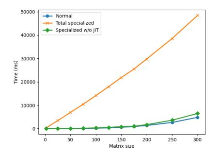

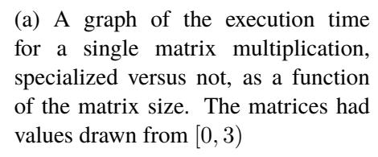

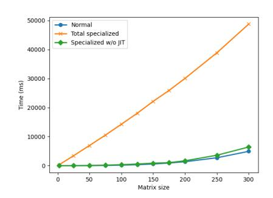

(b) A graph of the execution time for a single matrix multiplication, specialized versus not, as a function of the matrix size. The matrices had values drawn from [5, 105), i.e. no arithmetic simplification possible for the partial evaluator.

Figure 5.3: The performance results of the dot product tests

### <span id="page-65-0"></span>**5.2.4 Naive string matching**

The evaluation result for naive-str-match is shown in Figure [5.4a.](#page-66-0) From the figure, we can observe that specializing was never beneficial. However, what is not immediately apparent from the heatmap is that the specialization does not impact the execution time of the program much if any. In fact, the overhead gap between the specialized program and the baseline remains fairly constant throughout all inputs, as Figure [5.4c](#page-66-0) shows. Consequently, the ratio displayed in the heatmap decreases along the axes since the relative importance of the overhead diminishes as the execution times increase. That is, it is not due to the specialized program being faster that the ratio decreases with increasing problem size.

Looking at the same heatmap but with the JIT compilation time deducted, shown in Figure [5.4b,](#page-66-0) we can see that the specialized program achieves a speedup over the regular in some cases. In fact, for the needle of size 4 this speedup is consistent throughout and a break-even point was achieved at around 83000. A plot of the execution times for that needle size is shown in Figure [5.4c.](#page-66-0) However, this behavior was not consistent in all tests and if a speedup is gained it is miniscule. That the needle size 4 performed best is also in line with having a recursion depth of 4.

<span id="page-66-0"></span>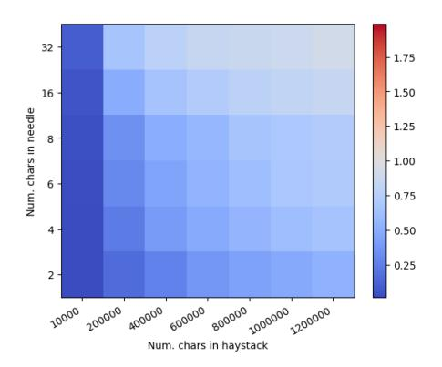

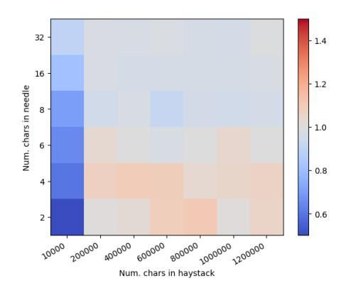

(a) The speedup between a baseline version and a specialized one, given different sizes of the haystack and needle. Once again, note that the needle is never in the haystack for any of the tests.

(b) The speedup between a baseline and a specialized naive string matcher where the JIT compilation time is discounted

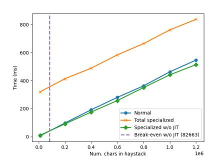

(c) Execution time of the naive string matcher for a needle size of 4, comparing the specialized program with and without JIT, versus not specializing.

Figure 5.4: The performance results of the naive string matcher tests

<span id="page-67-3"></span>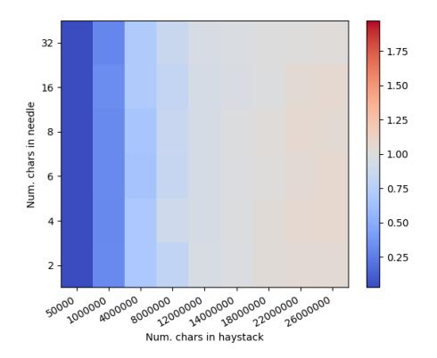

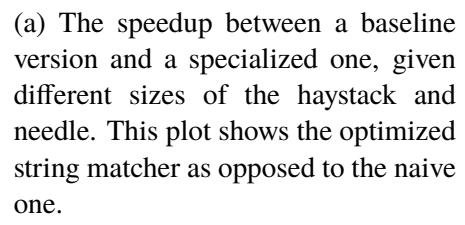

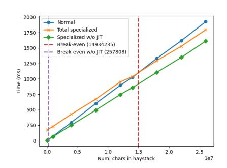

(b) Execution time of the optimized string matcher for a needle size of 4, comparing the specialized program with and without JIT, versus not specializing.

Figure 5.5: The performance results of the optimized string matcher tests

### <span id="page-67-0"></span>**5.2.5 Optimized string matching**

Figure [5.5a](#page-67-3) shows the evaluation result of opt-str-match. Contrary to the result of the previous section a decent speedup is visible in several scenarios. The largest speedup was achieved with a needle size of 4, and the graph for that test is presented in Figure [5.5b.](#page-67-3) Additionally, we see evidence of the specialized program having a better constant factor, time complexity wise, as the gap between it and the baseline grows steadily.

#### <span id="page-67-1"></span>**5.2.6 Correctness**

For every benchmarking test conducted, the output of the specialized program was compared to the original program's output. Additional test cases were also constructed, for example where the string matching algorithms were given a needle that existed in the haystack.

In all cases the output of the specialized program and the original program was equal.

#### <span id="page-67-2"></span>**5.2.7 Caveat**

In MCore sequences and sequence operations are intrinsic, and thus the definition of e.g. a foldl is not available to the partial evaluator. To better evaluate the specialization most sequence operations were implemented natively in MCore, and used in both programs when conducting the tests. However, those implementations still use the underlying intrinsic sequence, so cons and the like remain intrinsic. This also means that some functions on sequences cannot be implemented with the same time complexity as the intrinsic, for example length. For such functions the intrinsic was used instead of an MCore implementation.

The test that was impacted the most from this was naive-str-match, Section [5.2.4,](#page-65-0) where the subsequence operation was left intrinsic. However, when we instead used a native implementation the impact of specializing remained the same while the time complexity of the string matcher worsened. That is, the conclusions of the tests are in this case the same, but it should anyhow be noted.

The native sequence operations are slower than their intrinsic counterparts, partly because the underlying sequence is represented either by a cons list or a rope data structure. This adds an overhead to the native implementations since with each use of an intrinsic the data structure of the underlying sequence must be determined. For intrinsic operations this check only needs to happen once at the start.

For that reason, we compared specializing a program with native sequence operations against a normal program that uses the intrinsic sequence operations. The idea is to compare the best result for each test, rather than favor one or the other. Also note that this issue is not inherent, but rather that the partial evaluator did not support intrinsic versions of all sequence operations at the time of performing the evaluation. All test cases in this thesis are relevant to this except pow, since it does not use any such operations. The results are shown in Figure [5.6.](#page-69-0) In all except naive-str-match, we never achieve a break-even. For naive-str-match it is reasonable that a breakeven is achieved with no JIT time included, seeing as the core function of subsequence is also intrinsic in the specialized one (as per the previous discussion). Of note, in opt-str-match the specialized version lies fairly close to the regular one, whereas the others show quite large differences. Moreover, the gap increases with the problem size. This is likely due to the native sequence operations being less optimized, and due to the overhead explained in the previous paragraph.

<span id="page-69-0"></span>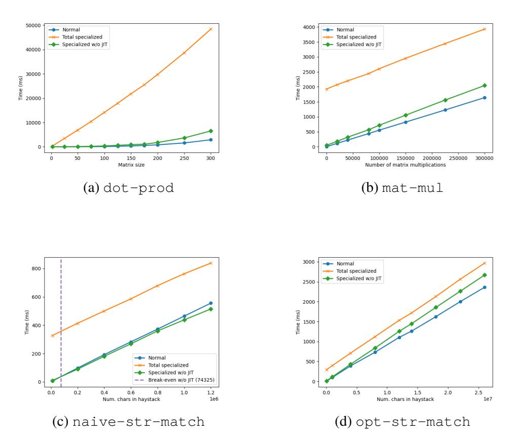

Figure 5.6: Comparing specializing with native sequences versus not specializing and using intrinsic sequences. The graphs shown are for the *best* static input from the results presented in the previous sections. Specifically needle size 4 in both the naive and optimized string matchers, and matrix size of 3 in the matrix multiplication.

## <span id="page-70-0"></span>**5.3 Threats to validity**

There are a couple of topics worth discussing related to the validity of the results. First off, the recursion depth being 4 throughout the majority of the tests. While initial experimentation concluded that the recursion depth was sufficient, the results may not be fully representative for the approach. For example, it might be a particularly well suited recursion depth for the tests conducted. However, that seems unlikely but without conducting more thorough tests with varying recursion depths it remains uncertain.

Secondly, the topic of intrinsics as described in Section [5.2.7.](#page-67-2) The results accurately describe the comparison between two programs using native sequence operations, when specializing versus not. However, basing the sequence operations on the underlying intrinsic complicated matters unnecessarily. It would have been more accurate to implement a wholly native sequence data structure, such that the partial evaluator is also able to specialize e.g. cons. Or alternatively, extend the partial evaluator to support all intrinsics that were used. With either alternative, the results would likely be better.

Thirdly, the artifact depended on a fairly newly implemented partial evaluator, that was still developed further after the evaluation concluded. This introduced an additional uncertainty that is difficult to control for, since it may have contained yet to be discovered issues that swayed the results in either direction. Though, we have no reason to believe the evaluation was impacted in any way.

## <span id="page-72-0"></span>**Chapter 6**

## **Discussion**

This chapter discusses the results presented in the previous chapter. First a general discussion is held, for example regarding the JIT compilation approach. The following two sections compare the results of the different tests, beginning with mat-mul and dot-prod, followed by the two string matchers. The last section of this chapter discusses the limitations the approach imposes on the expressiveness of the language.

## <span id="page-72-1"></span>**6.1 General**

In general the results indicate that speedups are achievable using the approach proposed in the thesis. However, it depends on several factors including the problem type and where the specialization keyword is placed. Moreover, as seen by comparing the different implementations for the string matching problem, the actual code for solving a problem is just as important as the problem type being amenable to specialization. These factors are characteristic for partial evaluators in general, but become even more important when specializing at run-time due to the time constrained situation. For run-time specialization in particular, one must also consider the amount of times the residual will be executed and whether that will be enough to breakeven, making the decision of when to specialize more difficult.

For all the experiments, there was a substantial gap between break-even points when including the time of JIT compiling and when not. This was expected, seeing as the approach there was rather naive. Though, it still gives an indication for what kind of speedups can be expected with a more sophisticated JIT compiler. Even now with the current implementation there are ways forward to decrease the overhead of compiling the residual. For example, retaining the types during the partial evaluation and utilizing the fact that the residual is in ANF. Likely, one can view the results in this thesis as an upper- and lower-bound for how the approach would perform with an efficient JIT compiler.

All the experiments conducted used a maximum recursion depth of 4, and while it is a quite small number it was enough to showcase the potential of the approach. An interesting step between an automatic partial evaluator and the one used in this thesis, would be to allow the bounded recursion limit to be set programmatically along with the specialize keyword. In doing so, it would be easier to investigate the trade-offs between spending time partially evaluating and executing. For example, we saw that a needle size of 4 achieved the largest speedups for the string matchers, however it is not clear if that relationship between needle size and recursion bound remains for larger depths. Especially when considering that an increased recursion depth may lead to larger residual programs.

### <span id="page-73-0"></span>**6.2 Matrix multiplication & Dot product**

The two experiments, mat-mul and dot-prod, were conducted under the observation that a partial evaluator should be able to perform simplifications in the arithmetic. The idea was to compare the difference between allowing the partial evaluator knowledge of the whole matrix multiplication, versus only the dot product.

For mat-mul we found break-even points, and it was clear that the residual programs were faster than the original ones. Though, it should be noted that it had the longest JIT compilation time per specialization, as the residual programs were very large. Changing the density percentage of the static matrix did not make much of a difference to the results, indicating that the performance gains came from other improvements rather than arithmetic simplifications. On the other hand, in dot-prod no speedups were observed at all, and the overhead was significant regardless of the input range. Including zeros and ones in the matrix only marginally altered the execution time for the largest matrix multiplication. This may be due to the small recursion depth only allowing a subset of simplification to be made per dot product. Since such miniscule gains can be made per row, the overhead dominates. Though, in the additional test that was presented in the appendix, Figure [B.2a,](#page-87-0) we observed that even when increasing the recursion depth to cover more of the rows, no gains were made. In fact, it was better to have a recursion depth of 4 over 50 (even when not including JIT). This implies that the performance gains from simplifying the arithmetic did not even outweigh the added time to partially evaluate. In a sense this compares two extremes, and it would therefore be interesting to see whether there is an ideal recursion depth for this problem. Or, if it is the case that it is never beneficial to specialize this problem using the approach of the thesis. The latter is likely true, that merely arithmetic simplification does not provide enough speedup potential with the partial evaluator used.

The hypothesis for these two test programs were rather the opposite of the results. The belief was that guiding the partial evaluator to where most speedups can be gained should be better due to two reasons. First, it should produce as small of a residual as possible, allowing for faster JIT compilation. Second, it minimizes the amount of unnecessary work by the partial evaluator. However, this turned out to be false, and the reasons for that have already been discussed. Perhaps, with a more advanced JIT compiler, and with dynamic recursion depth the results would be different. Though larger recursion depths also increases the code size of the residual, putting an additional toll on the JIT compiler. One reason for this is that the partial evaluator produces code in ANF. It would be interesting to investigate whether a prior constant folding step would make any difference in this scenario.

## <span id="page-74-0"></span>**6.3 String matching**

String matching is a typical problem where partial evaluators are applied, but as the results indicated it is not that easy to get right. Two different solutions to the string matching problem were compared. The first one, naive-str-match, a rather naive implementation where a speedup could never be achieved, except sometimes when excluding the time it took to JIT compile the residual. The second one, opt-str-match, is still rather simple but is implemented such that static information is more easily exploitable by a partial evaluator. It evidently made a large difference, as the second one were consistently faster when specializing versus not.

As such, to utilize specialize fully the programmer must start thinking about their code differently, with a partial evaluator in mind. In general, one should try to make the specialization opportunities more explicit. That is, by e.g. separating control flow into statically determinable and not, as they did in [\[18\]](#page-80-0). It would be interesting to further investigate how the system itself can facilitate this. A first step would be to allow for easy inspection of the residual, something we found helpful during the development.

## <span id="page-75-0"></span>**6.4 Expressiveness**

As part of the problem statement, three different sub-questions were identified. The first one related to performance has mainly been the focus. Though as important but perhaps less quantifiable, is the second sub-question related to whether the approach works for a usefully expressive subset of, in this case, MCore. The short answer to that would be yes, however there are some caveats for each part of the system.

When obtaining a partially evaluable representation, one limitation is that functions cannot be lifted via their type. This means that run-time supplied functions (not let-bound) cannot be utilized in the specialization. For the actual partial evaluator the limitation lies in the current inability to handle all types of intrinsics. Intrinsics are for the most part simply left as is in the residual, except for when obvious arithmetic simplifications can be made. The final limitation the approach imposes is due to how the dynamic linking works. Since the complete OCaml module of the main program must have been fully initialized before any residual is linked in, it will not work for some programs. So in total, all three parts of the system currently impose some limitations on the language. Yet, the subset of the language that remains is expressive enough that no real concern to the above were taken during the development of the evaluation programs. A good indication of this would be that the matrix multiplication program was developed by someone else and worked without modifications (barring removal of unit tests).

Note that the only limitation inherent to the approach is the first one, i.e. that run-time supplied functions cannot be utilized in the specialization. Further research is necessary to solve that issue. The two other limitations are specific to the artifact.

## <span id="page-76-0"></span>**Chapter 7**

## **Conclusions and Future work**

This chapter begins by presenting the conclusions drawn from the results and surrounding discussions. Thereafter, potential future work is suggested.

## <span id="page-76-1"></span>**7.1 Conclusions**

This thesis proposed an approach for incorporating an online partial evaluator in compiled code. The overall aim was to investigate how such an approach impacts the performance of programs. From the results we conclude that specializing programs at run-time in some cases is beneficial to the overall execution time. However, the overhead of doing so is often significant, and therefore the break-even points are large. This was expected since the proposed way of JIT compiling is slow, and since partial evaluation typically only gives linear speedups. Moreover, we conclude that specializing at runtime makes it increasingly difficult to decide when and what to specialize. This is primarily due to the timed constrained situation and the difficulty of knowing whether the residual program will be fast enough to break-even during the program's execution. With that said the approach shows promise, but additional experimentation is required to draw further conclusions related to performance benefits. The most obvious next step is to evaluate it with an efficient JIT compiler.

Additionally, the thesis aimed to investigate whether the approach is feasible for a usefully expressive subset of the language. From the results, and the surrounding discussions, we conclude that approach does not limit the expressiveness of the language much if any. In fact, the only known limitation relates to the inability of lifting unknown function variables via their type. Though, a few of MCore constructs were never addressed in this thesis, simply due to time limitations. One such example is the TmUtest for defining inline unit tests.

Lastly, the thesis concludes that the termination properties of the approach adhere to those of the partial evaluator. Seeing as a partial evaluator with bounded recursion was used, the partial evaluator will always terminate, and thereby a specialized program terminates as long as the original program would have terminated. Further investigation into the termination properties has not been conducted.

### <span id="page-77-0"></span>**7.2 Future work**

Several interesting areas of future work remain, the below list highlights some of them.

- Investigate the feasibility of the approach in a system with an efficient JIT compiler.
- Investigate the issue of lifting run-time supplied functions via their type. In Section [4.3.3](#page-49-0) the concept of lifting unknown variables via their type was introduced. The approach is as of now unable to handle function types, and thus future work includes finding ways to lift such variables. One idea is to perform a data flow analysis to gather what functions may be supplied during run-time, but of course such a solution may not work in all cases.
- Utilize the fact that the partial evaluator produces code in ANF.
- Preserve types during partial evaluation to speed up JIT compilation.
- Test the approach with larger and variable recursion bounds. For example, allowing a programmer to set the recursion bound to the length of the matrix's side.
- Further investigate the approach in a system where sequences are not intrinsic, where sequence operations are readily available to the partial evaluator for specialization.
- Implement and compare the environment approach, discussed in Section [4.3.4,](#page-52-0) to the representation used in this thesis.

## <span id="page-78-0"></span>**References**

- <span id="page-78-1"></span>[1] David Broman. "A Vision of Miking: Interactive Programmatic Modeling, Sound Language Composition, and Self-Learning Compilation". In: *Proceedings of the 12th ACM SIGPLAN International Conference on Software Language Engineering*. SLE 2019. Athens, Greece: Association for Computing Machinery, 2019, pp. 55–60. isbn: 9781450369817. doi: [10.1145/3357766.3359531](https://doi.org/10.1145/3357766.3359531).
- <span id="page-78-2"></span>[2] Roland Leißa et al. "AnyDSL: A Partial Evaluation Framework for Programming High-Performance Libraries". In: *Proc. ACM Program. Lang.* 2.OOPSLA (Oct. 2018). doi: [10.1145/3276489](https://doi.org/10.1145/3276489).
- <span id="page-78-3"></span>[3] David Broman and Jeremy G. Siek. "Gradually Typed Symbolic Expressions". In: *Proceedings of the ACM SIGPLAN Workshop on Partial Evaluation and Program Manipulation*. PEPM '18. Los Angeles, CA, USA: Association for Computing Machinery, 2017, pp. 15–29. isbn: 9781450355872. doi: [10.1145/3162068](https://doi.org/10.1145/3162068).
- <span id="page-78-4"></span>[4] Neil Jones, Carsten Gomard, and Peter Sestoft. *Partial Evaluation and Automatic Program Generation*. Jan. 1993. isbn: 0-13-020249-5.
- <span id="page-78-5"></span>[5] Charles Consel and Olivier Danvy. "Tutorial notes on partial evaluation". In: *Proceedings of the 20th ACM SIGPLAN-SIGACT symposium on Principles of programming languages*. 1993, pp. 493–501.
- <span id="page-78-6"></span>[6] Erik Ruf and Daniel Weise. *Opportunities for online partial evaluation*. Tech. rep. CSL-TR-92-516. Stanford University, Computer Systems Laboratory, Apr. 1992.
- <span id="page-78-7"></span>[7] Carl Friedrich Bolz, Michael Leuschel, and Armin Rigo. "Towards just-in-time partial evaluation of prolog". In: *Logic-Based Program Synthesis and Transformation: 19th International Symposium, LOPSTR 2009, Coimbra, Portugal, September 2009, Revised Selected Papers 19*. Springer. 2010, pp. 158–172.

- <span id="page-79-0"></span>[8] Mark Leone and Peter Lee. "Lightweight Run-Time Code Generation." In: *PEPM* 94 (1994), pp. 97–106.
- <span id="page-79-1"></span>[9] Hidehiko Masuhara and Akinori Yonezawa. "Run-time bytecode specialization: A portable approach to generating optimized specialized code". In: *Programs as Data Objects: Second Symposium, PADO2001 Aarhus, Denmark, May 21–23, 2001 Proceedings*. Springer. 2001, pp. 138–154.
- <span id="page-79-2"></span>[10] Renaud Marlet. *Program Specialization*. John Wiley & Sons, 2013.
- <span id="page-79-3"></span>[11] F. Noel et al. "Automatic, template-based run-time specialization: implementation and experimental study". In: *Proceedings of the 1998 International Conference on Computer Languages (Cat. No.98CB36225)*. 1998, pp. 132–142. doi: [10.1109/ICCL.1998.674164](https://doi.org/10.1109/ICCL.1998.674164).
- <span id="page-79-4"></span>[12] Charles Consel et al. "A uniform approach for compile-time and runtime specialization". In: *Partial Evaluation*. Ed. by Olivier Danvy, Robert Glück, and Peter Thiemann. Berlin, Heidelberg: Springer Berlin Heidelberg, 1996, pp. 54–72. isbn: 978-3-540-70589-5.
- <span id="page-79-5"></span>[13] Charles Consel and François Noël. "A General Approach for Run-Time Specialization and Its Application to C". In: *Proceedings of the 23rd ACM SIGPLAN-SIGACT Symposium on Principles of Programming Languages*. POPL '96. St. Petersburg Beach, Florida, USA: Association for Computing Machinery, 1996, pp. 145–156. isbn: 0897917693. doi: [10.1145/237721.237767](https://doi.org/10.1145/237721.237767).
- <span id="page-79-6"></span>[14] Joel Auslander et al. "Fast, Effective Dynamic Compilation". In: *SIGPLAN Not.* 31.5 (May 1996), pp. 149–159. issn: 0362-1340. doi: [10.1145/249069.231409](https://doi.org/10.1145/249069.231409).
- <span id="page-79-7"></span>[15] Brian Grant et al. "DyC: an expressive annotation-directed dynamic compiler for C". In: *Theoretical Computer Science* 248.1 (2000). PEPM'97, pp. 147–199. issn: 0304-3975. doi: [10.1016/S0304-](https://doi.org/10.1016/S0304-3975(00)00051-7) [3975\(00\)00051-7](https://doi.org/10.1016/S0304-3975(00)00051-7).
- <span id="page-79-8"></span>[16] Armin Rigo. "Representation-based just-in-time specialization and the psyco prototype for python". In: *Proceedings of the 2004 ACM SIGPLAN symposium on Partial evaluation and semantics-based program manipulation*. 2004, pp. 15–26.
- <span id="page-79-9"></span>[17] Thomas Würthinger et al. "Practical partial evaluation for highperformance dynamic language runtimes". In: *Proceedings of the 38th ACM SIGPLAN Conference on Programming Language Design and Implementation*. 2017, pp. 662–676.

- <span id="page-80-0"></span>[18] Charles Consel and Olivier Danvy. "Partial evaluation of pattern matching in strings". In: *Information Processing Letters* 30.2 (1989), pp. 79–86. issn: 0020-0190. doi: [10.1016/0020-0190\(89\)901](https://doi.org/10.1016/0020-0190(89)90113-0) [13-0](https://doi.org/10.1016/0020-0190(89)90113-0).
- <span id="page-80-1"></span>[19] William R. Cook and Ralf Lämmel. "Tutorial on Online Partial Evaluation". In: *Electronic Proceedings in Theoretical Computer Science* 66 (Sept. 2011), pp. 168–180. doi: [10.4204/eptcs.66.8](https://doi.org/10.4204/eptcs.66.8).
- <span id="page-80-2"></span>[20] Amin Shali and William R. Cook. "Hybrid Partial Evaluation". In: *SIGPLAN Not.* 46.10 (Oct. 2011), pp. 375–390. issn: 0362-1340. doi: [10.1145/2076021.2048098](https://doi.org/10.1145/2076021.2048098).
- <span id="page-80-3"></span>[21] Andrew Berlin and Rajeev Surati. "Partial Evaluation for Scientific Computing: The Supercomputer Toolkit Experience". In: *Proceedings of the 1994 ACM SIGPLAN Workshop on Partial Evaluation and Semantics-Based Program Manipulation*. July 1994, pp. 133–141.
- <span id="page-80-4"></span>[22] Julia L Lawall. *Faster Fourier transforms via automatic program specialization*. Springer, 1999.
- <span id="page-80-5"></span>[23] Erik Ruf and Daniel Weise. *Preserving information during online partial evaluation*. Tech. rep. CSL-TR-92-517. Stanford University, Computer Systems Laboratory, Apr.
- <span id="page-80-6"></span>[24] Daniel Weise et al. "Automatic online partial evaluation". In: *Functional Programming Languages and Computer Architecture: 5th ACM Conference Cambridge, MA, USA, August 26–30, 1991 Proceedings 5*. Springer. 1991, pp. 165–191.
- <span id="page-80-7"></span>[25] Peter Thiemann. "Implementing memoization for partial evaluation". In: *PLILP*. Citeseer. 1996, pp. 198–212.
- <span id="page-80-8"></span>[26] Eijiro Sumii and Naoki Kobayashi. "Online type-directed partial evaluation for dynamically-typed languages". In: *Computer Software* 17.3 (2000), pp. 38–62.
- <span id="page-80-9"></span>[27] Olivier Danvy. "Type-directed partial evaluation". In: *Proceedings of the 23rd ACM SIGPLAN-SIGACT symposium on Principles of programming languages*. 1996, pp. 242–257.
- <span id="page-80-10"></span>[28] Benjamin Grégoire and Xavier Leroy. "A compiled implementation of strong reduction". In: *Proceedings of the seventh ACM SIGPLAN international conference on Functional programming*. 2002, pp. 235–246.

- <span id="page-81-0"></span>[29] Gregory T Sullivan. "Dynamic partial evaluation". In: *Programs as Data Objects: Second Symposium, PADO2001 Aarhus, Denmark, May 21–23, 2001 Proceedings*. Springer. 2001, pp. 238–256.
- <span id="page-81-1"></span>[30] Luke Hornof and Trevor Jim. "Certifying compilation and run-time code generation". In: *Higher-Order and Symbolic Computation* 12 (1999), pp. 337–375.
- <span id="page-81-2"></span>[31] Frederick Smith et al. "Compiling for template-based run-time code generation". In: *Journal of Functional Programming* 13.3 (2003), pp. 677–708. doi: [10.1017/S095679680200463X](https://doi.org/10.1017/S095679680200463X).
- <span id="page-81-3"></span>[32] Peter Lee and Mark Leone. "Optimizing ML with run-time code generation". In: *ACM SIGPLAN Notices* 31.5 (1996), pp. 137–148.
- <span id="page-81-4"></span>[33] Michael Sperber and Peter Thiemann. "Two for the Price of One: Composing Partial Evaluation and Compilation". In: *SIGPLAN Not.* 32.5 (May 1997), pp. 215–225. issn: 0362-1340. doi: [10.1145/2](https://doi.org/10.1145/258916.258935) [58916.258935](https://doi.org/10.1145/258916.258935).
- <span id="page-81-5"></span>[34] Walid Taha. "A Gentle Introduction to Multi-stage Programming". In: *Domain-Specific Program Generation: International Seminar, Dagstuhl Castle, Germany, March 23-28, 2003. Revised Papers*. Berlin, Heidelberg: Springer Berlin Heidelberg, 2004, pp. 30–50. isbn: 978-3- 540-25935-0. doi: [10.1007/978-3-540-25935-0\\_3](https://doi.org/10.1007/978-3-540-25935-0_3).
- <span id="page-81-6"></span>[35] Taha Walid and Tim Sheard. "MetaML and multi-stage programming with explicit annotations". In: *Theoretical Computer Science* 248.1 (2000). PEPM'97, pp. 211–242. issn: 0304-3975. doi: [10.1016/S0](https://doi.org/10.1016/S0304-3975(00)00053-0) [304-3975\(00\)00053-0](https://doi.org/10.1016/S0304-3975(00)00053-0).
- <span id="page-81-7"></span>[36] Cristiano Calcagno et al. "Implementing Multi-Stage Languages Using ASTs, Gensym, and Reflection". In: *Proceedings of the 2nd International Conference on Generative Programming and Component Engineering*. GPCE '03. Erfurt, Germany: Springer-Verlag, 2003, pp. 57–76. isbn: 3540201025.
- <span id="page-81-8"></span>[37] Oleg Kiselyov. "The Design and Implementation of BER MetaOCaml". In: *Functional and Logic Programming*. Cham: Springer International Publishing, 2014, pp. 86–102. isbn: 978-3-319-07151-0.
- <span id="page-81-9"></span>[38] Tiark Rompf and Martin Odersky. "Lightweight Modular Staging: A Pragmatic Approach to Runtime Code Generation and Compiled DSLs". In: *SIGPLAN Not.* 46.2 (Oct. 2010), pp. 127–136. issn: 0362- 1340. doi: [10.1145/1942788.1868314](https://doi.org/10.1145/1942788.1868314).

- <span id="page-82-0"></span>[39] Jesper Jørgensen. "Similix: a self-applicable partial evaluator for Scheme". In: *Partial Evaluation: Practice and Theory DIKU 1998 International Summer School Copenhagen, Denmark, June 29–July 10, 1998*. Springer. 1999, pp. 83–107.
- <span id="page-82-1"></span>[40] A P Arif Ali and Erven Rohou. "Dynamic function specialization". In: *2017 International Conference on Embedded Computer Systems: Architectures, Modeling, and Simulation (SAMOS)*. 2017, pp. 163–170. doi: [10.1109/SAMOS.2017.8344624](https://doi.org/10.1109/SAMOS.2017.8344624).
- <span id="page-82-2"></span>[41] Dorit Nuzman et al. "JIT Technology with C/C++: Feedback-Directed Dynamic Recompilation for Statically Compiled Languages". In: *ACM Trans. Archit. Code Optim.* 10.4 (Dec. 2013). issn: 1544-3566. doi: [1](https://doi.org/10.1145/2541228.2555315) [0.1145/2541228.2555315](https://doi.org/10.1145/2541228.2555315).

## <span id="page-84-0"></span>**Appendix A**

## **OCaml programs**

<span id="page-84-1"></span>Listing A.1: The interface file that specifies the structure of the plugin file, and the interface that the main program interacts with the loaded plugin through.

```
1 module type PLUG =
2 sig
3 val residual : unit -> 'a
4 end
5
6 let registry : (string, (module PLUG)) Hashtbl.t =
     Hashtbl.create 1024
8 let register id m = Hashtbl.add registry id m
10 let get_plugin id =
11 match Hashtbl.find_opt registry id with
12 | Some s -> s
13 | None -> failwith "No plugin loaded"
```

Listing A.2: Example of the structure for a plugin.ml file

```
1 open Boot.Inter
2 open Sharedlib
4 module M:Boot.Inter.PLUG =
5 struct
6 (* Compiled MCore program inserted here, with entry
      point main*)
7 let residual () = Obj.magic (main ())
8 end
```

```
9
10 let () = Boot.Inter.register "_plugin_identifier"
     (module M:Boot.Inter.PLUG)
```

## <span id="page-86-0"></span>**Appendix B**

## **Additional results**

<span id="page-86-1"></span>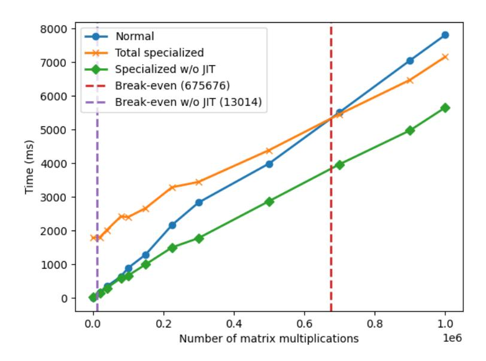

Figure B.1: A larger test for matrix multiplication, showing where the specialized version breaks-even with the baseline. The matrices have side 3 and values drawn from [0, 100).

<span id="page-87-0"></span>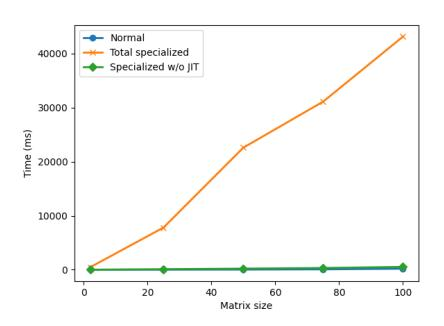

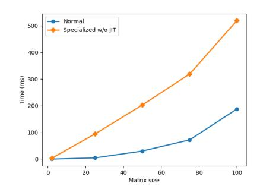

(a) Showing the execution time of the specialized program and the original program.

(b) Showing the execution time for the specialized program without JIT time and the original program.

Figure B.2: Graphs of the execution time for a single matrix multiplication, specialized versus not, as a function of the matrix size. The matrices multiplied together are null matrices. The recursion depth is 50.

## <span id="page-88-0"></span>**Appendix C**

## **Test programs**

For all tests programs there were some boilerplate code that e.g. retrieved the relevant input arguments, timed the execution and printed the results. An example of the boilerplate code is presented in Listing [C.1.](#page-88-1) The boilerplate code will be referred back to inside the test programs themselves. Moreover, two programs were used per test, one containing the specialize keyword and one not. Only the former is shown here.

<span id="page-88-1"></span>Listing C.1: Boilerplate code for evaluating the performance fo the test programs.

```
1 mexpr
2 if not (eqi (length argv) X) then print "usage:
       ./test_prog 1 2 ... X"
3 else
4
5 let statIn = get argv 1 in
6 let dynIn = get argv 2 in
7 −− Any additional arguments (e.g. seed for creating random
       matrix)
8
9 let t1 = wallTimeMs () in
10
11 −− Run the specific test program, and bound result to res
12
13 let t2 = wallTimeMs () in
14
15 printLn "Tot";
16 printLn (float2string (subf t2 t1));
17
18 printLn "Result";
19 printLn res;
20 ()
```

### <span id="page-89-0"></span>**C.1 Pow**

<span id="page-89-2"></span>The power program is shown in Listing [C.2.](#page-89-2)

Listing C.2: The power program used in pow

```
1 recursive let pow = lam n. lam x.
2 if eqi n 0 then 1
3 else
4 if eqi (modi n 2) 0 then
5 let r = pow (divi n 2) x in
6 muli r r
7 else
8 let r = pow (subi n 1) x in
9 muli x r
10 in
11
12 recursive let go = lam f. lam acc. lam base. lam i.
13 if eqi i base then acc
14 else
15 let res = f base in
16 go f res (addi 1 base) i
17 in
18
19 −− BOILERPLATE
20 let powE = specialize (pow exponent) in
21 let res = go powE 0 0 times in
22 −− BOILERPLATE
```

## <span id="page-89-1"></span>**C.2 String matchers**

The native string matcher is shown in Listing [C.3](#page-89-3) and the optimized string matcher in Listing [C.4.](#page-90-0)

<span id="page-89-3"></span>Listing C.3: The naive string matcher used in naive-str-match

```
1 recursive let isPrefix = lam pat. lam str.
2 switch (pat, str)
3 case ([], _) then true
4 case (_, []) then false
5 case ([x], [y] ++ _) then eqChar x y
6 case ([x] ++ _, [y]) then false
7 case ([x] ++ xs, [y] ++ ys) then and (eqChar x y)
        (isPrefix xs ys)
8 end
9 end
```

```
10
11 let naiveM = lam pat. lam str.
12 let patlen = length pat in
13 recursive let work = lam startIndex.
14 if gti (addi startIndex patlen) (length str) then false
15 else
16 if isPrefix pat (subsequence str startIndex patlen)
           then true
17 else work (addi startIndex 1)
18 in work 0
19
20 −− BOILERPLATE
21 let patternIn = specialize (naiveM pattern) in
22 let str = readFile file in
23 let res = patternIn str in
24 −− BOILERPLATE
```

<span id="page-90-0"></span>Listing C.4: The optimized string matcher used in opt-str-matcher

```
1 recursive
2 let kmp = lam pat. lam str.
3 match pat with [] then true
4 else start pat str
5
6 let start = lam pat. lam str.
7 match str with [] then false
8 else restart pat str
9
10 let restart = lam pat. lam str.
11 if eqChar (head pat) (head str) then
12 let xs = tail pat in
13 let ys = tail str in
14 if null xs then true else
15 if null ys then false else
16 loopKmp xs ys pat
17 else start pat (tail str)
18
19 let loopKmp = lam pat. lam str. lam pp.
20 if eqChar (head pat) (head str) then
21 let xs = tail pat in
22 let ys = tail str in
23 if null xs then true else
24 if null ys then false else
25 loopKmp xs ys pp
26 else
27 let np = staticKmp pp (tail pp) (subi (length (tail
            pp)) (length pat)) in
28 if eqSeq eqChar np pp then
```

```
29 if eqChar (head pp) (head pat)
30 then start pp (tail str) else restart pp str
31 else loopKmp np str pp
32
33 let staticKmp = lam pat. lam str. lam n.
34 staticLoop pat str n pat str n
35
36 let staticLoop = lam pat. lam str. lam n. lam pp. lam dd.
       lam nn.
37 if eqi n 0 then
38 if gti nn 0 then
39 if eqChar (head pat) (head str) then staticKmp pp
            (tail dd) (subi nn 1)
40 else pat
41 else pat
42 else
43 if eqChar (head pat) (head str) then
44 staticLoop (tail pat) (tail str) (subi n 1) pp dd nn
45 else staticKmp pp (tail dd) (subi nn 1)
46 end
47
48 −− BOILERPLATE
49 let patternIn = specialize (kmp pattern) in
50 let str = readFile file in
51 let res = patternIn str in
52 −− BOILERPLATE
```

## <span id="page-91-0"></span>**C.3 Matrix multiplication & Dot product**

For both of these tests, we used an existing matrix multiplication implementation that can be found in the Miking repository[∗](#page-91-2) . We will refer back to this implementation in the listings, and simply call it matmul.mc. Only what comes before the mexpr declaration was used, that is everything up until line . Moreover, all unit tests were stripped away. The matrix multiplication program is shown in Listing [C.5](#page-91-1) and the dot product program in Listing [C.6.](#page-92-0)

<span id="page-91-1"></span>Listing C.5: The matrix multiplication program used in mat-mul

```
1
2 −− matmul.mc as described in the beginning of the chapter
3
4 let startLoop = lam baseMat. lam f. lam acc. lam i.
```

<span id="page-91-2"></span><sup>∗</sup>[https://github.com/miking-lang/miking/blob/6bee5d45284293](https://github.com/miking-lang/miking/blob/6bee5d4528429314c0687ac37f8c1781b3f5a953/test/examples/accelerate/matmul.mc) [14c0687ac37f8c1781b3f5a953/test/examples/accelerate/matmul.mc](https://github.com/miking-lang/miking/blob/6bee5d4528429314c0687ac37f8c1781b3f5a953/test/examples/accelerate/matmul.mc)

```
5 recursive let go = lam f. lam acc. lam i.
6 if eqi i 0 then acc
7 else
8 let res = f (baseMat) in
9 let acc = get (get res 0) 0 in
10 go f acc (subi i 1)
11 in go f acc i
12
13 let getMatrix = lam s.
14 let f = lam i. create s (lam j. randIntU 0 100) in
15 let g = create s f in
16 g
17
18 mexpr
19
20 −− BOILERPLATE (including setting of seed)
21 let mulLhs = specialize (matMulSq lhs) in
22 let res = startLoop rhs mulLhs 0 times in
23 −− BOILERPLATE
```

As should be noted, the program of Listing [C.5](#page-91-1) only returns the top left value of the matrix. This was the state of the program when running the performance tests. In additional tests, we also compared the complete resulting matrix.

Listing C.6: The dot product program used in dot-prod

```
1
2 −− matmul.mc as described in the beginning of the chapter,
3 −− with the exception that line 47 of matmul.mc has been
      altered like:
4
5 let sAddProd = specialize (addProd aRow) in
6 let row : [Int] = map (sAddProd) b in
7
8 mexpr
9
10 −− BOILERPLATE (including setting of seed)
11 let res = matMulSq lhs rhs in
12 −− BOILERPLATE
```

74 | Appendix C: Test programs

www.kth.se

## **CCCC For DIVA CCCC**

```
"Author1": { "Last name": "Adamsson",
"First name": "Johan",
"Local User Id": "jada",
"E-mail": "jada@kth.se",
"organisation": {"L1": "School of Electrical Engineering and Computer Science",
},
"Cycle": "2",
"Course code": "DA231X",
"Credits": "30.0",
"Degree1": {"Educational program": "Master's Programme, Computer Science, 120 credits"
,"programcode": "TCSCM"
,"Degree": "Both Degree of Master of Science in Engineering and Master's degree"
,"subjectArea": "Computer Science and Engineering"
},
"Title": {
"Main title": "Run-time specialization for compiled languages using online partial evaluation",
"Language": "eng" },
"Alternative title": {
"Main title": "Specialisering av kompilerade språk i körtid med hjälp av online partiell evaluering",
"Language": "swe"
},
"Supervisor1": { "Last name": "Broman",
"First name": "David",
"Local User Id": "u1aeyn4q",
"E-mail": "dbro@kth.se",
"organisation": {"L1": "School of Electrical Engineering and Computer Science",
"L2": "Computer Science" }
},
"Supervisor2": { "Last name": "Palmkvist",
"First name": "Viktor",
"Local User Id": "u1z5jdph",
"E-mail": "vipa@kth.se",
"organisation": {"L1": "School of Electrical Engineering and Computer Science",
"L2": "Computer Science" }
},
"Examiner1": { "Last name": "Troubitsyna",
"First name": "Elena",
"Local User Id": "u1uem78s",
"E-mail": "elenatro@kth.se",
"organisation": {"L1": "School of Electrical Engineering and Computer Science",
"L2": "Computer Science" }
},
"National Subject Categories": "10201",
"Other information": {"Year": "2023", "Number of pages": "1,73"},
"Copyrightleft": "copyright",
"Series": { "Title of series": "TRITA-EECS-EX" , "No. in series": "2023:00" },
"Opponents": { "Name": "N. Georgiou"},
"Presentation": { "Date": "2023-10-20 09:00"
,"Language":"eng"
,"Room": "via Zoom https://kth-se.zoom.us/j/62999012127"
},
"Number of lang instances": "2",
"Abstract[eng ]": CCCC
```

Partial evaluation is a program transformation technique that specializes a program with respect to part of its input. While the specialization is typically performed ahead-of-time, moving it to a later stage may expose additional opportunities and allow for faster residual programs to be constructed. In this thesis, we present a method for specializing programs at run-time, for compiled code, using an online partial evaluator. Although partial evaluation has several applications, the evaluation of the method primarily focuses on its performance benefits. The main research problem addressed in this thesis is that of incorporating an online partial evaluator in compiled code. The partial evaluator is a source-to-source translator that takes and produces an abstract syntax tree (AST). Our approach consists of three parts, namely that of partially evaluating, obtaining a partially evaluable representation and run-time code emitting. Concretely, we use the concept of lifting to store an AST in

the compiled code that the partial evaluator then specializes at run-time. The residual code is thereafter naively just-in-time (JIT) compiled through dynamically linking it back to the executable as a shared library. We evaluate the method on several programs and show that the specialized programs sometimes are faster even with a low recursion depth. Though, while the results are promising, the overhead is typically significant and therefore the break-even points are large. Further research, for example using an efficient JIT compiler, is required to better evaluate the performance benefits of the approach.

```
CCCC,
"Keywords[eng ]": CCCC
```

Run-time Specialization, Partial Evaluation, Online Partial Evaluation CCCC,

"Abstract[swe ]": CCCC

Partiell evaluering är en programtransformationsteknik som specialiserar ett program givet delar av dess indata. Typisk sätt specialiseras program innan de exekveras, men genom att flytta specialisering till då programmet körs kan ytterligare information utnyttjas och därmed snabbare residualprogram konstrueras. I det här examensarbetet presenteras en metod för att specialisera program i körtid med online partiell evaluering, specifikt för kompilerade program. Metoden utvärderas främst utefter prestanda, men det ska nämnas att partiell evaluering har fler tillämpningar än så.

Det huvudsakliga problemet som examensarbetet undersöker är inkorporeringen av en programspecialiserare (partial evaluator) i kompilerad kod. Den programspecialiserare som används tar både som indata och producerar ett abstrakt syntaxträd (AST). Vårt tillvägagångssätt består av tre delar, nämligen programspecialisering, erhållning av en representation som kan specialiseras och slutligen kodgenerering i körtid. Mer specifikt används konceptet lyftning för att spara ett AST i den kompilerade koden som därefter partiellt evalueras av programspecialiseraren under körtid. Som ett sista steg just-in-time (JIT) kompileras residualprogrammet. Detta görs på ett naivt vis genom att programmet kompileras till ett delat bibliotek som därefter dynamiskt länkas tillbaka till huvudprogrammet.

Metoden utvärderas på flera program och vi visar att de specialiserade programmen i vissa fall var snabbare och det även med små rekursionsdjup. Resultaten är lovande, men den overhead som metoden ger upphov till är ofta signifikant vilket gör att det krävs många iterationer innan det specialiserade programmet blir snabbare. Ytterligare forskning och tester, till exempel med en effektiv JIT kompilator, är nödvändig för att bättre kunna utvärdera metodens prestandafördelar.

#### CCCC,

"Keywords[swe ]": CCCC Körtidsspecialisering, Partiell Evaluering, Online Partiell Evaluering CCCC,